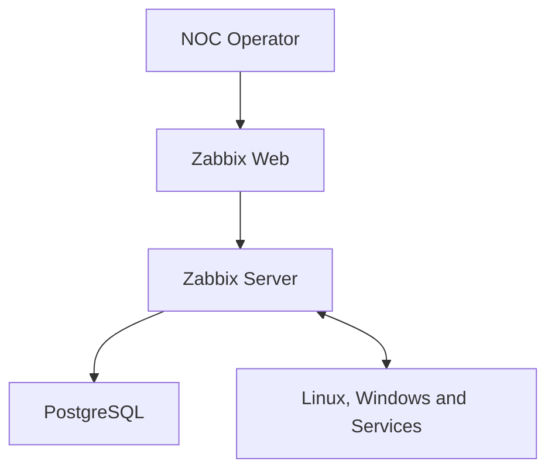

# Zabbix NOC Operations Lab

[](https://www.zabbix.com/)
[](https://www.docker.com/)
[](https://www.kernel.org/)
[](https://www.microsoft.com/windows/)
[](#implementation-roadmap)

A practical Network Operations Center lab focused on infrastructure monitoring, alert triage, troubleshooting, incident response, service recovery, and operational documentation.

Zabbix is the central monitoring platform. The project reproduces common NOC workflows across Linux, Windows, network connectivity, and HTTP services.

## Project Purpose

This repository demonstrates a complete monitoring and incident-handling cycle:

```text
Monitor -> Detect -> Validate -> Acknowledge -> Investigate
        -> Escalate or Restore -> Confirm Recovery -> Document
```

The objective is not limited to installing Zabbix. Each stage includes implementation, validation, failure simulation, troubleshooting, recovery, and selected technical evidence.

## Core Objectives

- Deploy a reproducible Zabbix 7.0 LTS environment.
- Monitor Linux and Windows hosts with Zabbix Agent 2.
- Monitor host availability, system resources, processes, and services.
- Validate ICMP, DNS, TCP port, and HTTP availability.
- Configure items, triggers, events, problems, severities, and actions.
- Practice alert acknowledgment, investigation, escalation, and recovery.
- Simulate infrastructure, network, and application incidents.
- Create reusable troubleshooting runbooks.
- Document incidents, maintenance windows, and shift activities.
- Introduce SNMP monitoring for network-oriented scenarios.
- Add Grafana only as an optional visualization layer after the core Zabbix workflows are complete.

## Architecture Overview



The initial platform runs locally through Docker Desktop and WSL 2.

PostgreSQL remains inside the Docker network. Only the interfaces required for administration and monitoring are exposed to the workstation.

## Monitoring Scope

| Area | Planned coverage |
|---|---|
| Host availability | Agent availability, ICMP reachability and response time |
| Linux | CPU, memory, disk, processes, services, logs and network interfaces |
| Windows | CPU, memory, disk, services, event information and Agent 2 |
| Network | ICMP, packet loss, latency, DNS resolution and TCP connectivity |
| HTTP services | Availability, status code, response time and service failure |
| Zabbix operations | Hosts, templates, items, triggers, events, problems and actions |
| Incident handling | Triage, acknowledgment, notes, severity, escalation and recovery |
| Maintenance | Planned downtime, alert suppression and recovery validation |
| Reporting | Incident tickets, operational checklists and shift reports |
| Network devices | Introductory SNMP monitoring |
| Visualization | Native Zabbix dashboards and optional Grafana integration |

## Incident Scenarios

The laboratory will reproduce scenarios commonly handled by NOC and infrastructure teams:

- monitored host unavailable;
- Zabbix Agent 2 unavailable;
- HTTP service stopped;
- TCP port inaccessible;
- DNS resolution failure;
- high CPU utilization;
- low available disk space;
- abnormal memory utilization;
- network latency or packet loss;
- service blocked by a local firewall;
- planned maintenance generating unnecessary alerts;
- poorly tuned trigger producing a false positive.

Each completed scenario must contain detection evidence, diagnostic steps, corrective action, recovery validation, and an operational record.

## Troubleshooting Method

1. Identify the alert source and affected asset.
2. Validate whether the problem is current and reproducible.
3. Determine the impact, scope, and severity.
4. Check connectivity, resources, services, ports, and logs.
5. Compare recent changes and related events.
6. Apply the documented recovery procedure when authorized.
7. Escalate when the issue exceeds the operator's access or responsibility.
8. Confirm recovery from both the system and monitoring perspectives.
9. Record actions, timestamps, findings, and follow-up recommendations.

## Current Repository Contents

- [`labs/00-workstation-validation/`](labs/00-workstation-validation/) - workstation baseline, acceptance criteria, findings, and results;
- [`scripts/powershell/validate-workstation.ps1`](scripts/powershell/validate-workstation.ps1) - reusable read-only workstation validation;
- [`.gitignore`](.gitignore) - protection for secrets, runtime data, logs, local overrides, and temporary files.

Additional directories will be introduced only when they contain implemented and validated material.

## Implementation Roadmap

| Stage | Scope | Status |
|:---:|---|:---:|
| 00 | Workstation validation and repository baseline | Completed |
| 01 | Zabbix platform deployment and health validation | In progress |
| 02 | Linux host monitoring with Zabbix Agent 2 | Planned |
| 03 | Windows host monitoring with Zabbix Agent 2 | Planned |
| 04 | Network, DNS, TCP, and HTTP service monitoring | Planned |
| 05 | Triggers, severities, events, and alert handling | Planned |
| 06 | Incident response and service recovery | Planned |
| 07 | Maintenance windows and operational reporting | Planned |
| 08 | Introductory SNMP and optional Grafana integration | Planned |

A stage is marked as completed only after its implementation, validation, troubleshooting notes, and relevant evidence are committed.

## Completed Stage

### Stage 00 - Workstation Validation

Stage 00 established and validated the local workstation baseline before any Zabbix service deployment.

The validation covered:

- Windows, PowerShell, and system architecture;
- processor, memory, and available disk capacity;
- WSL 2 and its active kernel;
- Docker Engine and Docker Compose;
- resources available to Docker;
- required TCP ports;
- DNS resolution and outbound HTTPS connectivity;
- existing containers, networks, and volumes;
- Git repository state.

Final validation result:

```text
Passed:   20
Warnings: 0
Failed:   0

RESULT: WORKSTATION APPROVED
```

See the complete documentation in [`labs/00-workstation-validation/README.md`](labs/00-workstation-validation/README.md).

## Current Stage

### Stage 01 - Zabbix Platform Deployment

The next stage will introduce and validate:

- PostgreSQL;
- Zabbix Server 7.0 LTS;
- Zabbix Web;
- persistent Docker volumes;
- an isolated Docker network;
- service health checks;
- controlled environment variables;
- initial platform availability tests.

Deployment files will be committed only after local configuration and validation succeed.

## Evidence Policy

Evidence is selected to demonstrate meaningful technical results rather than every mouse click.

Relevant evidence may include:

- platform and host availability;
- item data collection;
- trigger transition from `OK` to `PROBLEM`;
- acknowledged incident with an operational note;
- diagnostic command output;
- confirmed service recovery;
- trigger transition back to `OK`;
- maintenance period configuration;
- completed incident or shift report.

Screenshots containing credentials, tokens, personal information, or unrelated desktop content must not be committed.

## Security Practices

- Secrets and credentials are excluded from version control.
- PostgreSQL is not published directly to the Windows host.
- Environment-specific values remain outside tracked configuration.
- Example files use placeholders instead of real passwords.
- Private keys and certificates are ignored by Git.
- Diagnostic evidence is reviewed before publication.
- Existing resources from unrelated projects are preserved.

## Technology Stack

- Zabbix 7.0 LTS
- Zabbix Agent 2
- PostgreSQL
- Docker Desktop
- Docker Compose
- WSL 2
- Linux
- Windows PowerShell
- Nginx
- SNMP
- Grafana as an optional final-stage visualization layer

## Skills Demonstrated

- infrastructure and service monitoring;
- NOC alert triage;
- Linux and Windows administration;
- network connectivity validation;
- incident response;
- troubleshooting methodology;
- service restoration;
- operational escalation;
- maintenance coordination;
- technical documentation;
- monitoring-as-code fundamentals;
- Docker-based environment management.

## Project Status

Stage 00 is complete, validated, and documented.

Stage 01 is in progress and will introduce the reproducible Zabbix platform before the first monitored Linux host is added.

---

This repository is a controlled laboratory environment intended for technical practice and portfolio demonstration. It is not a production deployment guide.
