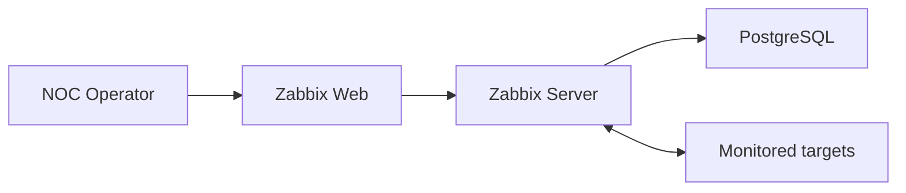
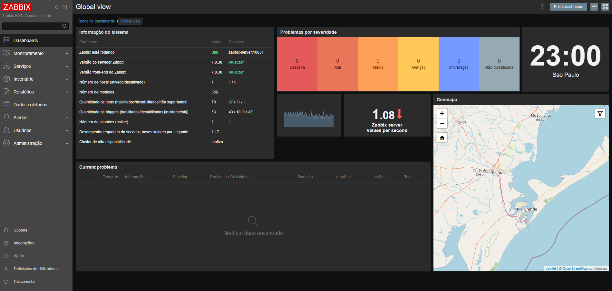

# Lab 01 — Zabbix Platform Deployment

[Back to the main README](../../README.md)

## Objective

Deploy and validate a reproducible Zabbix 7.0 LTS monitoring platform using Docker Compose.

This stage establishes the core services required for the subsequent Linux, Windows, network, service-monitoring, and incident-response laboratories.

## Learning Outcomes

After completing this laboratory, the operator can:

- validate container image availability;
- manage local environment variables without publishing secrets;
- validate a Docker Compose model before deployment;
- deploy PostgreSQL, Zabbix Server, and Zabbix Web;
- verify container state, database health, and restart counters;
- confirm server and frontend versions;
- test local HTTP availability;
- replace default administrative credentials;
- identify and acknowledge a monitoring problem;
- distinguish acknowledgment from resolution;
- investigate an incorrectly applied monitoring template;
- reduce monitoring noise from unused optional components;
- confirm platform recovery after corrective action.

## Platform Components

| Component | Image | Purpose |
|:---:|---|---|
| PostgreSQL | `postgres:16.15-alpine3.24` | Persistent Zabbix configuration and monitoring database |
| Zabbix Server | `zabbix/zabbix-server-pgsql:ubuntu-7.0.30` | Data collection, trigger evaluation, event processing, and monitoring logic |
| Zabbix Web | `zabbix/zabbix-web-nginx-pgsql:ubuntu-7.0.30` | Web administration and NOC operations interface |

Image versions are explicitly pinned in `.env.example` to make the laboratory reproducible and to prevent an unreviewed upgrade caused by a floating tag.

## Architecture



The platform uses three Docker networks with distinct responsibilities.

| Network | Purpose |
|:---:|---|
| `backend` | Isolated communication between PostgreSQL, Zabbix Server, and Zabbix Web |
| `frontend` | Access to the Zabbix web interface |
| `monitoring` | Communication between Zabbix Server and monitored services |

The `backend` network is internal. PostgreSQL is not published to the Windows workstation.

Only the following ports are published:

| Workstation endpoint | Container endpoint | Purpose |
|:---:|---|---|
| `127.0.0.1:8080` | `zabbix-web:8080` | Local Zabbix web interface |
| `127.0.0.1:10051` | `zabbix-server:10051` | Zabbix Server communication |

Binding these ports to `127.0.0.1` prevents direct access from other devices on the local network during this stage.

## Persistent Data

The named volume `postgres-data` stores the PostgreSQL database.

Stopping and removing the containers does not remove this volume:

```powershell
docker compose --env-file .env down
```

Removing the database volume is intentionally excluded from the routine shutdown procedure. Destructive cleanup must only be performed when the loss of all local Zabbix configuration and history is explicitly intended.

## Security Controls

- PostgreSQL is reachable only through the internal Docker network.
- Published ports listen only on the loopback interface.
- The real `.env` file is excluded by `.gitignore`.
- `.env.example` contains placeholders instead of operational credentials.
- Container logs use rotation to limit uncontrolled local growth.
- Default Zabbix administrative credentials are replaced after the first sign-in.
- Screenshots are reviewed before publication.

## Environment Preparation

Run the commands from the repository root.

Create the local environment file:

```powershell
Copy-Item .env.example .env
```

Edit `.env` and replace the example PostgreSQL password with a strong password used only by this local laboratory.

The `.env` file must never be committed.

Confirm its ignore status:

```powershell
git check-ignore -v .env
```

## Pre-deployment Validation

Run the workstation validation again because available ports and Docker state may have changed since Stage 00:

```powershell
powershell.exe -NoProfile -ExecutionPolicy Bypass `
    -File .\scripts\powershell\validate-workstation.ps1
```

Validate variable interpolation and the final Compose model:

```powershell
docker compose --env-file .env config
```

List the images referenced by the model:

```powershell
docker compose --env-file .env config --images
```

Pull the pinned images before starting the platform:

```powershell
docker compose --env-file .env pull
```

## Deployment

Start the services in detached mode:

```powershell
docker compose --env-file .env up -d
```

The expected startup order is:

1. PostgreSQL starts and passes `pg_isready`;
2. Zabbix Server starts after the database is healthy;
3. Zabbix Web starts and connects to PostgreSQL and Zabbix Server.

## Platform Validation

### Container state

Inspect service state and published ports:

```powershell
docker compose --env-file .env ps
```

Inspect service state and health information in a structured format:

```powershell
docker compose --env-file .env ps --format json |
    ConvertFrom-Json |
    Select-Object Name, Service, State, Health, ExitCode
```

Inspect container restart counters:

```powershell
docker compose --env-file .env ps -q |
    ForEach-Object {
        docker inspect `
            --format '{{.Name}} restart_count={{.RestartCount}}' $_
    }
```

Expected conditions:

- all three services are running;
- PostgreSQL reports a healthy state;
- no service is repeatedly restarting;
- PostgreSQL has no host-published port;
- Zabbix Web is available only at `127.0.0.1:8080`;
- Zabbix Server is available only at `127.0.0.1:10051`.

### Database validation

Validate database readiness inside the PostgreSQL container:

```powershell
docker compose --env-file .env exec postgres `
    pg_isready -U zabbix -d zabbix
```

Confirm that Zabbix tables were created:

```powershell
docker compose --env-file .env exec postgres `
    psql -U zabbix -d zabbix -tAc `
    "SELECT COUNT(*) FROM information_schema.tables WHERE table_schema = 'public';"
```

A nonzero result confirms that the application initialized the database schema. The exact table count may vary between supported Zabbix releases.

### Zabbix Server validation

Review recent server logs:

```powershell
docker compose --env-file .env logs `
    --tail 100 zabbix-server
```

The validation must confirm that the server started, connected to PostgreSQL, and did not enter a restart loop.

### HTTP validation

Test the local frontend:

```powershell
$response = Invoke-WebRequest `
    -Uri http://127.0.0.1:8080 `
    -UseBasicParsing

$response.StatusCode
```

The expected HTTP status is `200`.

Open the interface:

```text
http://127.0.0.1:8080
```

After the first sign-in, replace the default administrative password before continuing with monitoring configuration.

## Operational Finding and Corrective Action

During initial platform validation, an inappropriate monitoring template created alerts for optional components that were not part of the deployed architecture.

This provided an early NOC workflow exercise:

1. the generated problem was reviewed;
2. the event was acknowledged with an operational note;
3. acknowledgment was treated as a record of operator action, not as resolution;
4. the host and linked template were inspected;
5. the unnecessary template relationship was corrected;
6. the platform was observed until the problem cleared;
7. the dashboard was checked again to confirm recovery.

The finding demonstrates why a monitoring operator must validate whether an alert represents a real service failure, an incorrect configuration, or an unused component before escalating or changing infrastructure.

## Validation Evidence



The final dashboard confirms:

- Zabbix Server is running;
- server version `7.0.30`;
- frontend version `7.0.30`;
- communication between the frontend and Zabbix Server;
- no current monitoring problems after corrective action.

The image contains no credentials or unrelated desktop content.

## Acceptance Criteria

| Requirement | Acceptance condition | Result |
|---|---|:---:|
| Compose model | Configuration renders without missing variables | Passed |
| PostgreSQL | Container starts and reports healthy | Passed |
| Database isolation | PostgreSQL has no host-published port | Passed |
| Zabbix Server | Server starts and communicates with PostgreSQL | Passed |
| Zabbix Web | Frontend responds locally | Passed |
| Version alignment | Server and frontend report Zabbix 7.0.30 | Passed |
| Persistence | Named database volume is defined | Passed |
| Port exposure | Published ports bind to `127.0.0.1` | Passed |
| Credentials | Runtime `.env` remains outside version control | Passed |
| Initial monitoring noise | Incorrect template relationship investigated and corrected | Passed |
| Final platform state | Dashboard reports no current problems | Passed |

## Troubleshooting

### A required variable is missing

If Compose reports that an image, password, or port variable must be set:

1. confirm that `.env` exists in the repository root;
2. compare its variable names with `.env.example`;
3. run the command with `--env-file .env`;
4. run `docker compose --env-file .env config` again.

### PostgreSQL remains unhealthy

Inspect its state and recent logs:

```powershell
docker compose --env-file .env ps
docker compose --env-file .env logs --tail 100 postgres
```

Check the database name, user, password, volume state, and available disk space before recreating any resource.

### Zabbix Server cannot connect to PostgreSQL

```powershell
docker compose --env-file .env logs `
    --tail 100 postgres zabbix-server
```

Confirm that both services share the `backend` network and use identical PostgreSQL variables.

### The web interface does not respond

```powershell
docker compose --env-file .env ps
docker compose --env-file .env logs --tail 100 zabbix-web
Test-NetConnection 127.0.0.1 -Port 8080
```

Verify that the port is published, the frontend container is running, and another local service has not taken TCP 8080.

### A problem remains after acknowledgment

Acknowledgment does not resolve the monitored condition. It records that an operator reviewed or acted on the event.

Inspect the affected host, template, item, trigger, and latest data. Correct the underlying condition and wait for the next evaluation cycle.

## Routine Operations

Display platform state:

```powershell
docker compose --env-file .env ps
```

Display recent logs:

```powershell
docker compose --env-file .env logs --tail 100
```

Stop the platform while preserving containers and data:

```powershell
docker compose --env-file .env stop
```

Start stopped services:

```powershell
docker compose --env-file .env start
```

Remove containers and project networks while preserving the database volume:

```powershell
docker compose --env-file .env down
```

## Outcome

Stage 01 delivered a reproducible and locally isolated Zabbix 7.0 LTS platform composed of PostgreSQL, Zabbix Server, and Zabbix Web.

The deployment was validated from the container, database, server, HTTP, security, monitoring, and operator-workflow perspectives. An initial configuration-related problem was acknowledged, investigated, corrected, and confirmed as recovered.

Stage 02 will add a Linux monitored host with Zabbix Agent 2 and validate host availability, resource metrics, processes, filesystems, and network interfaces.
