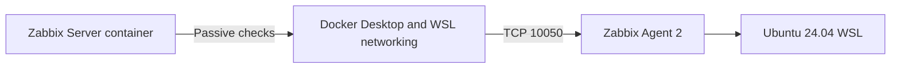

# Stage 02 - Linux Host Monitoring

## Overview

This stage introduces the first monitored Linux host into the Zabbix NOC Operations Lab.

The monitored target is an Ubuntu 24.04 LTS environment running under WSL 2. Zabbix Agent 2 collects operating-system, CPU, memory, process, filesystem, storage, and network-interface data.

The initial implementation uses passive agent checks initiated by the containerized Zabbix Server.

## Current Status

**In progress**

The following milestones are complete:

- Ubuntu 24.04 WSL target selected and validated;
- Zabbix Agent 2 installed from the official Zabbix 7.0 repository;
- agent service enabled and running under systemd;
- passive-check listener configured on TCP port `10050`;
- Docker-to-WSL connectivity validated;
- access restrictions adjusted for the Docker and WSL private networks;
- host registered in the Zabbix frontend;
- `Linux by Zabbix agent` template assigned;
- initial item discovery and data collection confirmed.

Further validation, unsupported-item investigation, controlled resource activity, and selected technical evidence remain pending.

## Environment

| Component | Value |
|---|---|
| Monitoring platform | Zabbix 7.0 LTS |
| Zabbix Server | Containerized |
| Database | PostgreSQL |
| Frontend | Zabbix Web |
| Monitored system | Ubuntu 24.04.4 LTS |
| Virtualization layer | WSL 2 |
| Agent | Zabbix Agent 2 |
| Agent version | `7.0.30` |
| Agent host name | `linux-wsl-01` |
| Agent port | `10050/TCP` |
| Check mode | Passive |
| Template | `Linux by Zabbix agent` |
| Host group | `Linux servers` |

## Architecture

