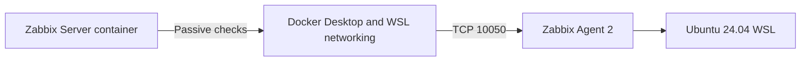
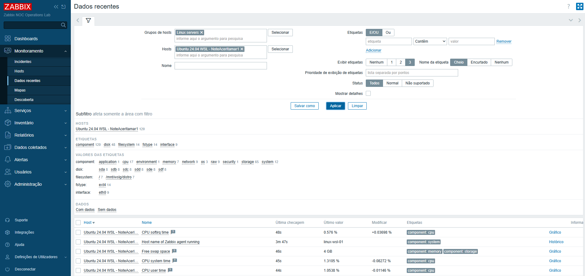
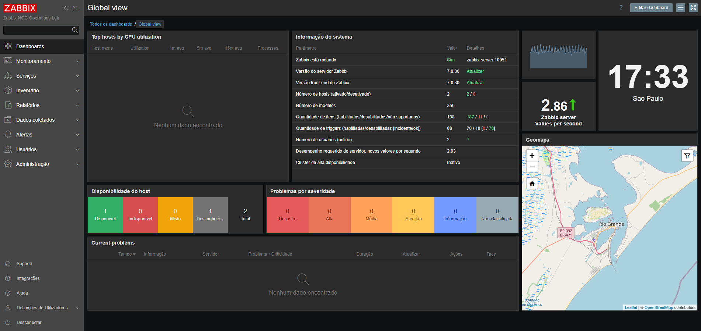
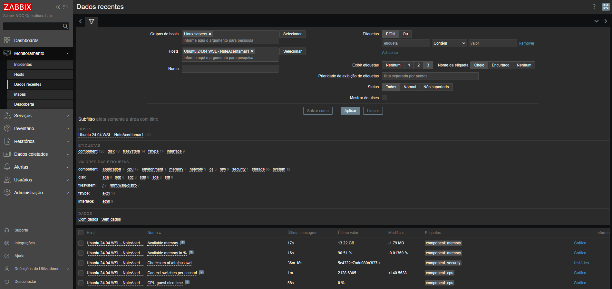
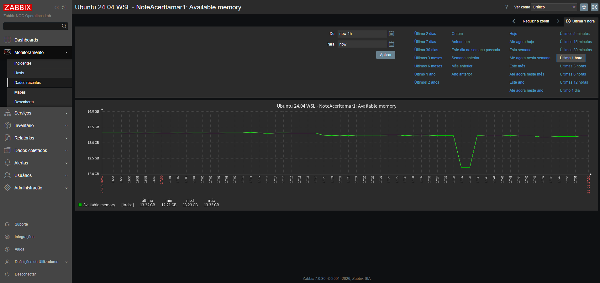

# Stage 02 - Linux Host Monitoring

## Overview

This stage introduces the first monitored Linux host into the Zabbix NOC Operations Lab.

The monitored target is an Ubuntu 24.04 LTS environment running under WSL 2. Zabbix Agent 2 collects operating-system, CPU, memory, process, filesystem, storage, and network-interface data.

The initial implementation uses passive agent checks initiated by the containerized Zabbix Server.

## Current Status

**Completed**

The following milestones are complete:

- Ubuntu 24.04 WSL target selected and validated;
- Zabbix Agent 2 installed from the official Zabbix 7.0 repository;
- agent service enabled and running under systemd;
- passive-check listener configured on TCP port `10050`;
- Docker-to-WSL connectivity validated;
- access restrictions adjusted for the Docker and WSL private networks;
- host registered in the Zabbix frontend;
- `Linux by Zabbix agent` template assigned;
- initial item discovery and data collection confirmed;
- initial unsupported-item state reviewed and confirmed as transient;
- controlled CPU, memory, filesystem, and network activity validated;
- Agent 2 startup after WSL termination validated;
- final technical evidence selected and stored.

## Environment

| Component | Value |
|---|---|
| Monitoring platform | Zabbix 7.0 LTS |
| Zabbix Server | Containerized |
| Database | PostgreSQL |
| Frontend | Zabbix Web |
| Monitored system | Ubuntu 24.04.4 LTS |
| Virtualization layer | WSL 2 |
| Agent | Zabbix Agent 2 |
| Agent version | `7.0.30` |
| Agent host name | `linux-wsl-01` |
| Agent port | `10050/TCP` |
| Check mode | Passive |
| Template | `Linux by Zabbix agent` |
| Host group | `Linux servers` |

## Architecture



The Zabbix Server runs inside the Docker monitoring network. The monitored Ubuntu system runs under WSL 2 and is reached through the private WSL network.

Because both environments use private address ranges, the agent access configuration must authorize the Zabbix Server source network visible from WSL.

## Prerequisites

Before installation, the following conditions were confirmed:

- Ubuntu 24.04 WSL was available;
- systemd was running inside the distribution;
- the system architecture was `amd64`;
- outbound HTTPS access to the Zabbix repository was available;
- the Zabbix Server container was healthy;
- the server container could reach the WSL address;
- TCP port `10050` was not occupied before agent installation.

The WSL environment was inspected with:

```bash
hostname
cat /etc/os-release
uname -r
systemctl is-system-running
hostname -I
ip -4 address show
ss -lntp
```

## Zabbix Repository Installation

The official Zabbix 7.0 repository package for Ubuntu 24.04 was downloaded to the WSL user home directory:

```bash
curl -fL \
  "https://repo.zabbix.com/zabbix/7.0/ubuntu/pool/main/z/zabbix-release/zabbix-release_latest_7.0+ubuntu24.04_all.deb" \
  -o /home/itamarsbt/zabbix-release.deb
```

The package was inspected before installation:

```bash
ls -lh /home/itamarsbt/zabbix-release.deb
dpkg-deb --info /home/itamarsbt/zabbix-release.deb
```

The repository package was installed and the package indexes were updated:

```bash
sudo dpkg -i /home/itamarsbt/zabbix-release.deb
sudo apt-get update
```

Package availability was confirmed with:

```bash
apt-cache policy zabbix-agent2
```

The repository provided Zabbix Agent 2 version `7.0.30` for Ubuntu 24.04.

## Agent Installation

Zabbix Agent 2 was installed with:

```bash
sudo apt-get install -y zabbix-agent2
```

The installed version was validated with:

```bash
zabbix_agent2 -V
```

Validated version:

```text
zabbix_agent2 (Zabbix) 7.0.30
```

The package installation created and enabled the systemd service.

Service status was inspected with:

```bash
systemctl status zabbix-agent2 --no-pager
```

The service was confirmed as:

```text
active (running)
```

## Agent Configuration

The original configuration file was preserved before modification:

```bash
sudo cp -p \
  /etc/zabbix/zabbix_agent2.conf \
  /etc/zabbix/zabbix_agent2.conf.pre-stage02
```

The relevant passive-check configuration is:

```ini
Server=172.20.0.0/16,172.31.96.0/20
# ServerActive disabled during passive-check validation
Hostname=linux-wsl-01
ListenIP=0.0.0.0
```

The parameters have the following purposes:

| Parameter | Purpose |
|---|---|
| `Server` | Authorizes passive checks from the Docker and WSL private networks |
| `ServerActive` | Disabled during the initial passive-check implementation |
| `Hostname` | Defines the technical host identity used by the agent |
| `ListenIP` | Makes the agent listen on the WSL network interfaces |
| `ListenPort` | Uses the default Agent 2 port, TCP `10050` |

The configuration was validated before restarting the service:

```bash
sudo zabbix_agent2 -T -c /etc/zabbix/zabbix_agent2.conf
```

Validated result:

```text
Validation successful
```

The agent was restarted and checked:

```bash
sudo systemctl restart zabbix-agent2
systemctl is-active zabbix-agent2
ss -lntp | grep ':10050'
```

Validated results:

```text
active
LISTEN ... *:10050
```

## Docker-to-WSL Connectivity

The Ubuntu WSL IPv4 address was obtained from PowerShell:

```powershell
$wslIp = (wsl.exe -d Ubuntu-24.04 -- hostname -I).Trim().Split()[0]
Write-Host "Ubuntu WSL IPv4: $wslIp"
```

During this validation, the address was:

```text
172.31.111.15
```

The Zabbix Server container was identified dynamically:

```powershell
$serverContainer = docker ps `
  --filter "label=com.docker.compose.service=zabbix-server" `
  --format "{{.Names}}" |
  Select-Object -First 1

Write-Host "Zabbix Server container: $serverContainer"
```

Basic IP connectivity was confirmed from the container:

```powershell
docker exec $serverContainer ping -c 2 $wslIp
```

The test completed successfully with no packet loss.

## Passive Agent Validation

The Zabbix Server container already included the `zabbix_get` utility:

```powershell
docker exec $serverContainer which zabbix_get
```

Three direct passive checks were performed:

```powershell
docker exec $serverContainer zabbix_get `
  -s $wslIp `
  -p 10050 `
  -k agent.ping

docker exec $serverContainer zabbix_get `
  -s $wslIp `
  -p 10050 `
  -k system.hostname

docker exec $serverContainer zabbix_get `
  -s $wslIp `
  -p 10050 `
  -k agent.version
```

The validated responses were:

| Item key | Result |
|---|:---:|
| `agent.ping` | `1` |
| `system.hostname` | `NoteAcerItamar1` |
| `agent.version` | `7.0.30` |

These results confirmed:

- TCP communication from the Zabbix Server container to WSL;
- Agent 2 availability;
- successful passive-check authorization;
- correct operating-system host identification;
- expected agent version.

## Host Registration

The monitored host was registered in the Zabbix frontend with the following settings:

| Field | Value |
|---|---|
| Host name | `linux-wsl-01` |
| Visible name | `Ubuntu 24.04 WSL - NoteAcerItamar1` |
| Host group | `Linux servers` |
| Template | `Linux by Zabbix agent` |
| Agent interface | WSL IPv4 address |
| Agent port | `10050` |
| Monitored by | Zabbix Server |

The technical host name matches the `Hostname` value configured in the agent.

## Initial Data Collection

After host registration and template assignment, Zabbix initialized 120 items.

The initial item state was:

| State | Count |
|:---:|:---:|
| Normal | 116 |
| Unsupported | 4 |
| Total | 120 |

Collected information included:

- agent availability;
- agent host name and version;
- CPU utilization;
- system and user CPU time;
- memory availability;
- swap capacity and utilization;
- system uptime;
- operating-system identification;
- operating-system architecture;
- installed-package count;
- process count;
- network-interface discovery;
- filesystem discovery;
- storage-device discovery.

The four initially unsupported items were transient during template discovery and initialization. Without disabling items or changing the template, subsequent collection showed all supported items operating normally and no unsupported items remaining.

## Controlled Resource Validation

Controlled activity was generated to confirm that the collected metrics reacted to real changes on the monitored host and returned to their previous ranges afterward.

### CPU activity

Four CPU-intensive processes were executed for 90 seconds:

```bash
for i in {1..4}; do
  yes > /dev/null &
done

sleep 90
pkill yes
```

Zabbix recorded CPU system time at approximately `39.93%` and CPU user time at approximately `10.09%` during the test. Both values returned to approximately `1%` after the workload ended.

### Memory activity

A Python process allocated and touched 1 GiB of memory for 90 seconds:

```bash
python3 - <<'PY'
import time

memory = bytearray(1024 * 1024 * 1024)

for position in range(0, len(memory), 4096):
    memory[position] = 1

print("1 GB memory allocation active for 90 seconds.")
time.sleep(90)
print("Memory allocation completed.")
PY
```

Available memory decreased from approximately `13.33 GB` to `12.21 GB`, reached a minimum of approximately `83.60%`, and recovered to approximately `13.22 GB` after the process completed.

### Filesystem activity

A temporary 512 MiB file was created and removed:

```bash
dd if=/dev/zero \
  of=/tmp/zabbix-stage02-io-test.bin \
  bs=1M \
  count=512 \
  conv=fdatasync \
  status=progress

rm -f /tmp/zabbix-stage02-io-test.bin
```

During the test, used filesystem space increased from approximately `2.31 GB` to `2.81 GB`, while available space decreased from approximately `953.33 GB` to `952.83 GB`. Both measurements returned to their previous values after cleanup. Total filesystem capacity remained stable at approximately `1006.85 GB`.

### Network activity

The first attempt used a hard-coded repository URL and returned HTTP `404`. The corrected test used APT to resolve the current package path dynamically:

```bash
test_dir="/tmp/zabbix-stage02-network-test"

mkdir -p "$test_dir"
cd "$test_dir" || exit 1

for i in {1..10}; do
  echo "Download $i of 10"
  rm -f ./*.deb
  apt-get download zabbix-agent2 || exit 1
done

rm -f ./*.deb
cd - >/dev/null
```

Ten downloads of the approximately `5.6 MB` Agent 2 package generated controlled inbound traffic. The `Interface eth0: Bits received` item increased from its low baseline to approximately `2.68 Mbps` and returned to the baseline after the downloads ended.

## Validation Evidence

### Initial Linux data collection



This evidence confirms host registration, template assignment, initialization of 120 items, and current CPU, swap, system, and agent data.

### Zabbix platform after Linux host integration



The dashboard confirms that the Zabbix Server remained operational, the monitored host was available, and no active problems were generated after the integration.

### Final Linux data collection



The final **Latest data** view confirms continued collection across memory, CPU, operating-system, security, filesystem, storage, and network categories.

### Controlled memory activity



The graph records the controlled 1 GiB memory allocation, the reduction from approximately `13.33 GB` to `12.21 GB`, and the recovery after the workload completed.

The selected images contain no credentials, passwords, tokens, or private authentication material.

## Troubleshooting

### Temporary file unavailable between WSL commands

An initial repository package was downloaded to `/tmp`, but subsequent WSL invocations could not locate it.

The package was downloaded again to the persistent user home directory:

```text
/home/itamarsbt/zabbix-release.deb
```

This provided a stable path across the installation commands.

### PowerShell altered Linux command syntax

Some Linux commands containing pipes, quotes, regular expressions, and `sed` expressions were interpreted incorrectly when invoked directly through PowerShell.

The corrective action was to open an interactive Ubuntu WSL shell and execute the Linux configuration commands inside that shell.

### Agent listening but connection refused

The agent initially listened on TCP port `10050`, but the Zabbix Server container could not complete a passive check.

The investigation confirmed:

- ICMP connectivity was successful;
- TCP port `10050` was listening;
- the agent service was active;
- the request source was not fully authorized by the original `Server` configuration.

The WSL private subnet was added to the permitted source networks:

```ini
Server=172.20.0.0/16,172.31.96.0/20
```

After configuration validation and service restart, all three `zabbix_get` checks succeeded.

### Agent lifecycle after WSL termination

The Ubuntu distribution was deliberately terminated from PowerShell and started again:

```powershell
wsl.exe --terminate Ubuntu-24.04
Start-Sleep -Seconds 5
wsl.exe -d Ubuntu-24.04 -- systemctl is-active zabbix-agent2
```

After restart, systemd automatically restored Zabbix Agent 2 to the `active` state and TCP port `10050` was listening again. Direct checks from the Zabbix Server returned:

| Item key | Result |
|---|:---:|
| `agent.ping` | `1` |
| `system.hostname` | `NoteAcerItamar1` |
| `agent.version` | `7.0.30` |

No manual service intervention was required.

### Dynamic WSL address

The WSL IPv4 address is dynamically assigned and may change after WSL or Windows restarts.

The address remained `172.31.111.15` during the controlled WSL termination and restart test. Because WSL addresses are not guaranteed to remain fixed, the current operational procedure is to rediscover the address after a restart and update the Zabbix host interface only if it changes.

## Acceptance Criteria

| Criterion | Status |
|---|:---:|
| Ubuntu 24.04 WSL selected as monitored host | Passed |
| Official Zabbix repository configured | Passed |
| Zabbix Agent 2 installed | Passed |
| Agent version validated | Passed |
| Agent configuration validated | Passed |
| Agent service active | Passed |
| TCP port `10050` listening | Passed |
| Zabbix Server reaches WSL | Passed |
| Direct passive checks succeed | Passed |
| Host registered in Zabbix | Passed |
| Linux template assigned | Passed |
| Initial item discovery completed | Passed |
| Initial metric collection confirmed | Passed |
| Unsupported items investigated | Passed |
| Controlled resource activity validated | Passed |
| WSL lifecycle handling evaluated | Passed |
| Final Stage 02 evidence selected | Passed |

## Current Result

The first monitored Linux host is operational.

Zabbix Agent 2 version `7.0.30` is installed on Ubuntu 24.04 WSL, runs under systemd, listens on TCP port `10050`, accepts authorized passive checks from the containerized Zabbix Server, and provides current Linux operating-system and resource metrics.

Direct `zabbix_get` validation, frontend data collection, controlled resource tests, and the WSL lifecycle validation all succeeded.

The four initially unsupported items resolved during template initialization without manual suppression or template modification. All Stage 02 acceptance criteria passed, and the selected evidence is stored in the repository.

Stage 02 is complete.

## Next Steps

The next project stage will introduce Windows host monitoring and validate operating-system, service, resource, and network data collection from a Windows target.
