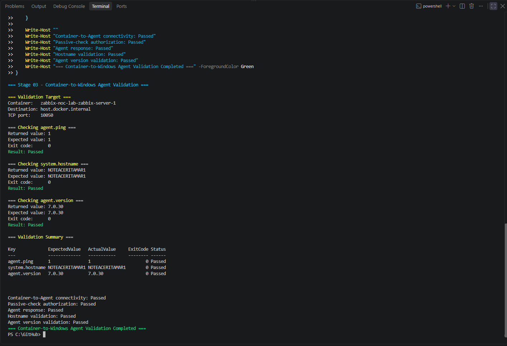
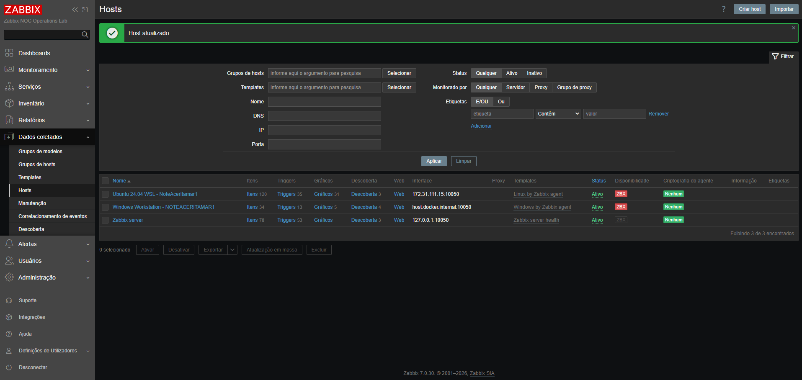
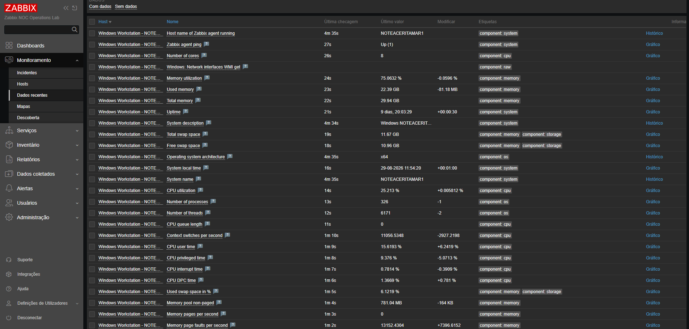
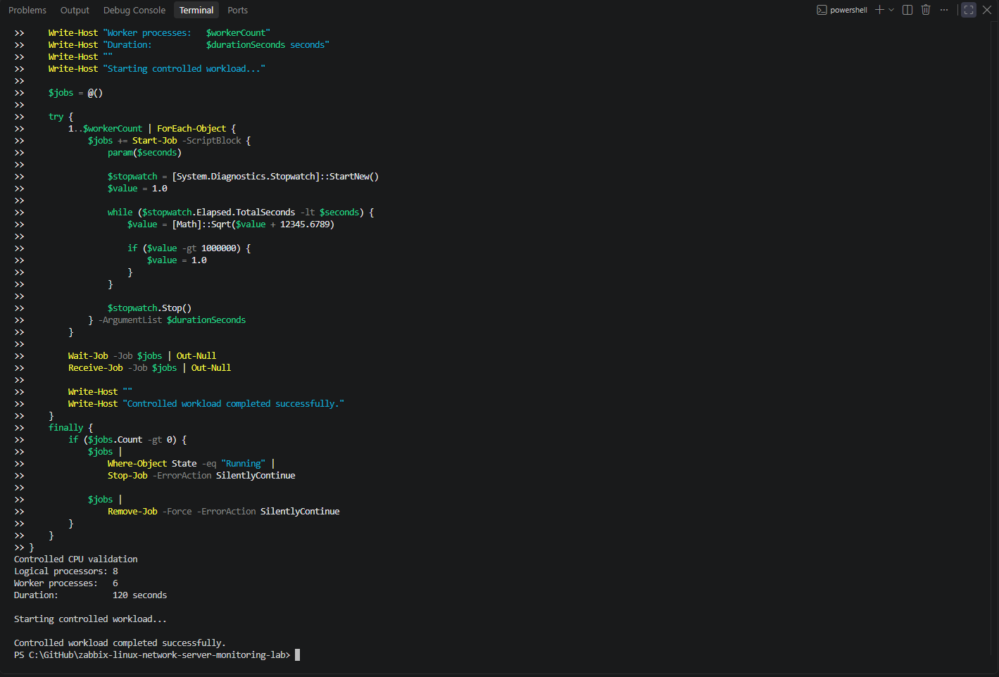
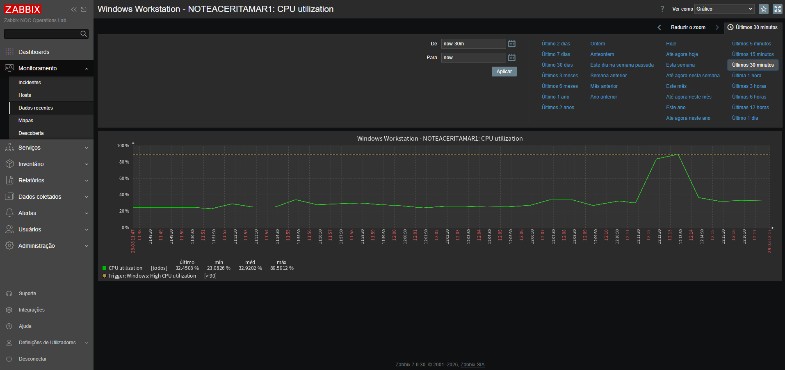

# Stage 03 - Windows Host Monitoring

## Overview

This stage introduces the first monitored Windows host into the Zabbix NOC Operations Lab.

The monitoring target is the Windows 11 Pro workstation that also hosts Docker Desktop, WSL 2, and the containerized Zabbix platform.

Zabbix Agent 2 is installed as a native Windows service and configured for passive checks initiated by the Zabbix Server container.

## Current Status

**Completed**

The following milestones are complete:

- Windows host baseline collected before Agent 2 installation;
- container-to-Windows IPv4 connectivity validated;
- preferred Docker-to-Windows destination identified;
- Docker network scope discovered and documented;
- official Zabbix Agent 2 package downloaded and verified;
- Zabbix Agent 2 installed as a Windows service;
- passive-check configuration applied and validated;
- restricted Windows Firewall rule created;
- TCP port `10050` listener validated;
- direct checks from the Zabbix Server container completed successfully;
- Windows host group created in the Zabbix frontend;
- Windows host registered with a DNS-based Agent interface;
- `Windows by Zabbix agent` template assigned;
- Agent availability and initial metric collection validated;
- low-level discovery populated Windows resources;
- controlled CPU activity generated and observed;
- CPU recovery after the controlled workload validated;
- final Stage 03 evidence selected and stored.

Stage 03 implementation and validation are complete.

## Baseline Environment

| Component | Validated value |
|---|---|
| Operating system | Microsoft Windows 11 Pro |
| Operating-system version | `10.0.26200` |
| Build number | `26200` |
| Architecture | 64-bit |
| Computer name | `NOTEACERITAMAR1` |
| Manufacturer | Acer |
| Model | Aspire A315-42G |
| Processor | AMD Ryzen 5 3500U with Radeon Vega Mobile Gfx |
| Logical processors | `8` |
| Physical memory | `29.94 GB` |
| PowerShell edition | Desktop |
| PowerShell version | `5.1.26100.9168` |
| Installed agent | Zabbix Agent 2 `7.0.30` |
| Agent port | `10050/TCP` |
| Check mode | Passive |

The workstation last boot time reported during the baseline was:

```text
19/08/2026 15:50:46
```

## Network Baseline

Two active IPv4 interfaces were identified:

| Interface | IPv4 address | Default gateway |
|---|---|---|
| `vEthernet (WSL (Hyper-V firewall))` | `172.31.96.1` | None |
| `Wi-Fi` | `192.168.0.179` | `192.168.0.1` |

The WSL virtual interface provides communication between Windows and the WSL environment.

The Wi-Fi interface provides local-network and internet connectivity.

## Docker-to-Windows IPv4 Validation

The Zabbix Server container was identified dynamically:

```powershell
$serverContainer = docker ps `
    --filter "label=com.docker.compose.service=zabbix-server" `
    --format "{{.Names}}" |
    Select-Object -First 1
```

The identified container was:

```text
zabbix-noc-lab-zabbix-server-1
```

Its runtime state was:

```text
running
```

### Docker internal host resolution

The Docker-managed host name was resolved from inside the Zabbix Server container:

```powershell
docker exec `
    $serverContainer `
    getent ahostsv4 host.docker.internal
```

Validated IPv4 result:

```text
192.168.65.254
```

The command completed with exit code `0`.

This result confirms that the container can resolve a Docker-managed IPv4 destination representing the Windows host.

### WSL virtual interface connectivity

The WSL virtual interface was tested from the Zabbix Server container:

```powershell
docker exec `
    $serverContainer `
    ping -c 2 172.31.96.1
```

Validated result:

```text
2 packets transmitted
2 packets received
0% packet loss
Average round-trip time: 2.557 ms
```

The command completed with exit code `0`.

### Wi-Fi interface connectivity

The Windows Wi-Fi interface was also tested:

```powershell
docker exec `
    $serverContainer `
    ping -c 2 192.168.0.179
```

Validated result:

```text
2 packets transmitted
2 packets received
0% packet loss
Average round-trip time: 2.683 ms
```

The command completed with exit code `0`.

## Selected Monitoring Destination

All three relevant paths were evaluated:

| Destination | Purpose | Result |
|---|---|:---:|
| `host.docker.internal` | Docker-managed Windows destination | Resolved to IPv4 |
| `172.31.96.1` | Windows WSL virtual interface | Reachable |
| `192.168.0.179` | Windows Wi-Fi interface | Reachable |

The preferred destination for container-initiated Agent 2 checks is:

```text
host.docker.internal
```

This name is preferable to a directly configured Wi-Fi or WSL address because Docker Desktop manages its resolution.

The Zabbix frontend can therefore use a DNS-based Agent interface instead of depending on the current physical or virtual IPv4 address.

TCP port `10050` was subsequently validated through this destination after Agent 2 installation and Windows Firewall configuration.

## Docker Network Scope Discovery

The Zabbix Server container is attached to two Docker bridge networks:

| Docker network | Container IPv4 | Prefix | Subnet | Gateway |
|---|---|:---:|:---:|:---:|
| `zabbix-noc-lab_backend` | `172.19.0.3` | `16` | `172.19.0.0/16` | `172.19.0.1` |
| `zabbix-noc-lab_monitoring` | `172.20.0.2` | `16` | `172.20.0.0/16` | `172.20.0.1` |

The container resolved the Docker-managed Windows destination as:

```text
host.docker.internal -> 192.168.65.254
```

The Windows Wi-Fi interface was using the `Public` network profile during discovery.

Docker Desktop may translate the source address while forwarding a connection from a Linux container to a Windows-hosted service. The passive-check authorization therefore includes only the observed local and Docker-related ranges:

```text
127.0.0.1,172.19.0.0/16,172.20.0.0/16,192.168.65.0/24
```

This is a controlled scope rather than unrestricted access. Successful direct checks confirmed that it supports the current Docker Desktop path, and it may be narrowed further if later source-address evidence permits.

### Network-scope evidence


The evidence records both Docker networks, the current Zabbix Server addresses, Docker-managed Windows resolution, the Windows network profile, and the absence of an existing TCP `10050` listener or Zabbix-specific firewall rule.

## Pre-installation State

The baseline inspection confirmed:

| Check | Result |
|---|:---:|
| Existing Zabbix Windows service | Not found |
| TCP port `10050` already in use | No |
| Zabbix-specific Windows Firewall rule | Not found |
| Zabbix Server container available | Yes |
| Zabbix Server container state | Running |
| `host.docker.internal` IPv4 resolution | Passed |
| WSL-interface ICMP connectivity | Passed |
| Wi-Fi-interface ICMP connectivity | Passed |
| Container-to-Windows IPv4 path | Passed |

Because no existing Zabbix service, listener, or firewall rule was found, the workstation was ready for a controlled Agent 2 installation without conflicting with an earlier installation.

## Official Agent 2 Package Verification

The official Windows Zabbix Agent 2 package was downloaded directly from the Zabbix content-delivery network:

```text
https://cdn.zabbix.com/zabbix/binaries/stable/7.0/7.0.30/zabbix_agent2-7.0.30-windows-amd64-openssl.msi
```

Validated package information:

| Property | Validated value |
|---|---|
| Product | Zabbix Agent 2 |
| Version | `7.0.30` |
| Platform | Windows AMD64 |
| TLS implementation | OpenSSL |
| Package type | MSI |
| File size | `18,305,024 bytes` (`17.46 MB`) |
| SHA-256 | `3BD05B4A2FF50179CB303CF84A834CF3736595C791884A14C0FB17907ABEEC16` |
| Authenticode status | Valid |
| Signer | Zabbix SIA |
| Certificate issuer | SSL.com Code Signing Intermediate CA RSA R1 |
| Certificate expiration | `11/05/2027 22:08:00` |

The verified signer subject was:

```text
CN=Zabbix SIA, O=Zabbix SIA, L=Riga, C=LV
```

The SHA-256 digest provides a reproducible identifier for the exact package used in this stage. The valid Authenticode signature confirms that Windows recognized the package as signed by Zabbix SIA and that the signed content passed integrity verification.

The package was only downloaded and inspected during this verification activity. Installation was performed later as a separate controlled change.

### Verification evidence


The evidence records the official download URL, package metadata, SHA-256 digest, valid Authenticode status, signer identity, and the explicit confirmation that installation had not yet occurred.

## Controlled Agent 2 Installation

The previously verified MSI was installed silently with Windows Installer after its SHA-256 digest was recalculated and matched against the recorded value.

Validated installation details:

| Property | Validated value |
|---|---|
| Product | Zabbix Agent 2 |
| Version | `7.0.30` |
| Installation directory | `C:\Program Files\Zabbix Agent 2` |
| Windows service | `Zabbix Agent 2` |
| Service state | Running |
| Configuration file | `C:\Program Files\Zabbix Agent 2\zabbix_agent2.conf` |
| Passive-check port | `10050/TCP` |
| Agent hostname | `NOTEACERITAMAR1` |
| Configuration validation | Passed |

Before changing the generated configuration, the original file was preserved as:

```text
C:\Program Files\Zabbix Agent 2\zabbix_agent2.conf.pre-stage03-20260828-234136.bak
```

The controlled passive-check configuration is:

```ini
Server=127.0.0.1,172.19.0.0/16,172.20.0.0/16,192.168.65.0/24
ServerActive=
Hostname=NOTEACERITAMAR1
ListenPort=10050
```

The Agent configuration test completed successfully with exit code `0` before the service was started.

## Windows Firewall Configuration

The installation created a dedicated inbound Windows Firewall rule:

| Property | Validated value |
|---|:---:|
| Display name | `Zabbix Agent 2 - Passive Checks` |
| Direction | Inbound |
| Action | Allow |
| Protocol | TCP |
| Local port | `10050` |
| Enabled | True |
| Profile | Any |

The permitted remote-address scope is restricted to:

```text
172.19.0.0/16
172.20.0.0/16
192.168.65.0/24
```

The rule does not permit arbitrary remote systems to initiate passive checks.

## Local Agent Validation

After configuration, the Windows service reached the `Running` state and opened TCP port `10050`.

The listener was reported on the IPv6 wildcard address, which also supports the required Windows socket behavior:

```text
State:        Listen
LocalAddress: ::
LocalPort:    10050
```

Local Agent checks returned:

| Check | Returned value | Exit code | Result |
|---|:---:|:---:|:---:|
| `agent.ping` | `1` | `0` | Passed |
| `system.hostname` | `NOTEACERITAMAR1` | `0` | Passed |
| Agent version | `7.0.30` | `0` | Passed |

## Container-to-Windows Agent Validation

Direct passive checks were initiated from the Zabbix Server container through the selected Docker-managed destination:

```text
host.docker.internal:10050
```

The validated results were:

| Item key | Expected value | Returned value | Exit code | Result |
|---|:---:|:---:|:---:|:---:|
| `agent.ping` | `1` | `1` | `0` | Passed |
| `system.hostname` | `NOTEACERITAMAR1` | `NOTEACERITAMAR1` | `0` | Passed |
| `agent.version` | `7.0.30` | `7.0.30` | `0` | Passed |

These results confirm that:

- Docker-to-Windows TCP connectivity is operational;
- the Windows Firewall rule permits the documented Docker source scope;
- the Agent accepts passive checks from the Zabbix Server container;
- the configured hostname matches the Windows monitoring target;
- the running Agent version matches the verified package.

### Service-validation evidence



The evidence records the three successful `zabbix_get` checks, expected and returned values, exit codes, and the final container-to-Windows validation result.

## Zabbix Frontend Registration

A dedicated host group was created for Windows monitoring targets:

```text
Windows servers
```

The Windows workstation was then registered in the Zabbix frontend with the following configuration:

| Property | Configured value |
|---|---|
| Host name | `NOTEACERITAMAR1` |
| Visible name | `Windows Workstation - NOTEACERITAMAR1` |
| Host group | `Windows servers` |
| Template | `Windows by Zabbix agent` |
| Interface type | Agent |
| Connect to | DNS |
| DNS name | `host.docker.internal` |
| Port | `10050` |
| Monitored by | Server |
| Status | Active |

The DNS-based interface preserves the Docker-managed Windows destination selected during network validation and avoids coupling the host configuration to the current Wi-Fi or WSL IPv4 address.

After the configuration was corrected from the initial IP selection to DNS, the frontend displayed the interface as:

```text
host.docker.internal:10050
```

The `ZBX` availability indicator became active, confirming successful Agent communication through the registered interface.

### Host-availability evidence



The evidence provides a directly recognizable Zabbix view of the registered Windows and Linux monitoring targets, their interfaces, assigned templates, active status, and Agent availability.

## Initial Discovery and Metric Collection

The `Windows by Zabbix agent` template initiated collection and low-level discovery after host registration.

The Windows host exposed `146` monitored values in the filtered latest-data view. The collected and discovered scope included:

- Agent availability and ping;
- host name and system description;
- operating-system architecture and local time;
- logical processor count and CPU utilization;
- CPU queue, user, privileged, interrupt, and DPC time;
- total and used physical memory;
- swap capacity and utilization;
- system uptime;
- process and thread counts;
- file systems and disk volumes;
- network interfaces;
- Windows services.

Representative validated values were:

| Item | Validated value |
|---|---:|
| Zabbix Agent ping | `Up (1)` |
| Agent host name | `NOTEACERITAMAR1` |
| System name | `NOTEACERITAMAR1` |
| Operating-system architecture | `x64` |
| Logical processors | `8` |
| Total memory | `29.94 GB` |
| Used memory | `22.39 GB` |
| Memory utilization | `75.0632%` |
| Uptime | `9 days, 20:03:29` |
| CPU utilization at capture time | `25.213%` |
| Running processes | `326` |
| Threads | `6171` |

The values had recent check timestamps and continued changing between collection cycles, confirming live metric ingestion rather than static configuration alone.

### Latest-data evidence



The evidence records the monitored host, item names, recent check times, current values, value changes, component tags, and links to history or graphs.

## Controlled CPU Validation

A non-administrative PowerShell workload generated controlled CPU activity without modifying system configuration or creating persistent files.

The workload used six background workers, representing approximately `75%` of the eight logical processors, for `120` seconds:

```powershell
& {
    $ErrorActionPreference = "Stop"

    $durationSeconds = 120
    $logicalProcessors = [Environment]::ProcessorCount
    $workerCount = [Math]::Max(
        1,
        [Math]::Ceiling($logicalProcessors * 0.75)
    )

    Write-Host "Controlled CPU validation"
    Write-Host "Logical processors: $logicalProcessors"
    Write-Host "Worker processes:   $workerCount"
    Write-Host "Duration:           $durationSeconds seconds"
    Write-Host ""
    Write-Host "Starting controlled workload..."

    $jobs = @()

    try {
        1..$workerCount | ForEach-Object {
            $jobs += Start-Job -ScriptBlock {
                param($seconds)

                $stopwatch = [System.Diagnostics.Stopwatch]::StartNew()
                $value = 1.0

                while ($stopwatch.Elapsed.TotalSeconds -lt $seconds) {
                    $value = [Math]::Sqrt($value + 12345.6789)

                    if ($value -gt 1000000) {
                        $value = 1.0
                    }
                }

                $stopwatch.Stop()
            } -ArgumentList $durationSeconds
        }

        Wait-Job -Job $jobs | Out-Null
        Receive-Job -Job $jobs | Out-Null

        Write-Host ""
        Write-Host "Controlled workload completed successfully."
    }
    finally {
        if ($jobs.Count -gt 0) {
            $jobs |
                Where-Object State -eq "Running" |
                Stop-Job -ErrorAction SilentlyContinue

            $jobs |
                Remove-Job -Force -ErrorAction SilentlyContinue
        }
    }
}
```

The workload completed successfully and cleaned up its background jobs.

### Controlled-workload evidence



The evidence records the logical processor count, selected worker count, duration, successful completion, and return to the PowerShell prompt.

### Monitoring response and recovery

Zabbix recorded the full resource-change cycle:

| Measurement | Observed value |
|---|---:|
| Normal range before the workload | Approximately `23%` to `34%` |
| Maximum CPU utilization | `89.5912%` |
| Template high-CPU threshold | Greater than `90%` |
| CPU utilization after workload recovery | `36.6596%` |

The workload approached but did not cross the template's high-CPU trigger threshold. This was intentional for Stage 03: the activity validated metric response and recovery without deliberately creating an incident. Trigger activation and incident handling remain part of later alerting and incident-response stages.

### CPU-response evidence



The graph shows the stable baseline, rapid utilization increase, recorded maximum, configured trigger threshold, workload termination, and return toward the pre-test range.

## Baseline Commands

The Windows baseline inspected:

- operating-system identity and version;
- computer manufacturer and model;
- processor and memory;
- PowerShell version;
- active IPv4 interfaces;
- existing Zabbix services;
- TCP port `10050`;
- Windows Firewall rules;
- Zabbix Server container availability;
- Docker resolution of `host.docker.internal`;
- container connectivity to the Windows virtual and physical interfaces.

The baseline and connectivity tests did not:

- install software;
- create or modify services;
- create firewall rules;
- open network ports;
- change the Zabbix configuration;
- modify Docker or WSL networking.

## Troubleshooting

### PowerShell rejected separate `else` blocks

During interactive execution, some `else` blocks returned:

```text
The term 'else' is not recognized as the name of a cmdlet,
function, script file, or operable program.
```

The preceding `if` blocks had already been submitted and executed before the corresponding `else` statements were pasted.

In PowerShell, `if` and `else` must be parsed as part of the same compound statement:

```powershell
if ($condition) {
    Write-Host "Condition is true."
}
else {
    Write-Host "Condition is false."
}
```

The syntax issue did not install software or change the workstation.

The absence of output from the completed `if` checks, together with the failed standalone `else` messages, indicated that:

- no Zabbix service was found;
- no TCP listener was found on port `10050`;
- no Zabbix-specific firewall rule was found.

Future interactive validation blocks will avoid separated `if` and `else` statements.

### The container did not include the `ip` utility

An attempt to display the container IPv4 routing table returned:

```text
exec: "ip": executable file not found in $PATH
```

The Zabbix Server container image does not include the `ip` command-line utility.

No package was installed inside the container because runtime containers should remain consistent with their declared image.

The missing diagnostic utility did not indicate a connectivity failure. IPv4 name resolution and ICMP tests subsequently completed successfully.

### Configuration continuation after an interrupted installation workflow

The MSI installation completed successfully, but the first configuration-editing function stopped when PowerShell attempted to bind configuration content containing empty lines to a mandatory string-array parameter.

The interruption occurred after installation and after the original configuration had been backed up, but before creation of the firewall rule or completion of service validation.

A state assessment confirmed the installed components, and the workflow continued without reinstalling the MSI. The corrected configuration routine preserved empty lines safely, removed conflicting key definitions, appended the controlled values, and validated the resulting configuration before starting the service.

This recovery avoided duplicating the installation and preserved the original configuration backup.

## Security Considerations

The Windows Agent 2 configuration follows these controls:

- use the official Zabbix package;
- validate the downloaded package before installation;
- authorize only the required monitoring source;
- avoid unrestricted passive-check access;
- create a narrowly scoped inbound firewall rule;
- avoid publishing credentials or private authentication material;
- preserve the original Agent 2 configuration before modification;
- review all diagnostic evidence before committing it.

The package-verification controls completed before installation were:

- download over HTTPS from the official Zabbix content-delivery domain;
- confirm the expected version, architecture, and package type;
- reject an empty download;
- calculate and record the SHA-256 digest;
- require a valid Windows Authenticode signature;
- confirm Zabbix SIA as the signing organization;
- stop before installation so that deployment remains a separate controlled change.

The Agent `Server` authorization is:

```text
127.0.0.1,172.19.0.0/16,172.20.0.0/16,192.168.65.0/24
```

The Windows Firewall rule uses the required Docker-related remote-address scope instead of allowing arbitrary remote systems. Successful direct checks confirmed that the current scope supports the Docker Desktop path without unrestricted access.

## Acceptance Criteria

| Criterion | Status |
|---|:---:|
| Windows host baseline collected | Passed |
| Existing Zabbix installation checked | Passed |
| TCP port `10050` availability checked | Passed |
| Existing firewall rules checked | Passed |
| Zabbix Server container identified | Passed |
| `host.docker.internal` IPv4 resolution validated | Passed |
| Container-to-WSL-interface connectivity validated | Passed |
| Container-to-Wi-Fi-interface connectivity validated | Passed |
| Container-to-Windows IPv4 connectivity validated | Passed |
| Docker backend network identified | Passed |
| Docker monitoring network identified | Passed |
| Initial passive-check authorization scope defined | Passed |
| Official Zabbix Agent 2 package obtained | Passed |
| Package SHA-256 recorded | Passed |
| Package Authenticode signature validated | Passed |
| Package signer identified as Zabbix SIA | Passed |
| Package authenticity validated | Passed |
| Zabbix Agent 2 installed | Passed |
| Windows service active | Passed |
| Passive-check configuration validated | Passed |
| Windows Firewall rule configured | Passed |
| TCP port `10050` listening | Passed |
| Direct passive checks succeed | Passed |
| Windows host group created | Passed |
| Windows host registered in Zabbix | Passed |
| DNS-based Agent interface configured | Passed |
| Windows template assigned | Passed |
| Agent availability confirmed | Passed |
| Initial item discovery completed | Passed |
| Initial metric collection confirmed | Passed |
| Controlled CPU activity completed | Passed |
| CPU response observed in Zabbix | Passed |
| Post-workload recovery confirmed | Passed |
| Final Stage 03 evidence selected | Passed |

## Current Result

The Windows workstation baseline, Docker-to-Windows IPv4 validation, Docker network-scope discovery, official Agent 2 package verification, controlled installation, direct passive-check validation, frontend registration, initial discovery, metric collection, controlled CPU validation, and recovery confirmation are complete.

The target is a 64-bit Windows 11 Pro system now running Zabbix Agent 2 `7.0.30` as a native Windows service.

The Zabbix Server container successfully:

- resolved `host.docker.internal` to `192.168.65.254`;
- reached the Windows WSL virtual interface at `172.31.96.1`;
- reached the Windows Wi-Fi interface at `192.168.0.179`;
- completed both ICMP tests without packet loss.

The preferred monitoring destination is `host.docker.internal`.

The Zabbix Server currently uses `172.19.0.3` on the backend network and `172.20.0.2` on the monitoring network. Agent authorization accounts for Docker Desktop address translation through `192.168.65.0/24` and local validation through `127.0.0.1`.

The official Zabbix Agent 2 `7.0.30` Windows AMD64 OpenSSL MSI was downloaded from the Zabbix content-delivery network. Its SHA-256 digest was recorded, and Windows reported a valid Authenticode signature from Zabbix SIA.

The original Agent configuration was preserved, the passive-check configuration passed validation, the restricted firewall rule was created, and TCP port `10050` is listening. Direct checks from the Zabbix Server container returned `1`, `NOTEACERITAMAR1`, and `7.0.30` for `agent.ping`, `system.hostname`, and `agent.version`, respectively.

The Windows host is registered in the `Windows servers` group as `Windows Workstation - NOTEACERITAMAR1`. It uses `host.docker.internal:10050` as its DNS-based Agent interface and the `Windows by Zabbix agent` template.

The frontend confirmed Agent availability and exposed `146` monitored values after initial discovery. Live data included Agent status, CPU, memory, swap, uptime, processes, threads, disks, file systems, network interfaces, and Windows services.

A controlled two-minute CPU workload used six of the workstation's eight logical processors. Zabbix recorded an increase from the normal range to `89.5912%` and then a decrease to `36.6596%` after the workload ended. The monitoring path remained available throughout the test.

Stage 03 acceptance criteria are satisfied.

## Next Steps

The next stage will introduce network, DNS, TCP, and HTTP service monitoring while preserving the validated Linux and Windows Agent monitoring paths.
