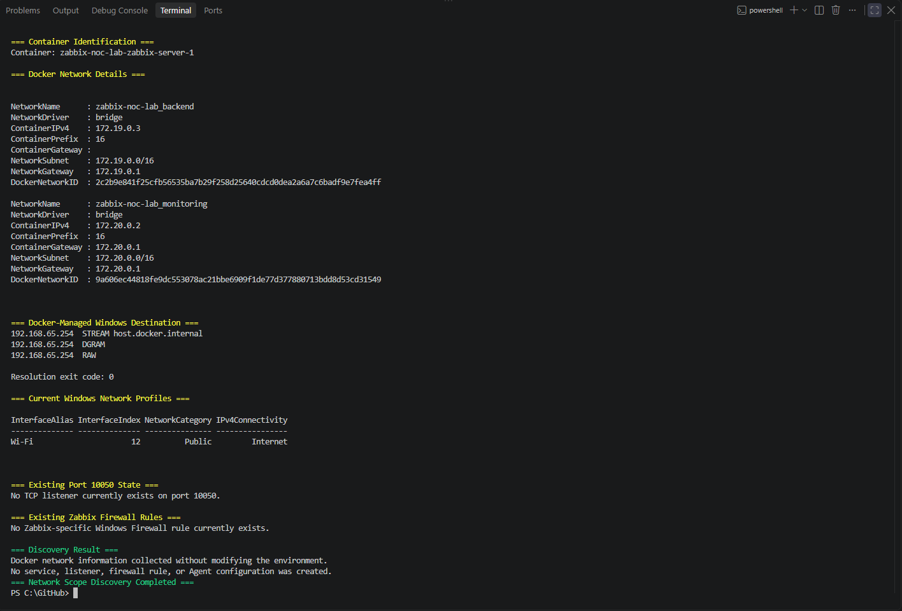
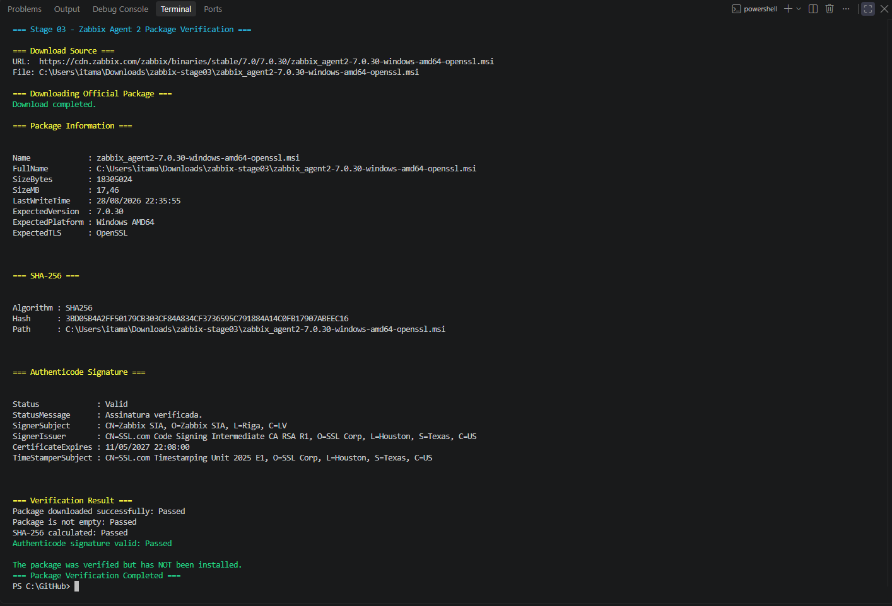

# Stage 03 - Windows Host Monitoring

## Overview

This stage introduces the first monitored Windows host into the Zabbix NOC Operations Lab.

The monitoring target is the Windows 11 Pro workstation that also hosts Docker Desktop, WSL 2, and the containerized Zabbix platform.

Zabbix Agent 2 will be installed as a native Windows service and initially configured for passive checks initiated by the Zabbix Server container.

## Current Status

**In progress**

The following milestones are complete:

- Windows host baseline collected before Agent 2 installation;
- container-to-Windows IPv4 connectivity validated;
- preferred Docker-to-Windows destination identified;
- Docker network scope discovered and documented;
- official Zabbix Agent 2 package downloaded and verified.

The following activities remain pending:

- install Zabbix Agent 2 as a Windows service;
- configure passive-check authorization;
- create the required Windows Firewall rule;
- validate TCP port `10050`;
- perform direct checks from the Zabbix Server container;
- register the Windows host in the Zabbix frontend;
- assign the Windows monitoring template;
- validate initial item discovery and data collection;
- generate controlled Windows resource or service activity;
- select and store meaningful technical evidence.

## Baseline Environment

| Component | Validated value |
|---|---|
| Operating system | Microsoft Windows 11 Pro |
| Operating-system version | `10.0.26200` |
| Build number | `26200` |
| Architecture | 64-bit |
| Computer name | `NOTEACERITAMAR1` |
| Manufacturer | Acer |
| Model | Aspire A315-42G |
| Processor | AMD Ryzen 5 3500U with Radeon Vega Mobile Gfx |
| Logical processors | `8` |
| Physical memory | `29.94 GB` |
| PowerShell edition | Desktop |
| PowerShell version | `5.1.26100.9168` |
| Planned agent | Zabbix Agent 2 |
| Planned agent port | `10050/TCP` |
| Planned check mode | Passive |

The workstation last boot time reported during the baseline was:

```text
19/08/2026 15:50:46
```

## Network Baseline

Two active IPv4 interfaces were identified:

| Interface | IPv4 address | Default gateway |
|---|---|---|
| `vEthernet (WSL (Hyper-V firewall))` | `172.31.96.1` | None |
| `Wi-Fi` | `192.168.0.179` | `192.168.0.1` |

The WSL virtual interface provides communication between Windows and the WSL environment.

The Wi-Fi interface provides local-network and internet connectivity.

## Docker-to-Windows IPv4 Validation

The Zabbix Server container was identified dynamically:

```powershell
$serverContainer = docker ps `
    --filter "label=com.docker.compose.service=zabbix-server" `
    --format "{{.Names}}" |
    Select-Object -First 1
```

The identified container was:

```text
zabbix-noc-lab-zabbix-server-1
```

Its runtime state was:

```text
running
```

### Docker internal host resolution

The Docker-managed host name was resolved from inside the Zabbix Server container:

```powershell
docker exec `
    $serverContainer `
    getent ahostsv4 host.docker.internal
```

Validated IPv4 result:

```text
192.168.65.254
```

The command completed with exit code `0`.

This result confirms that the container can resolve a Docker-managed IPv4 destination representing the Windows host.

### WSL virtual interface connectivity

The WSL virtual interface was tested from the Zabbix Server container:

```powershell
docker exec `
    $serverContainer `
    ping -c 2 172.31.96.1
```

Validated result:

```text
2 packets transmitted
2 packets received
0% packet loss
Average round-trip time: 2.557 ms
```

The command completed with exit code `0`.

### Wi-Fi interface connectivity

The Windows Wi-Fi interface was also tested:

```powershell
docker exec `
    $serverContainer `
    ping -c 2 192.168.0.179
```

Validated result:

```text
2 packets transmitted
2 packets received
0% packet loss
Average round-trip time: 2.683 ms
```

The command completed with exit code `0`.

## Selected Monitoring Destination

All three relevant paths were evaluated:

| Destination | Purpose | Result |
|---|---|:---:|
| `host.docker.internal` | Docker-managed Windows destination | Resolved to IPv4 |
| `172.31.96.1` | Windows WSL virtual interface | Reachable |
| `192.168.0.179` | Windows Wi-Fi interface | Reachable |

The preferred destination for container-initiated Agent 2 checks is:

```text
host.docker.internal
```

This name is preferable to a directly configured Wi-Fi or WSL address because Docker Desktop manages its resolution.

The Zabbix frontend can therefore use a DNS-based Agent interface instead of depending on the current physical or virtual IPv4 address.

TCP port `10050` will be tested through this destination after Agent 2 installation and Windows Firewall configuration.

## Docker Network Scope Discovery

The Zabbix Server container is attached to two Docker bridge networks:

| Docker network | Container IPv4 | Prefix | Subnet | Gateway |
|---|---|---:|---|---|
| `zabbix-noc-lab_backend` | `172.19.0.3` | `16` | `172.19.0.0/16` | `172.19.0.1` |
| `zabbix-noc-lab_monitoring` | `172.20.0.2` | `16` | `172.20.0.0/16` | `172.20.0.1` |

The container resolved the Docker-managed Windows destination as:

```text
host.docker.internal -> 192.168.65.254
```

The Windows Wi-Fi interface was using the `Public` network profile during discovery.

Docker Desktop may translate the source address while forwarding a connection from a Linux container to a Windows-hosted service. The initial passive-check authorization will therefore include only the observed local and Docker-related ranges:

```text
127.0.0.1,172.19.0.0/16,172.20.0.0/16,192.168.65.0/24
```

This is a controlled initial scope rather than unrestricted access. After the first successful direct check, the effective source address presented to Windows will be reviewed and the authorization may be narrowed further.

### Network-scope evidence



The evidence records both Docker networks, the current Zabbix Server addresses, Docker-managed Windows resolution, the Windows network profile, and the absence of an existing TCP `10050` listener or Zabbix-specific firewall rule.

## Pre-installation State

The baseline inspection confirmed:

| Check | Result |
|---|:---:|
| Existing Zabbix Windows service | Not found |
| TCP port `10050` already in use | No |
| Zabbix-specific Windows Firewall rule | Not found |
| Zabbix Server container available | Yes |
| Zabbix Server container state | Running |
| `host.docker.internal` IPv4 resolution | Passed |
| WSL-interface ICMP connectivity | Passed |
| Wi-Fi-interface ICMP connectivity | Passed |
| Container-to-Windows IPv4 path | Passed |

Because no existing Zabbix service, listener, or firewall rule was found, the workstation is ready for a controlled Agent 2 installation without conflicting with an earlier installation.

## Official Agent 2 Package Verification

The official Windows Zabbix Agent 2 package was downloaded directly from the Zabbix content-delivery network:

```text
https://cdn.zabbix.com/zabbix/binaries/stable/7.0/7.0.30/zabbix_agent2-7.0.30-windows-amd64-openssl.msi
```

Validated package information:

| Property | Validated value |
|---|---|
| Product | Zabbix Agent 2 |
| Version | `7.0.30` |
| Platform | Windows AMD64 |
| TLS implementation | OpenSSL |
| Package type | MSI |
| File size | `18,305,024 bytes` (`17.46 MB`) |
| SHA-256 | `3BD05B4A2FF50179CB303CF84A834CF3736595C791884A14C0FB17907ABEEC16` |
| Authenticode status | Valid |
| Signer | Zabbix SIA |
| Certificate issuer | SSL.com Code Signing Intermediate CA RSA R1 |
| Certificate expiration | `11/05/2027 22:08:00` |

The verified signer subject was:

```text
CN=Zabbix SIA, O=Zabbix SIA, L=Riga, C=LV
```

The SHA-256 digest provides a reproducible identifier for the exact package used in this stage. The valid Authenticode signature confirms that Windows recognized the package as signed by Zabbix SIA and that the signed content passed integrity verification.

The package was only downloaded and inspected. It was not executed or installed during this activity.

### Verification evidence



The evidence records the official download URL, package metadata, SHA-256 digest, valid Authenticode status, signer identity, and the explicit confirmation that installation had not yet occurred.

## Baseline Commands

The Windows baseline inspected:

- operating-system identity and version;
- computer manufacturer and model;
- processor and memory;
- PowerShell version;
- active IPv4 interfaces;
- existing Zabbix services;
- TCP port `10050`;
- Windows Firewall rules;
- Zabbix Server container availability;
- Docker resolution of `host.docker.internal`;
- container connectivity to the Windows virtual and physical interfaces.

The baseline and connectivity tests did not:

- install software;
- create or modify services;
- create firewall rules;
- open network ports;
- change the Zabbix configuration;
- modify Docker or WSL networking.

## Troubleshooting

### PowerShell rejected separate `else` blocks

During interactive execution, some `else` blocks returned:

```text
The term 'else' is not recognized as the name of a cmdlet,
function, script file, or operable program.
```

The preceding `if` blocks had already been submitted and executed before the corresponding `else` statements were pasted.

In PowerShell, `if` and `else` must be parsed as part of the same compound statement:

```powershell
if ($condition) {
    Write-Host "Condition is true."
}
else {
    Write-Host "Condition is false."
}
```

The syntax issue did not install software or change the workstation.

The absence of output from the completed `if` checks, together with the failed standalone `else` messages, indicated that:

- no Zabbix service was found;
- no TCP listener was found on port `10050`;
- no Zabbix-specific firewall rule was found.

Future interactive validation blocks will avoid separated `if` and `else` statements.

### The container did not include the `ip` utility

An attempt to display the container IPv4 routing table returned:

```text
exec: "ip": executable file not found in $PATH
```

The Zabbix Server container image does not include the `ip` command-line utility.

No package was installed inside the container because runtime containers should remain consistent with their declared image.

The missing diagnostic utility did not indicate a connectivity failure. IPv4 name resolution and ICMP tests subsequently completed successfully.

## Security Considerations

The Windows Agent 2 configuration will follow these controls:

- use the official Zabbix package;
- validate the downloaded package before installation;
- authorize only the required monitoring source;
- avoid unrestricted passive-check access;
- create a narrowly scoped inbound firewall rule;
- avoid publishing credentials or private authentication material;
- preserve the original Agent 2 configuration before later modifications;
- review all diagnostic evidence before committing it.

The package-verification controls completed before installation were:

- download over HTTPS from the official Zabbix content-delivery domain;
- confirm the expected version, architecture, and package type;
- reject an empty download;
- calculate and record the SHA-256 digest;
- require a valid Windows Authenticode signature;
- confirm Zabbix SIA as the signing organization;
- stop before installation so that deployment remains a separate controlled change.

The initial Agent `Server` authorization will be:

```text
127.0.0.1,172.19.0.0/16,172.20.0.0/16,192.168.65.0/24
```

The Windows Firewall rule will use the required Docker-related remote-address scope instead of allowing arbitrary remote systems. Its final scope will be validated after observing the effective source address used by Docker Desktop.

## Acceptance Criteria

| Criterion | Status |
|---|:---:|
| Windows host baseline collected | Passed |
| Existing Zabbix installation checked | Passed |
| TCP port `10050` availability checked | Passed |
| Existing firewall rules checked | Passed |
| Zabbix Server container identified | Passed |
| `host.docker.internal` IPv4 resolution validated | Passed |
| Container-to-WSL-interface connectivity validated | Passed |
| Container-to-Wi-Fi-interface connectivity validated | Passed |
| Container-to-Windows IPv4 connectivity validated | Passed |
| Docker backend network identified | Passed |
| Docker monitoring network identified | Passed |
| Initial passive-check authorization scope defined | Passed |
| Official Zabbix Agent 2 package obtained | Passed |
| Package SHA-256 recorded | Passed |
| Package Authenticode signature validated | Passed |
| Package signer identified as Zabbix SIA | Passed |
| Package authenticity validated | Passed |
| Zabbix Agent 2 installed | Pending |
| Windows service active | Pending |
| Passive-check configuration validated | Pending |
| Windows Firewall rule configured | Pending |
| TCP port `10050` listening | Pending |
| Direct passive checks succeed | Pending |
| Windows host registered in Zabbix | Pending |
| Windows template assigned | Pending |
| Initial item discovery completed | Pending |
| Initial metric collection confirmed | Pending |
| Controlled activity validated | Pending |
| Final Stage 03 evidence selected | Pending |

## Current Result

The Windows workstation baseline, Docker-to-Windows IPv4 validation, Docker network-scope discovery, and official Agent 2 package verification are complete.

The target is a 64-bit Windows 11 Pro system with no existing Zabbix service, no listener on TCP port `10050`, and no Zabbix-specific Windows Firewall rule.

The Zabbix Server container successfully:

- resolved `host.docker.internal` to `192.168.65.254`;
- reached the Windows WSL virtual interface at `172.31.96.1`;
- reached the Windows Wi-Fi interface at `192.168.0.179`;
- completed both ICMP tests without packet loss.

The preferred monitoring destination is `host.docker.internal`.

The Zabbix Server currently uses `172.19.0.3` on the backend network and `172.20.0.2` on the monitoring network. The initial Agent authorization will also account for Docker Desktop address translation through `192.168.65.0/24` and local validation through `127.0.0.1`.

The official Zabbix Agent 2 `7.0.30` Windows AMD64 OpenSSL MSI was downloaded from the Zabbix content-delivery network. Its SHA-256 digest was recorded, and Windows reported a valid Authenticode signature from Zabbix SIA.

No Agent installation, service creation, firewall modification, or Zabbix host registration has been performed during Stage 03.

## Next Steps

The next activity will install Zabbix Agent 2 as a Windows service with the documented initial passive-check authorization. The service, configuration, firewall rule, TCP listener, and direct checks will then be validated before the scope is finalized.
