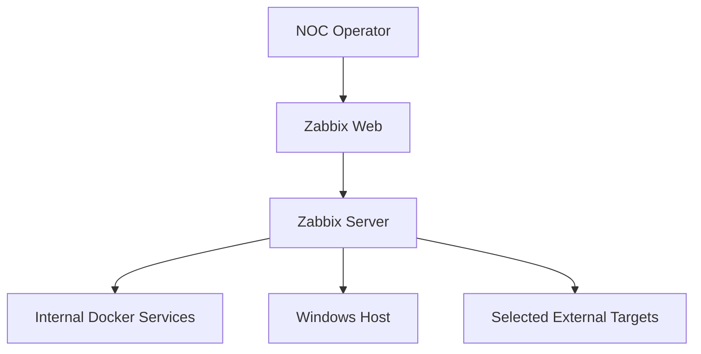
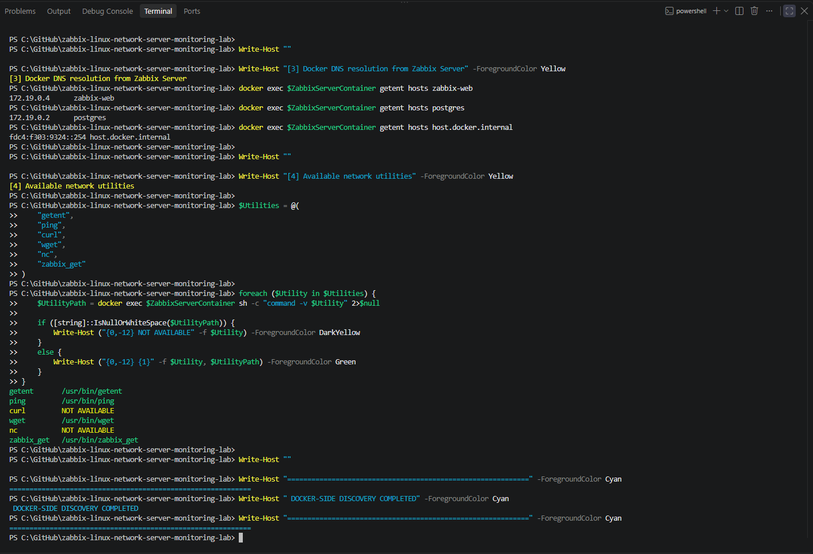
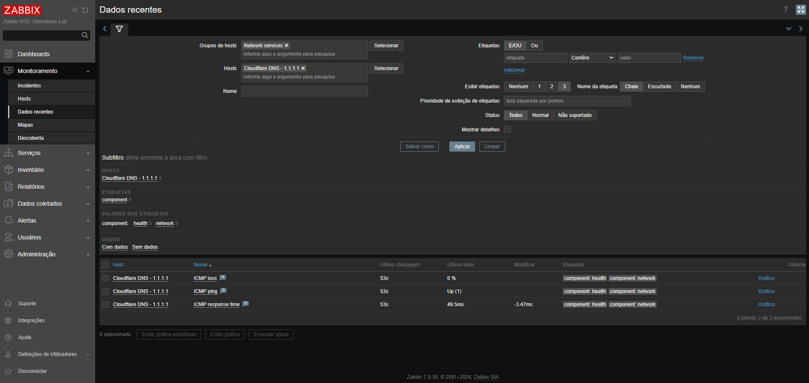
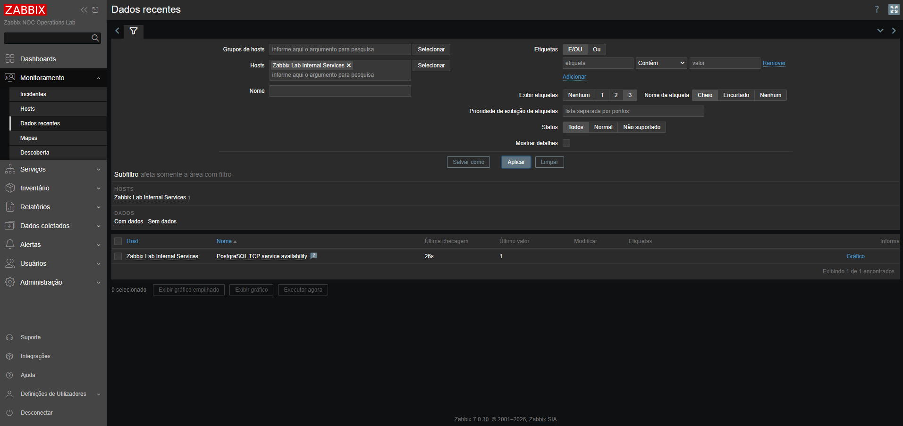
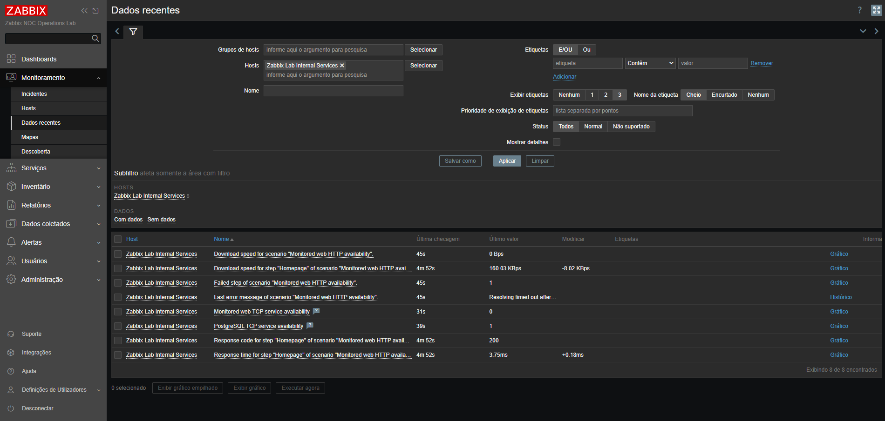
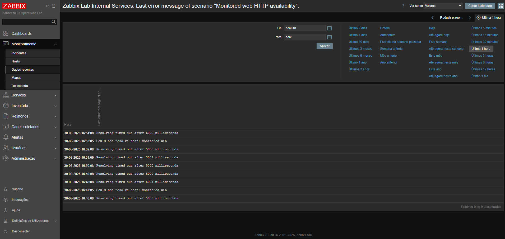
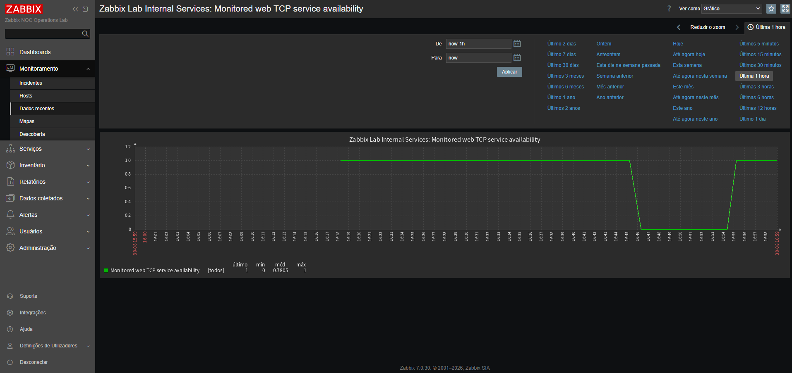
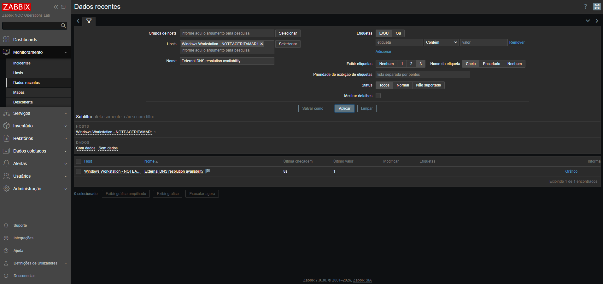

# Stage 04 - Network, DNS, TCP, and HTTP Service Monitoring

## Objective

This stage introduces network and service monitoring through native Zabbix checks performed by the Zabbix Server and Zabbix Agent 2.

The implementation validates:

- ICMP reachability;
- ICMP response time and packet loss;
- DNS resolution;
- TCP service availability;
- HTTP service availability;
- HTTP response codes;
- HTTP response time;
- controlled service failure;
- monitoring-state changes during failure and recovery.

The stage extends the host-level monitoring completed in Stages 02 and 03 with service-oriented availability checks commonly performed by Network Operations Center teams.

## Current Status

Stage 04 is complete.

The connectivity baselines and the native ICMP, DNS, TCP, and HTTP monitoring activities have been completed.

The implementation currently confirms:

- local Zabbix Web availability on TCP port `8080`;
- local Zabbix Server availability on TCP port `10051`;
- local Windows Agent 2 availability on TCP port `10050`;
- successful HTTP response from the local Zabbix frontend;
- functional public DNS resolution;
- functional local and external ICMP connectivity;
- Docker DNS resolution from the Zabbix Server container;
- access to internal Docker services through stable service names;
- ICMP availability, packet-loss, and response-time collection for `1.1.1.1`;
- external DNS resolution monitoring from the Windows host through Cloudflare DNS;
- TCP availability monitoring for PostgreSQL and the dedicated HTTP target;
- HTTP availability, response-code, response-time, and download-speed collection;
- controlled HTTP service interruption;
- monitoring-state changes during failure;
- successful service recovery with a recorded `1 -> 0 -> 1` TCP transition;
- preservation of PostgreSQL and the Zabbix platform throughout the controlled failure;
- storage of the selected validation, failure, and recovery evidence.

## Monitoring Architecture



The Zabbix Server performs the agentless ICMP, TCP, and HTTP checks. Zabbix Agent 2 on the Windows host performs the dedicated external DNS query.

Internal services are addressed through Docker DNS names rather than transient container IP addresses.

## Monitoring Targets

| Monitoring area | Target | Validation purpose | Status |
|---|---|---|:---:|
| ICMP | `1.1.1.1` | External reachability without DNS dependency | Completed |
| ICMP packet loss | `1.1.1.1` | Packet-loss collection | Completed |
| ICMP response time | `1.1.1.1` | Latency collection | Completed |
| Internal DNS | `monitored-web` | Dedicated Docker service-name resolution | Baseline completed |
| Internal TCP | `postgres:5432` | PostgreSQL service-port availability | Completed |
| Internal TCP | `monitored-web:80` | Dedicated HTTP target port availability | Completed |
| Internal HTTP | `http://monitored-web/` | HTTP content, status-code, and response-time validation | Completed |
| External DNS | `1.1.1.1` resolving `example.com` | Dedicated DNS resolution availability | Completed |

## Windows-Side Connectivity Baseline

The initial baseline was executed from the Windows workstation.

### TCP results

| Service | Destination | Result |
|---|---|:---:|
| Zabbix Web | `127.0.0.1:8080` | Reachable |
| Zabbix Server | `127.0.0.1:10051` | Reachable |
| Windows Agent 2 | `127.0.0.1:10050` | Reachable |

### HTTP result

The local Zabbix frontend returned:

```text
URL=http://127.0.0.1:8080/
StatusCode=200
ContentLength=5224
```

This result confirmed that the published frontend port was available and serving HTTP content before native Zabbix web monitoring was configured.

### Public DNS results

Public name resolution succeeded for:

- `example.com`;
- `cloudflare.com`.

The Windows host did not resolve `host.docker.internal` during this test. This result does not indicate a monitoring failure because the name is intended primarily for container-to-host communication.

Resolution was subsequently confirmed from the Zabbix Server container.

### ICMP results

| Target | Result |
|---|:---:|
| `127.0.0.1` | Reachable |
| `1.1.1.1` | Reachable |
| `example.com` | Reachable |

The results confirmed local and external ICMP connectivity before monitoring-item creation.

## Docker-Side Connectivity Discovery

The active Zabbix Server container was identified as:

```text
zabbix-noc-lab-zabbix-server-1
```

### Network attachments

| Docker network | Zabbix Server address |
|---|:---:|
| `zabbix-noc-lab_backend` | `172.19.0.3` |
| `zabbix-noc-lab_monitoring` | `172.20.0.2` |

The dual-network attachment allows the Zabbix Server to communicate with platform services through the backend network and monitored systems through the monitoring network.

The addresses document the discovery-time state only. Monitoring configuration uses DNS names whenever possible instead of depending on these transient addresses.

### Docker DNS resolution

The Zabbix Server successfully resolved:

```text
zabbix-web           -> 172.19.0.4
postgres             -> 172.19.0.2
host.docker.internal -> fdc4:f303:9324::254
monitored-web        -> 172.20.0.3
```

This validation confirms that the server can address:

- the Zabbix frontend;
- the PostgreSQL service;
- the Windows host;
- the dedicated monitored HTTP service;
- through stable names available within its runtime environment.

## Available Diagnostic Utilities

The Zabbix Server image contains the following utilities:

| Utility | Availability | Purpose |
|:---:|:---:|---|
| `getent` | Available | DNS and name-resolution validation |
| `ping` | Available | ICMP connectivity validation |
| `wget` | Available | Complementary HTTP validation |
| `zabbix_get` | Available | Direct Zabbix Agent checks |
| `curl` | Not available | Not required for native Zabbix monitoring |
| `nc` | Not available | Not required for native Zabbix monitoring |

The absence of `curl` and `nc` did not block the stage. Zabbix simple checks and web scenarios provided native TCP and HTTP monitoring.

## Native Monitoring Implementation

### ICMP monitoring

The host `Cloudflare DNS - 1.1.1.1` was created in the `Network services` host group and linked to the `ICMP Ping` template.

The template collects:

- ICMP availability;
- ICMP packet loss;
- ICMP response time.

Normal-state validation confirmed:

- availability value `1`;
- packet loss of `0%`;
- response-time collection in milliseconds.

### External DNS resolution monitoring

The item `External DNS resolution availability` was created on the host `Windows Workstation - NOTEACERITAMAR1` and collected through Zabbix Agent 2.

| Setting | Value |
|---|:---:|
| Item type | Zabbix agent |
| Key | `net.dns[1.1.1.1,example.com,A,2,1,udp]` |
| DNS server | `1.1.1.1` |
| Query name | `example.com` |
| Record type | `A` |
| Transport | UDP |
| Update interval | `1m` |
| Normal value | `1` |

The item validates whether Cloudflare DNS can resolve the requested A record from the monitored Windows host. The direct item test returned `1`, and subsequent scheduled collections remained at `1`, confirming repeatable DNS resolution availability.

### Internal TCP monitoring

The host `Zabbix Lab Internal Services` was created to represent services reached directly from the Zabbix Server through Docker networking.

The following simple checks were configured:

| Item | Key | Normal value |
|---|---|:---:|
| PostgreSQL TCP service availability | `net.tcp.service[tcp,postgres,5432]` | `1` |
| Monitored web TCP service availability | `net.tcp.service[tcp,monitored-web,80]` | `1` |

The PostgreSQL item confirms database-port reachability without interrupting or modifying the database used by Zabbix.

### Dedicated HTTP monitoring target

A dedicated Nginx service named `monitored-web` was added to the Docker Compose environment.

The service:

- uses the `nginx:1.28.0-alpine` image;
- connects only to the monitoring network;
- exposes TCP port `80` internally;
- includes a container health check;
- is not published directly to the Windows host;
- can be safely stopped without affecting Zabbix or PostgreSQL.

Docker DNS and HTTP connectivity were validated from the Zabbix Server container before the native checks were created.

### HTTP web scenario

The web scenario `Monitored web HTTP availability` contains one step named `Homepage`.

| Setting | Value |
|---|:---:|
| URL | `http://monitored-web/` |
| Update interval | `1m` |
| Attempts | `1` |
| Timeout | `5s` |
| Required text | `Welcome to nginx!` |
| Required HTTP status | `200` |

The scenario collects:

- scenario download speed;
- step download speed;
- failed-step status;
- last error message;
- HTTP response code;
- HTTP response time.

Normal-state collection confirmed failed step `0`, HTTP response code `200`, TCP availability `1`, and active response-time and download-speed metrics.

## Controlled Failure and Recovery

The dedicated HTTP target was stopped with Docker Compose while the Zabbix Server, Zabbix Web, PostgreSQL, Linux host, and Windows host remained operational.

The controlled failure produced the following monitoring changes:

| Signal | Normal state | Failure state | Recovered state |
|---|:---:|:---:|:---:|
| Monitored web TCP availability | `1` | `0` | `1` |
| Failed web-scenario step | `0` | `1` | `0` |
| Scenario download speed | Collected | `0 Bps` | Collected |
| HTTP response code | `200` | No new successful response | `200` |
| PostgreSQL TCP availability | `1` | `1` | `1` |

During the outage, the web scenario recorded messages including:

```text
Could not resolve host: monitored-web
Resolving timed out after 5000 milliseconds
```

This behavior is expected because a stopped Compose container is disconnected from its Docker network and its service name is temporarily removed from Docker DNS.

After `monitored-web` was started again, Docker DNS registration returned, the HTTP scenario resumed successful collection, and the TCP graph recorded the complete `1 -> 0 -> 1` transition.

The last-error item preserves the most recent recorded error after recovery. Recovery is therefore confirmed by the failed-step value returning to `0`, TCP availability returning to `1`, HTTP status `200`, and resumed response-time and download-speed collection.

## Monitoring Strategy

Stage 04 uses native Zabbix capabilities wherever possible.

| Requirement | Zabbix method | Status |
|---|---|:---:|
| ICMP availability | ICMP Ping template | Completed |
| Packet loss | `icmppingloss` | Completed |
| Response time | `icmppingsec` | Completed |
| DNS resolution | Zabbix Agent 2 `net.dns` item | Completed |
| TCP service availability | `net.tcp.service` | Completed |
| HTTP availability | Web scenario | Completed |
| HTTP response code | Web scenario response-code validation | Completed |
| HTTP response time | Web scenario response-time metric | Completed |
| Failure validation | Controlled `monitored-web` interruption | Completed |
| Recovery validation | Service restoration and metric confirmation | Completed |

Triggers, severities, acknowledgment, and complete incident handling remain primarily within Stages 05 and 06. Stage 04 records the availability-state changes required to validate the monitoring items.

## Troubleshooting Notes

### Missing operational environment file

Docker Compose initially rejected the new service because the operational `.env` file was absent. The file is intentionally excluded from Git and was therefore not restored through repository synchronization.

The operational file was reconstructed from `.env.example`. The existing PostgreSQL password was retrieved from the running PostgreSQL container without being printed, and the reconstructed `.env` remained excluded by `.gitignore`.

Validation then succeeded with:

```text
docker compose --env-file .env config --quiet
```

### Diagnostic utility limitations

The Zabbix Server image does not include `curl` or `nc`. Native Zabbix simple checks and web scenarios were used for monitoring, while `wget`, `getent`, and `ping` remained available for complementary validation.

### Controlled failure isolation

PostgreSQL was not selected as the failure target because it stores the Zabbix database. The isolated `monitored-web` service allowed the failure and recovery workflow to be tested without compromising the monitoring platform.

## Evidence

### Docker connectivity and utility discovery



The evidence confirms internal Docker DNS resolution and identifies the diagnostic utilities available inside the Zabbix Server container.

### ICMP latest-data validation



The evidence confirms ICMP availability, zero packet loss, and response-time collection for the external target.

### PostgreSQL TCP availability



The evidence confirms successful TCP service monitoring for PostgreSQL through the internal Docker backend network.

### HTTP latest-data validation


The evidence confirms normal-state HTTP status, failed-step, response-time, download-speed, and TCP availability collection.

### Controlled HTTP failure



The evidence confirms TCP availability `0`, failed step `1`, scenario download speed `0 Bps`, and preserved PostgreSQL availability.

### HTTP failure error history



The evidence records the Docker DNS resolution failures observed while the dedicated target was stopped.

### Controlled HTTP failure recovery



The graph confirms the full TCP availability transition from normal operation to failure and back to normal operation.

### External DNS resolution validation



The evidence confirms repeated successful DNS resolution collections with value `1` from the monitored Windows host.

## Acceptance Criteria

Stage 04 is complete because:

- [x] Windows-side connectivity baseline is completed;
- [x] Zabbix Server network attachments are identified;
- [x] internal Docker DNS resolution is validated;
- [x] available diagnostic utilities are identified;
- [x] ICMP availability monitoring is configured;
- [x] packet-loss and response-time metrics are collected;
- [x] dedicated DNS resolution monitoring is configured;
- [x] TCP service monitoring is configured;
- [x] HTTP availability monitoring is configured;
- [x] HTTP response-code validation is configured;
- [x] HTTP response-time data is collected;
- [x] a controlled service failure is performed;
- [x] monitoring changes during failure are validated;
- [x] service recovery is confirmed;
- [x] selected Stage 04 evidence is stored;
- [x] final troubleshooting notes and results are documented.

## Next Steps

Stage 05 will introduce triggers, severity classification, incident visibility, acknowledgment, and operational response workflows based on the monitoring signals established in this stage.
