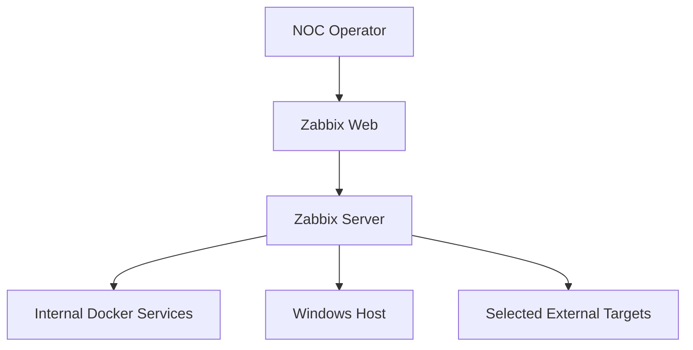

# Stage 04 - Network, DNS, TCP, and HTTP Service Monitoring

## Objective

This stage introduces agentless network and service monitoring through the Zabbix Server.

The implementation will validate:

- ICMP reachability;
- ICMP response time and packet loss;
- DNS resolution;
- TCP service availability;
- HTTP service availability;
- HTTP response codes;
- HTTP response time;
- controlled service failure;
- monitoring-state changes during failure and recovery.

The stage extends the host-level monitoring completed in Stages 02 and 03 with service-oriented availability checks commonly performed by Network Operations Center teams.

## Current Status

Stage 04 is in progress.

The initial Windows-side and Docker-side connectivity baselines have been completed.

The baseline confirmed:

- local Zabbix Web availability on TCP port `8080`;
- local Zabbix Server availability on TCP port `10051`;
- local Windows Agent 2 availability on TCP port `10050`;
- successful HTTP response from the local Zabbix frontend;
- functional public DNS resolution;
- functional local and external ICMP connectivity;
- Docker DNS resolution from the Zabbix Server container;
- access to internal Docker services through stable service names;
- availability of the utilities required for complementary diagnostics.

Monitoring items, web scenarios, failure simulations, recovery validation, and final evidence remain to be implemented.

## Monitoring Architecture



The Zabbix Server performs the agentless network and service checks.

Internal services are addressed through Docker DNS names rather than transient container IP addresses.

## Initial Monitoring Targets

| Monitoring area | Initial target | Validation purpose |
|---|---|---|
| ICMP | `1.1.1.1` | External IP reachability without DNS dependency |
| ICMP and DNS | `example.com` | Name resolution and external reachability |
| Internal DNS | `zabbix-web` | Docker service-name resolution |
| Internal TCP | `postgres:5432` | Database service-port availability |
| Windows TCP | `host.docker.internal:10050` | Windows Agent 2 service availability |
| Internal HTTP | `http://zabbix-web:8080/` | Zabbix frontend availability and response validation |
| Local HTTP | `http://127.0.0.1:8080/` | Windows-side frontend validation |

The final target set may be adjusted after native Zabbix item and web-scenario validation.

## Windows-Side Connectivity Baseline

The initial baseline was executed from the Windows workstation.

### TCP results

| Service | Destination | Result |
|---|---|:---:|
| Zabbix Web | `127.0.0.1:8080` | Reachable |
| Zabbix Server | `127.0.0.1:10051` | Reachable |
| Windows Agent 2 | `127.0.0.1:10050` | Reachable |

### HTTP result

The local Zabbix frontend returned:

```text
URL=http://127.0.0.1:8080/
StatusCode=200
ContentLength=5224
```

This result confirmed that the published frontend port was available and serving HTTP content before native Zabbix web monitoring was configured.

### Public DNS results

Public name resolution succeeded for:

- `example.com`;
- `cloudflare.com`.

The Windows host did not resolve `host.docker.internal` during this test. This result does not indicate a monitoring failure because the name is intended primarily for container-to-host communication.

Resolution was subsequently confirmed from the Zabbix Server container.

### ICMP results

| Target | Result |
|---|:---:|
| `127.0.0.1` | Reachable |
| `1.1.1.1` | Reachable |
| `example.com` | Reachable |

The results confirmed local and external ICMP connectivity before monitoring-item creation.

## Docker-Side Connectivity Discovery

The active Zabbix Server container was identified as:

```text
zabbix-noc-lab-zabbix-server-1
```

### Network attachments

| Docker network | Zabbix Server address |
|---|---|
| `zabbix-noc-lab_backend` | `172.19.0.3` |
| `zabbix-noc-lab_monitoring` | `172.20.0.2` |

The dual-network attachment allows the Zabbix Server to communicate with platform services through the backend network and monitored systems through the monitoring network.

The addresses document the discovery-time state only. Monitoring configuration will use DNS names whenever possible instead of depending on these transient addresses.

### Docker DNS resolution

The Zabbix Server successfully resolved:

```text
zabbix-web           -> 172.19.0.4
postgres             -> 172.19.0.2
host.docker.internal -> fdc4:f303:9324::254
```

This validation confirms that the server can address:

- the Zabbix frontend;
- the PostgreSQL service;
- the Windows host;
- through stable names available within its runtime environment.

## Available Diagnostic Utilities

The Zabbix Server image contains the following utilities:

| Utility | Availability | Purpose |
|---|:---:|---|
| `getent` | Available | DNS and name-resolution validation |
| `ping` | Available | ICMP connectivity validation |
| `wget` | Available | Complementary HTTP validation |
| `zabbix_get` | Available | Direct Zabbix Agent checks |
| `curl` | Not available | Not required for native Zabbix monitoring |
| `nc` | Not available | Not required for native Zabbix monitoring |

The absence of `curl` and `nc` does not block the stage. Zabbix simple checks and web scenarios will provide native TCP and HTTP monitoring.

## Monitoring Strategy

Stage 04 will use native Zabbix capabilities wherever possible.

Planned methods include:

| Requirement | Zabbix method |
|---|---|
| ICMP availability | ICMP simple check or ICMP Ping template |
| Packet loss | `icmppingloss` |
| Response time | `icmppingsec` |
| DNS resolution | `net.dns` or equivalent native check |
| TCP service availability | `net.tcp.service` |
| HTTP availability | HTTP service check or web scenario |
| HTTP response code | Web scenario response-code validation |
| HTTP response time | Web scenario response-time metric |
| Failure validation | Controlled target-service interruption |
| Recovery validation | Service restoration and metric confirmation |

Triggers, severities, acknowledgment, and complete incident handling remain primarily within Stages 05 and 06. Stage 04 may still observe availability-state changes required to validate the monitoring items.

## Evidence

### Docker connectivity and utility discovery


The evidence confirms internal Docker DNS resolution and identifies the diagnostic utilities available inside the Zabbix Server container.

Additional evidence will be selected after native Zabbix checks begin collecting data.

## Acceptance Criteria

Stage 04 will be considered complete when:

- [x] Windows-side connectivity baseline is completed;
- [x] Zabbix Server network attachments are identified;
- [x] internal Docker DNS resolution is validated;
- [x] available diagnostic utilities are identified;
- [ ] ICMP availability monitoring is configured;
- [ ] packet-loss and response-time metrics are collected;
- [ ] DNS resolution monitoring is configured;
- [ ] TCP service monitoring is configured;
- [ ] HTTP availability monitoring is configured;
- [ ] HTTP response-code validation is configured;
- [ ] HTTP response-time data is collected;
- [ ] a controlled service failure is performed;
- [ ] monitoring changes during failure are validated;
- [ ] service recovery is confirmed;
- [ ] selected Stage 04 evidence is stored;
- [ ] final troubleshooting notes and results are documented.

## Next Steps

The next activity will create the first native Zabbix network-monitoring target and validate ICMP availability, packet loss, and response-time collection.
