# Stage 05 - Triggers, Severities, Events, and Alert Handling

[Back to the main README](../../README.md)

## Objective

This stage introduces trigger configuration, severity classification, event generation, problem acknowledgment, operator notes, controlled recovery, and initial alert-handling workflows.

The implementation uses monitoring signals established in the previous stages to reproduce common Network Operations Center activities:

- converting monitoring data into actionable alerts;
- reducing false positives through sustained-condition expressions;
- assigning operational severity according to service impact;
- identifying active problems in the Zabbix frontend;
- acknowledging incidents;
- recording operator findings and decisions;
- validating automatic recovery;
- preserving event history after service restoration.

Two monitored conditions were selected:

1. HTTP availability for the dedicated `monitored-web` container;
2. external DNS resolution from the Windows workstation.

These tests demonstrate different severity levels and validate the complete lifecycle from normal monitoring through problem detection and recovery.

---

## Current Status

Stage 05 is complete.

The laboratory successfully validated:

- an HTTP availability trigger with **High** severity;
- a DNS resolution trigger with **Average** severity;
- sustained failure conditions;
- controlled fault injection;
- automatic problem generation;
- host and service identification;
- problem acknowledgment;
- operator investigation notes;
- recovery actions;
- automatic event resolution;
- preservation of event history;
- practical troubleshooting when the initial DNS fault-injection method did not affect the monitored item.

---

## Laboratory Scope

| Component | Role in this stage |
|:---:|---|
| Zabbix Server | Evaluates collected values and trigger expressions |
| Zabbix Web | Displays triggers, incidents, acknowledgments, and history |
| PostgreSQL | Stores Zabbix configuration and monitoring history |
| `monitored-web` | Dedicated HTTP target used for controlled interruption |
| Windows Workstation | Executes Zabbix Agent 2 checks, including DNS resolution |
| Zabbix Agent 2 | Collects the external DNS resolution result |
| Docker Compose | Controls the isolated HTTP service lifecycle |

The controlled tests were designed to avoid interrupting the Zabbix platform itself.

---

## Alert Lifecycle

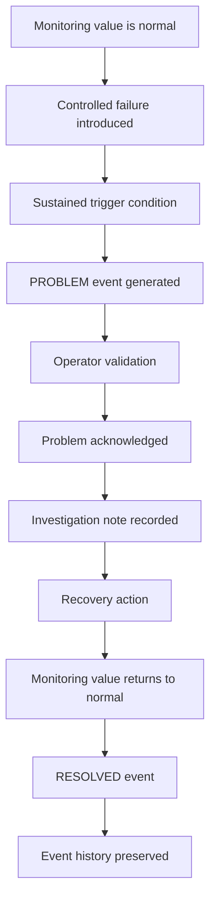

The objective is not only to display a problem. The stage demonstrates the complete operational lifecycle from detection through recovery.

---

## Severity Model

The laboratory uses the Zabbix severity levels according to expected operational impact.

| Severity | Intended use |
|:---:|---|
| Not classified | Conditions without an established operational classification |
| Information | Informational state changes that do not require immediate action |
| Warning | Degraded behavior or an early indication of possible impact |
| Average | A relevant problem with limited or moderate operational impact |
| High | Service unavailability or a significant condition requiring prompt investigation |
| Disaster | Critical platform or infrastructure failure with extensive impact |

Two severities were explicitly demonstrated during this stage:

| Trigger | Severity | Operational reasoning |
|---|:---:|---|
| HTTP service unavailable | High | Represents direct unavailability of the dedicated monitored service |
| External DNS resolution unavailable | Average | Represents loss of one external dependency while the workstation and monitoring platform remain operational |

---

# Part 1 - HTTP Service Trigger

## Monitored Item

The HTTP trigger uses the TCP service-availability item created for the dedicated target:

```text
net.tcp.service[tcp,monitored-web,80]
```

Expected values:

| Value | Meaning |
|:---:|---|
| `1` | TCP service is reachable |
| `0` | TCP service is unavailable |

The target is resolved through the internal Docker network.

---

## HTTP Trigger Configuration

| Field | Configuration |
|---|---|
| Trigger name | `Monitored web service is unavailable` |
| Event name | `HTTP service unavailable on monitored-web` |
| Host | `Zabbix Lab Internal Services` |
| Technical host name | `Internal Services - Zabbix Lab` |
| Severity | High |
| Problem generation mode | Single |
| OK event generation | Expression |
| Status | Enabled |

Operational data:

```text
Current TCP availability: {ITEM.LASTVALUE1}
```

Trigger expression:

```text
max(/Internal Services - Zabbix Lab/net.tcp.service[tcp,monitored-web,80],2m)=0
```

The expression requires the item to remain unavailable during the evaluated two-minute window. This reduces the risk of generating an incident from a brief transient failure.

Description:

```text
The dedicated monitored HTTP service is unavailable on TCP port 80. Validate Docker service state, internal DNS resolution, container health, and network connectivity before escalation.
```

---

## Initial HTTP State

The trigger was created, enabled, assigned **High** severity, and initially displayed the normal `OK` state.

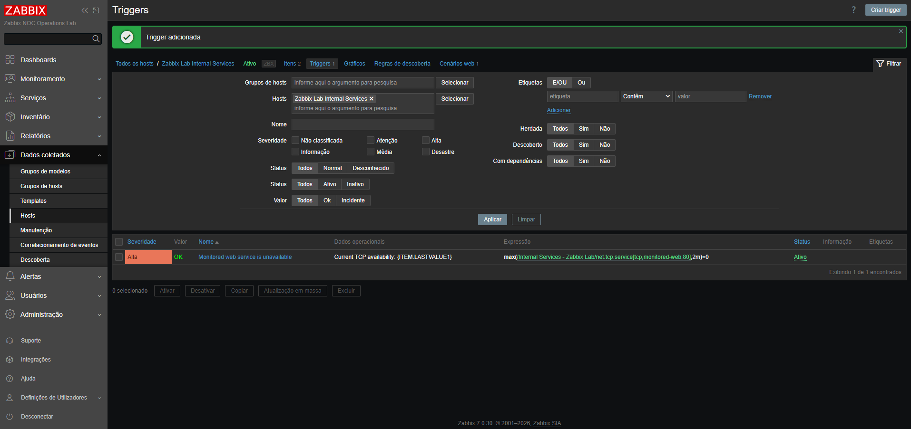

This confirms that the trigger configuration was active before introducing the controlled failure.

---

## Controlled HTTP Failure

Only the dedicated `monitored-web` service was stopped:

```powershell
docker compose --env-file .env stop monitored-web
```

The remaining platform services were verified with:

```powershell
docker compose --env-file .env ps
```

PostgreSQL, Zabbix Server, and Zabbix Web remained operational.

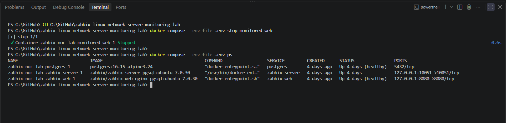

The isolation of the failure is important because it demonstrates service-specific monitoring without disabling the monitoring platform.

---

## HTTP Problem Detection

After the sustained-condition period elapsed, Zabbix generated the expected event:

```text
HTTP service unavailable on monitored-web
```

The event displayed:

- severity **High**;
- the affected internal-services host;
- the dedicated monitored service;
- the current incident state;
- the elapsed problem duration.

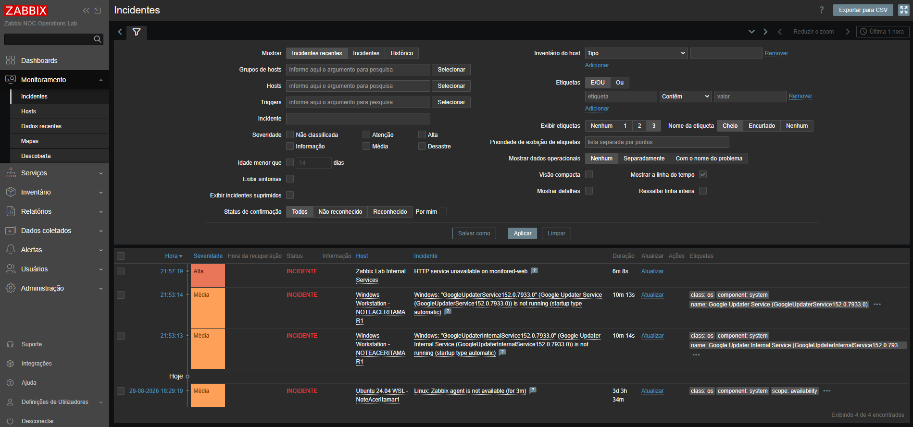

---

## HTTP Incident Acknowledgment

The event was acknowledged and an operational investigation note was recorded.

Operator note:

```text
Initial triage completed. The dedicated monitored-web service is confirmed unavailable during a controlled laboratory test. PostgreSQL, Zabbix Server, and Zabbix Web remain operational. Investigation is limited to the isolated HTTP target. Escalation is not required, and service recovery is authorized within the laboratory scope.
```

The note documents:

- operator ownership;
- validation of the affected service;
- confirmation that the Zabbix platform remained operational;
- investigation scope;
- escalation decision;
- authorization to restore the service.

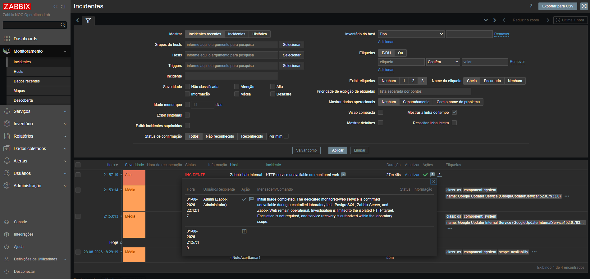

This activity reproduces an important NOC practice: a problem should not only be observed, but also assigned operational context and a documented response.

---

## HTTP Service Recovery

The dedicated service was restored with:

```powershell
docker compose --env-file .env start monitored-web
```

The initial container state was observed during startup.

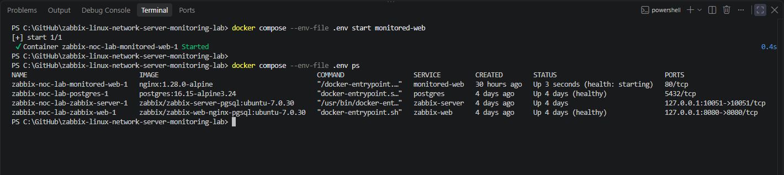

After the health check completed, Docker reported the service as healthy.

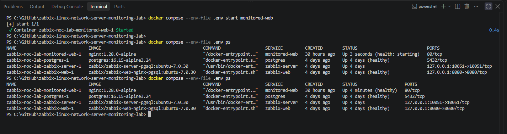

---

## HTTP Event Resolution

When TCP availability returned to `1`, the trigger automatically returned to its normal state.

Zabbix preserved:

- the original failure time;
- the recovery time;
- total incident duration;
- severity;
- acknowledgment;
- operator note;
- complete event lifecycle.

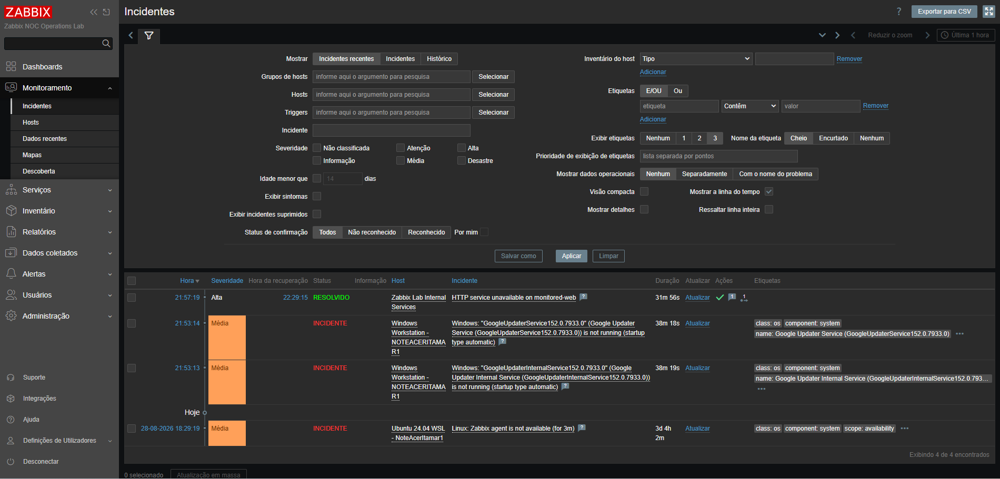

The HTTP incident was resolved automatically without manually terminating the event.

---

# Part 2 - External DNS Resolution Trigger

## Monitored Item

The Windows workstation uses Zabbix Agent 2 to validate external DNS resolution.

Production key:

```text
net.dns[1.1.1.1,example.com,A,2,1,udp]
```

Parameters:

| Parameter | Value |
|---|---|
| DNS server | `1.1.1.1` |
| Queried domain | `example.com` |
| Record type | `A` |
| Timeout | `2` seconds |
| Retry count | `1` |
| Protocol | UDP |

Expected values:

| Value | Meaning |
|---:|---|
| `1` | DNS resolution succeeded |
| `0` | DNS resolution failed |

---

## DNS Trigger Configuration

| Field | Configuration |
|---|---|
| Trigger name | `External DNS resolution is unavailable` |
| Event name | `External DNS resolution failure on Windows workstation` |
| Host | `Windows Workstation - NOTEACERITAMAR1` |
| Technical host name | `NOTEACERITAMAR1` |
| Severity | Average |
| Problem generation mode | Single |
| OK event generation | Expression |
| Status | Enabled |

Operational data:

```text
Current DNS availability: {ITEM.LASTVALUE1}
```

Trigger expression:

```text
max(/NOTEACERITAMAR1/net.dns[1.1.1.1,example.com,A,2,1,udp],3m)=0
```

The expression requires the DNS check to remain unavailable during the evaluated three-minute period.

Description:

```text
External DNS resolution through Zabbix Agent 2 is unavailable. Validate Windows Agent 2 status, UDP connectivity to the configured DNS server, local firewall rules, name resolution, and upstream network availability before escalation.
```

---

## Initial DNS State

The trigger was created with **Average** severity and initially reported `OK`.

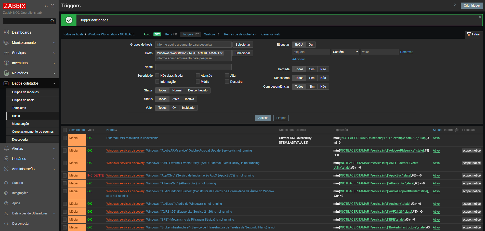

This second trigger demonstrates that operational severity should reflect impact rather than merely the existence of an error.

---

## Initial Fault-Injection Attempt

The first DNS test attempted to block outbound communication to `1.1.1.1` using Windows Firewall.

Initial UDP-specific rule:

```powershell
New-NetFirewallRule `
  -DisplayName "Zabbix Lab - Block DNS 1.1.1.1 UDP" `
  -Direction Outbound `
  -Action Block `
  -Protocol UDP `
  -RemoteAddress 1.1.1.1 `
  -RemotePort 53
```

A broader rule limited to the same destination was also tested:

```powershell
New-NetFirewallRule `
  -DisplayName "Zabbix Lab - Block DNS Target 1.1.1.1" `
  -Direction Outbound `
  -Action Block `
  -RemoteAddress 1.1.1.1 `
  -Profile Any
```

The local Agent 2 test continued to return:

```text
net.dns[1.1.1.1,example.com,A,2,1,udp] [s|1]
```

Because the monitored value remained `1`, this attempt did not constitute a validated failure and was not accepted as incident evidence.

The temporary firewall rule was removed:

```powershell
Remove-NetFirewallRule `
  -DisplayName "Zabbix Lab - Block DNS Target 1.1.1.1"
```

This unsuccessful attempt was retained as a troubleshooting lesson:

- verify the monitored value instead of assuming that a control produced the intended condition;
- do not label a screenshot as failure evidence without observing the expected state transition;
- remove temporary controls after testing;
- use a deterministic fault-injection method when the initial method does not affect the monitored signal.

---

## Controlled DNS Failure

A deterministic failure was introduced by temporarily changing the DNS server in the monitored item from:

```text
1.1.1.1
```

to the documentation-only address:

```text
192.0.2.1
```

Temporary test key:

```text
net.dns[192.0.2.1,example.com,A,2,1,udp]
```

The `192.0.2.0/24` network is reserved for documentation and laboratory examples. In this environment, the selected address did not provide DNS resolution.

Zabbix Latest Data confirmed that the item transitioned from `1` to `0`.

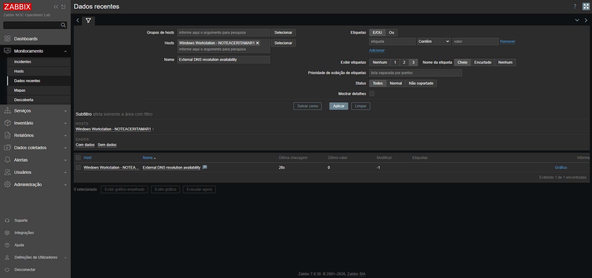

This evidence confirms the failure at the monitored-data layer before validating the trigger event.

---

## DNS Problem Detection

After the three-minute sustained condition, Zabbix generated:

```text
External DNS resolution failure on Windows workstation
```

The incident correctly displayed:

- severity **Average**;
- host `Windows Workstation - NOTEACERITAMAR1`;
- external DNS resolution failure;
- active incident status;
- elapsed duration.

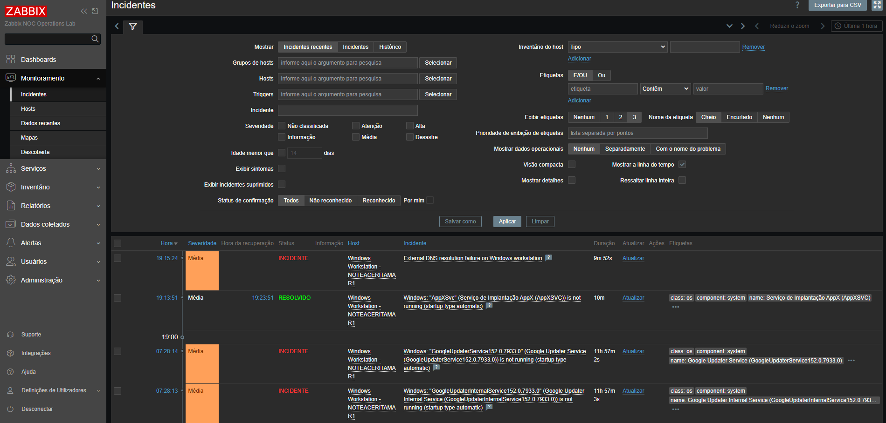

---

## DNS Recovery

The monitored item was restored to its original production key:

```text
net.dns[1.1.1.1,example.com,A,2,1,udp]
```

Latest Data confirmed that DNS availability returned to `1`.

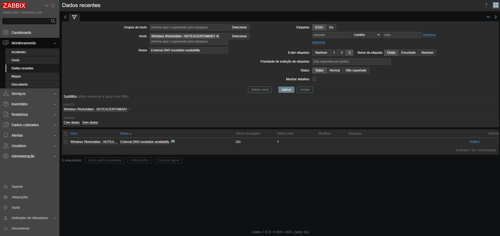

No workstation restart, Agent 2 restart, or general network interruption was required.

---

## DNS Event Resolution

After the original DNS target was restored, Zabbix automatically closed the incident.

The event history recorded:

| Field | Result |
|---|---|
| Problem time | `19:15:24` |
| Recovery time | `19:34:22` |
| Duration | `18m 58s` |
| Severity | Average |
| Final status | Resolved |
| Host | `Windows Workstation - NOTEACERITAMAR1` |

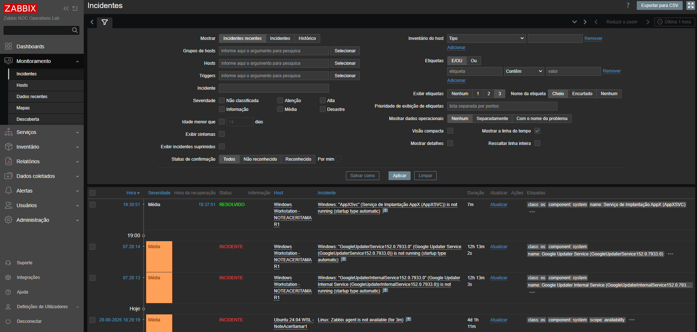

The event initially disappeared from the recent-incidents view after recovery. The historical view was therefore used to retrieve and preserve the complete lifecycle.

---

# Validation Summary

## HTTP Validation

| Validation | Result |
|---|---|
| Trigger created | Passed |
| Trigger initially `OK` | Passed |
| Severity classified as High | Passed |
| Controlled service interruption | Passed |
| Sustained failure detected | Passed |
| Problem event generated | Passed |
| Host and service identified | Passed |
| Incident acknowledged | Passed |
| Operator note recorded | Passed |
| Escalation decision documented | Passed |
| Service restored | Passed |
| Container returned to healthy state | Passed |
| Trigger returned to normal | Passed |
| Event automatically resolved | Passed |
| History preserved | Passed |

## DNS Validation

| Validation | Result |
|---|---|
| Trigger created | Passed |
| Trigger initially `OK` | Passed |
| Severity classified as Average | Passed |
| Initial firewall attempt evaluated | Completed with no monitored state change |
| Ineffective test evidence rejected | Passed |
| Temporary firewall configuration removed | Passed |
| Deterministic fault introduced | Passed |
| Item changed from `1` to `0` | Passed |
| Sustained failure detected | Passed |
| Problem event generated | Passed |
| Original DNS target restored | Passed |
| Item changed from `0` to `1` | Passed |
| Event automatically resolved | Passed |
| Historical lifecycle preserved | Passed |

---

# Operational Findings

## Finding 1 - Monitoring values must validate fault injection

A firewall rule existing in the operating system does not prove that the monitored application experienced the expected failure.

The authoritative validation sequence is:

```text
Control applied
    -> monitored value changes
    -> trigger expression becomes true
    -> event is generated
```

If the monitored value does not change, the failure has not been demonstrated.

---

## Finding 2 - Sustained conditions reduce false positives

The HTTP and DNS triggers require repeated failure during a time window:

```text
HTTP: 2 minutes
DNS:  3 minutes
```

This design prevents isolated transient samples from immediately becoming operational incidents.

---

## Finding 3 - Severity represents operational impact

Both tests generated service problems, but they were intentionally assigned different severities:

- HTTP unavailability: **High**;
- external DNS resolution failure: **Average**.

Severity classification helps operators prioritize work according to business and technical impact.

---

## Finding 4 - Acknowledgment creates operational accountability

Acknowledgment records that an operator has:

- seen the problem;
- accepted responsibility for initial triage;
- validated the affected scope;
- documented findings;
- decided whether escalation is required.

An acknowledgment without an investigation note provides less operational value.

---

## Finding 5 - Recovery must be validated at multiple layers

For the HTTP service, recovery was confirmed through:

- Docker service startup;
- container health;
- TCP availability;
- trigger normalization;
- resolved event history.

For DNS resolution, recovery was confirmed through:

- restoration of the original item key;
- value `1` in Latest Data;
- trigger normalization;
- resolved historical event.

---

## Finding 6 - Recent and historical incident views serve different purposes

The recent-incidents view is useful for active operations.

The historical view is required when:

- a resolved event is no longer displayed as recent;
- exact failure and recovery timestamps are needed;
- total incident duration must be documented;
- evidence of the complete lifecycle must be preserved.

---

# Evidence Index

| Evidence | File |
|---|---|
| Initial HTTP trigger | [`stage-05-http-trigger-initial-ok.png`](../../docs/screenshots/stage-05-http-trigger-initial-ok.png) |
| Controlled HTTP interruption | [`stage-05-controlled-http-service-stop.png`](../../docs/screenshots/stage-05-controlled-http-service-stop.png) |
| HTTP problem detected | [`stage-05-http-problem-detected.png`](../../docs/screenshots/stage-05-http-problem-detected.png) |
| HTTP problem acknowledged | [`stage-05-http-problem-acknowledged.png`](../../docs/screenshots/stage-05-http-problem-acknowledged.png) |
| HTTP recovery initiated | [`stage-05-controlled-http-service-recovery.png`](../../docs/screenshots/stage-05-controlled-http-service-recovery.png) |
| HTTP service healthy | [`stage-05-http-service-health-validation.png`](../../docs/screenshots/stage-05-http-service-health-validation.png) |
| HTTP problem resolved | [`stage-05-http-problem-recovered.png`](../../docs/screenshots/stage-05-http-problem-recovered.png) |
| Initial DNS trigger | [`stage-05-dns-trigger-initial-ok.png`](../../docs/screenshots/stage-05-dns-trigger-initial-ok.png) |
| Controlled DNS failure | [`stage-05-controlled-dns-failure.png`](../../docs/screenshots/stage-05-controlled-dns-failure.png) |
| DNS problem detected | [`stage-05-dns-problem-detected.png`](../../docs/screenshots/stage-05-dns-problem-detected.png) |
| DNS service restored | [`stage-05-dns-service-recovery.png`](../../docs/screenshots/stage-05-dns-service-recovery.png) |
| DNS problem resolved | [`stage-05-dns-problem-recovered.png`](../../docs/screenshots/stage-05-dns-problem-recovered.png) |

---

# Troubleshooting Reference

## Trigger expression reports an unknown host

Confirm the technical host name used by the expression.

The visible host name and technical host name can differ:

```text
Visible name: Zabbix Lab Internal Services
Host name:    Internal Services - Zabbix Lab
```

Trigger expressions must reference the technical host name selected by Zabbix.

---

## Trigger remains `OK` after a test control is applied

Check the item value in:

```text
Monitoring -> Latest data
```

Do not assume that an operating-system or network control changed the monitored condition.

Validate:

1. the item key;
2. the latest collected value;
3. the item update interval;
4. the trigger evaluation window;
5. the trigger status;
6. the host association.

---

## Problem does not appear immediately

The triggers use sustained time windows.

Expected behavior:

```text
HTTP trigger: waits for the evaluated two-minute failure window
DNS trigger:  waits for the evaluated three-minute failure window
```

The item update interval can add additional time before the frontend displays the event.

---

## Resolved incident disappears from recent incidents

Use:

```text
Monitoring -> Problems -> History
```

Filter by the incident name and appropriate time range.

---

## Temporary test configuration remains active

Restore the original monitored target immediately.

DNS production key:

```text
net.dns[1.1.1.1,example.com,A,2,1,udp]
```

Verify that Latest Data returns:

```text
1
```

---

# Acceptance Criteria

Stage 05 is complete because:

- [x] the initial HTTP service-availability trigger was created;
- [x] the HTTP trigger uses a sustained two-minute failure condition;
- [x] the HTTP trigger was assigned High severity;
- [x] the HTTP trigger was enabled and initially reported `OK`;
- [x] a controlled HTTP service failure generated a `PROBLEM` event;
- [x] the HTTP problem appeared with the expected severity;
- [x] the HTTP event identified the affected host and service;
- [x] the HTTP problem was acknowledged;
- [x] an operational investigation note was recorded;
- [x] an escalation decision was documented;
- [x] the monitored HTTP service was restored;
- [x] the HTTP container returned to a healthy state;
- [x] the HTTP trigger automatically returned to normal;
- [x] the HTTP incident was displayed as `RESOLVED`;
- [x] the HTTP event history preserved the complete lifecycle;
- [x] selected HTTP incident evidence was stored;
- [x] an additional DNS trigger with a different severity was configured;
- [x] the DNS trigger was enabled and initially reported `OK`;
- [x] an ineffective fault-injection attempt was identified and rejected;
- [x] temporary Windows Firewall rules were removed;
- [x] a deterministic DNS failure was introduced;
- [x] the monitored DNS value changed from `1` to `0`;
- [x] the DNS trigger generated an Average-severity incident;
- [x] the original DNS target was restored;
- [x] the monitored DNS value returned from `0` to `1`;
- [x] the DNS trigger automatically returned to normal;
- [x] the DNS incident was displayed as `RESOLVED`;
- [x] the DNS event history preserved failure and recovery;
- [x] selected DNS incident evidence was stored;
- [x] troubleshooting findings were documented;
- [x] final Stage 05 results were documented.

---

# Stage Result

Stage 05 demonstrated that the laboratory can convert raw monitoring values into operationally meaningful events.

The implementation now supports:

```text
Monitoring signal
    -> sustained trigger condition
    -> severity classification
    -> problem event
    -> operator validation
    -> acknowledgment and investigation note
    -> recovery action
    -> automatic resolution
    -> historical operational record
```

The HTTP test demonstrated isolated service unavailability with **High** severity and formal operator handling.

The DNS test demonstrated a dependency failure with **Average** severity, deterministic fault injection, automatic recovery, and historical validation.

The unsuccessful firewall attempt also provided a realistic troubleshooting exercise: configuration changes must be validated against the actual monitored signal before being accepted as evidence.

---

# Next Steps

The next stage will extend the laboratory from frontend incident handling toward alert delivery and operational notification workflows.

Planned activities include:

- configuring a notification channel suitable for the laboratory;
- creating an action linked to trigger severity;
- defining action conditions;
- testing message content;
- validating problem and recovery notifications;
- documenting notification delivery and troubleshooting behavior.
