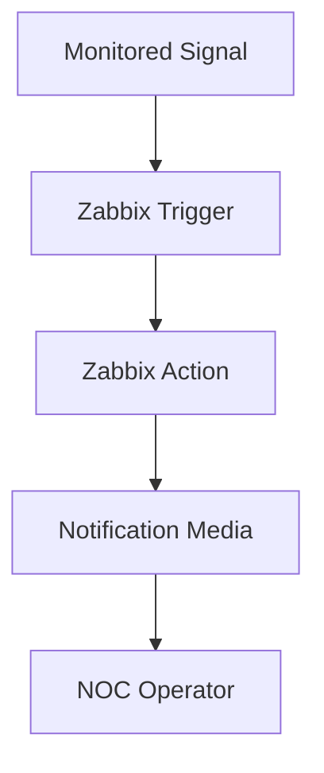
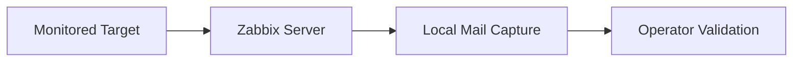

# Stage 06 - Alert Delivery, Actions, and Notifications

[Back to the main README](../../README.md)

## Objective

This stage extends the incident-handling workflows implemented in Stage 05 by introducing automated alert delivery through native Zabbix actions and media types.

The implementation will validate:

- a notification channel suitable for the controlled laboratory;
- Zabbix media-type configuration;
- user media assignment;
- trigger-action configuration;
- severity-based action conditions;
- problem-notification delivery;
- recovery-notification delivery;
- message content and operational context;
- delivery-history validation;
- notification troubleshooting;
- secure handling of notification configuration.

The objective is to demonstrate the complete transition from a detected monitoring condition to an operator-facing notification and its corresponding recovery message.

## Current Status

Stage 06 has been initialized.

The repository structure and implementation plan are documented, but notification infrastructure and Zabbix actions have not yet been configured.

The next activity will validate the current platform state and select the notification delivery method for the controlled laboratory.

## Previous-Stage Baseline

Stage 05 established the incident lifecycle required by this stage.

The available monitoring signals include:

| Monitoring signal | Severity | Trigger behavior | Recovery behavior |
|---|:---:|---|---|
| Dedicated HTTP service availability | High | Sustained failure generates a problem event | Service restoration returns the trigger to `OK` |
| External DNS resolution availability | Average | Sustained failure generates a problem event | DNS restoration returns the trigger to `OK` |

The HTTP incident also demonstrated:

- problem detection;
- affected host and service identification;
- operator acknowledgment;
- investigation notes;
- escalation decision;
- controlled service restoration;
- automatic event resolution;
- historical preservation.

Stage 06 will reuse these validated triggers instead of creating unrelated alert sources.

## Planned Notification Architecture



A problem-state transition will activate a Zabbix action. The action will evaluate its configured conditions, select the appropriate operation, and deliver an operator-facing message through the selected media type.

When the monitored condition returns to normal, the action will generate a recovery notification containing the corresponding recovery context.

## Planned Laboratory Architecture

The preferred laboratory design uses a local notification-capture service rather than a personal or production messaging account.



This design is intended to provide:

- deterministic local delivery;
- repeatable tests;
- visible problem and recovery messages;
- no dependency on a personal mailbox;
- no publication of external SMTP credentials;
- isolated notification troubleshooting;
- reproducible portfolio evidence.

The final notification channel will be confirmed only after platform and connectivity validation.

## Planned Scope

### Notification channel

The stage will configure one controlled notification channel suitable for repeatable laboratory testing.

The preferred approach is a local SMTP-capture service accessible from the Zabbix Server container.

The implementation must confirm:

- service availability;
- Docker network connectivity;
- destination port reachability;
- message reception;
- problem-message visibility;
- recovery-message visibility.

### Zabbix media type

A Zabbix media type will be configured for the selected notification channel.

The configuration must define:

- delivery protocol;
- destination service;
- destination port;
- sender identity;
- message format;
- connection-security requirements;
- authentication requirements, when applicable.

No real credential may be committed to the repository.

### Operator user media

A dedicated laboratory recipient will be associated with the Zabbix operator account or with a dedicated notification user.

The configuration must confirm:

- media type assignment;
- recipient address;
- enabled severity range;
- active notification period;
- user-group access;
- frontend permissions for the affected hosts.

### Trigger action

A Zabbix trigger action will be created to process selected Stage 05 events.

The initial action will evaluate:

- event source;
- problem status;
- trigger severity;
- monitored host or host group;
- selected HTTP and DNS triggers;
- operation and recovery-operation requirements.

### Problem operation

The problem operation will send a message when a selected trigger enters the `PROBLEM` state.

The message should identify:

- event status;
- event name;
- affected host;
- trigger severity;
- problem start time;
- current operational data;
- event identifier;
- acknowledgment state;
- suggested initial validation.

### Recovery operation

The recovery operation will send a message when the corresponding trigger returns to `OK`.

The recovery message should identify:

- recovery status;
- original event name;
- affected host;
- original severity;
- problem start time;
- recovery time;
- event duration;
- recovery event identifier;
- final operational state.

### Delivery history

Notification delivery will be validated from both the Zabbix and recipient perspectives.

The validation will include:

- Zabbix action execution;
- notification status;
- recipient identification;
- message subject;
- message body;
- delivery timestamp;
- problem and recovery correlation;
- failure details when delivery does not succeed.

## Message Design Principles

Notification messages must be concise enough for operational use while preserving sufficient context for initial triage.

The messages should:

- place the event state at the beginning of the subject;
- identify the affected service and host;
- include severity and timestamps;
- distinguish problem messages from recovery messages;
- avoid exposing credentials or sensitive configuration;
- include only information useful for investigation;
- preserve consistent terminology across both lifecycle messages.

The stage will avoid unnecessarily large default messages when a smaller operational template communicates the same information more clearly.

## Severity-Based Behavior

The HTTP and DNS incidents use different severities and provide a basis for validating conditional action behavior.

| Trigger | Severity | Planned notification behavior |
|---|:---:|---|
| HTTP service unavailable | High | Immediate problem and recovery notification |
| External DNS resolution unavailable | Average | Problem and recovery notification under the selected action conditions |

If multiple actions or operation steps are required, they will be introduced incrementally and validated separately.

## Controlled Validation Strategy

The Stage 05 failure procedures will be reused only after notification configuration has been validated in its normal state.

The planned lifecycle is:

```text
Validate platform
-> Validate notification channel
-> Configure media type
-> Configure operator media
-> Configure action
-> Confirm normal trigger state
-> Introduce controlled failure
-> Validate problem notification
-> Restore the monitored service
-> Validate recovery notification
-> Review delivery history
-> Document results
```

The HTTP service will remain the preferred initial failure target because it is isolated from PostgreSQL and the Zabbix platform.

The DNS trigger may be used afterward to validate different severity behavior.

## Security Requirements

The implementation must follow these controls:

- no personal mailbox password in version control;
- no external SMTP credential in screenshots;
- no access token or webhook secret in documentation;
- no credential printed in terminal evidence;
- no operational `.env` file committed;
- placeholders used in versioned example files;
- local-only exposure for any notification web interface;
- minimum required Docker network access;
- evidence reviewed before publication.

If temporary credentials are required, they must remain outside the tracked repository and be removed after validation.

## Troubleshooting Strategy

Notification failures will be investigated in the following order:

1. confirm that the source trigger generated an event;
2. confirm that the action conditions matched the event;
3. confirm that an action operation was scheduled;
4. confirm that the recipient has an enabled media entry;
5. confirm that the selected severity is permitted;
6. confirm Zabbix Server connectivity to the notification service;
7. review notification and action history;
8. review Zabbix Server logs;
9. review notification-service logs;
10. correct the configuration and repeat the controlled test.

A failed notification attempt will be documented when it provides a meaningful troubleshooting result.

## Acceptance Criteria

Stage 06 will be complete when:

- [ ] the current Zabbix platform state is validated;
- [ ] a laboratory notification channel is selected;
- [ ] the notification service is deployed or configured;
- [ ] connectivity from Zabbix Server to the notification service is validated;
- [ ] a Zabbix media type is configured;
- [ ] a laboratory recipient is assigned to the operator;
- [ ] the recipient severity range is validated;
- [ ] a trigger action is created;
- [ ] action conditions are documented;
- [ ] a problem operation is configured;
- [ ] a recovery operation is configured;
- [ ] problem-message content is validated;
- [ ] recovery-message content is validated;
- [ ] a controlled HTTP failure generates a notification;
- [ ] the HTTP problem notification reaches the selected channel;
- [ ] HTTP service restoration generates a recovery notification;
- [ ] the HTTP recovery notification reaches the selected channel;
- [ ] Zabbix notification history confirms delivery;
- [ ] severity-based behavior is validated with the DNS trigger;
- [ ] notification troubleshooting findings are documented;
- [ ] temporary test configuration is removed or justified;
- [ ] selected Stage 06 evidence is stored;
- [ ] final Stage 06 results are documented.

## Initial Implementation Plan

The implementation will proceed incrementally:

1. validate the current Docker and Zabbix platform state;
2. confirm the local notification-channel design;
3. introduce the notification service without changing trigger behavior;
4. validate service connectivity;
5. configure the Zabbix media type;
6. configure the operator recipient;
7. create the initial trigger action;
8. validate problem notification delivery;
9. validate recovery notification delivery;
10. test severity-based behavior;
11. document troubleshooting findings;
12. complete the acceptance criteria and final results.

## Next Steps

The next activity will validate the current laboratory state and confirm the local notification-capture architecture before any Docker Compose or Zabbix configuration is changed.
