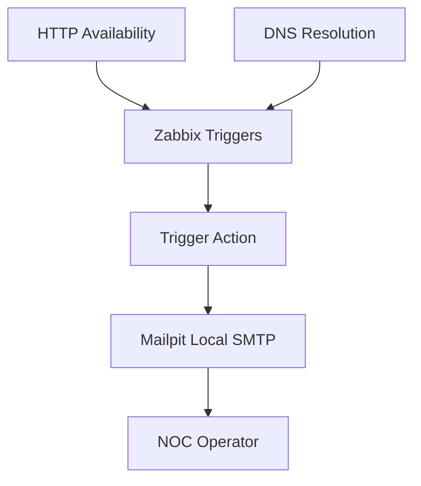
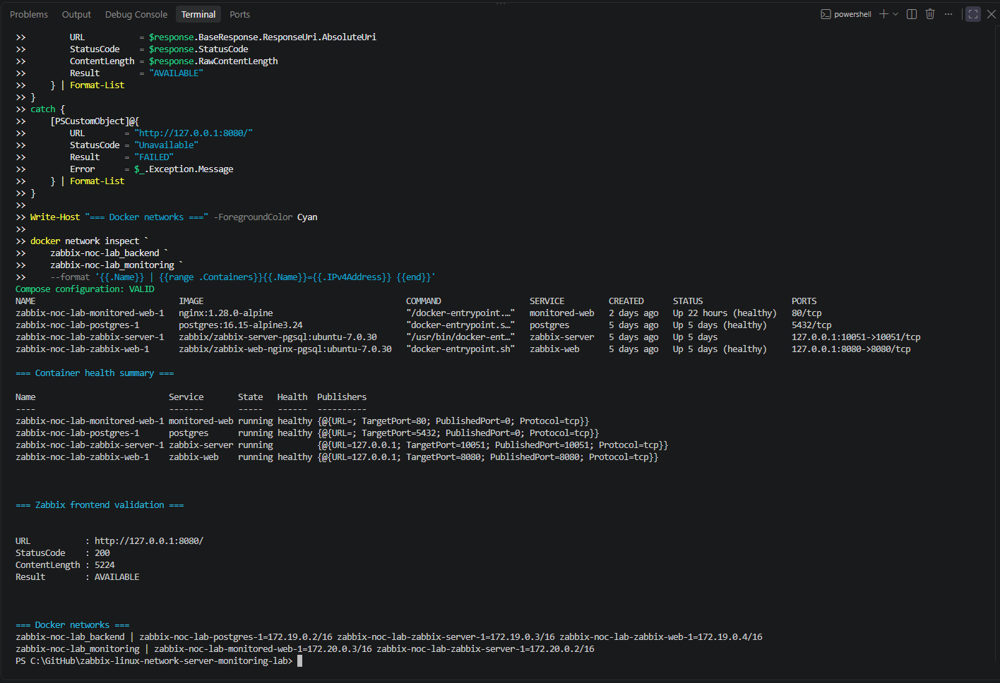
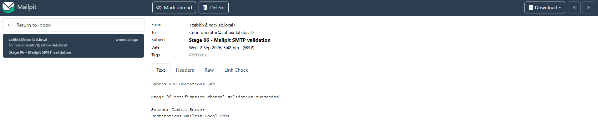
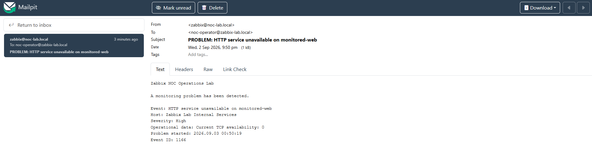
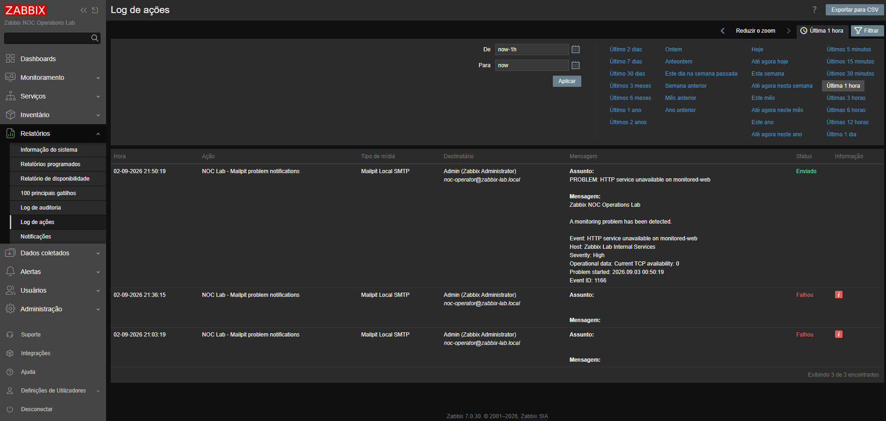
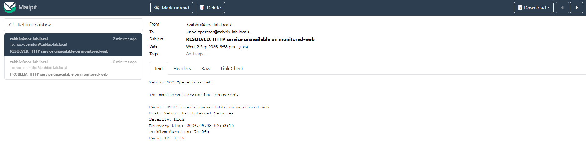
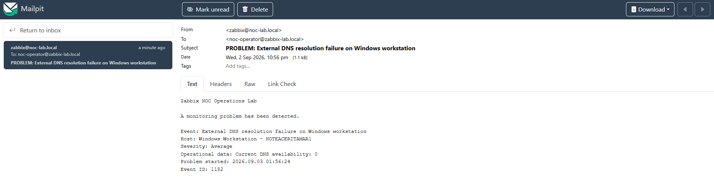
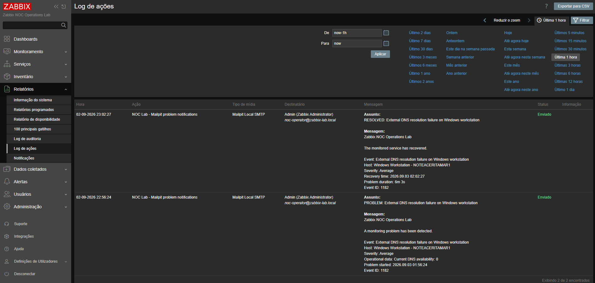

# Stage 06 - Alert Delivery, Actions, and Notifications

[Back to the main README](../../README.md)

## Objective

This stage extends the incident-handling workflow implemented in Stage 05 by introducing automated alert delivery through native Zabbix actions and media types.

The implementation demonstrates the complete transition from a detected monitoring condition to an operator-facing notification, followed by the corresponding recovery notification.

The stage validates:

- a local SMTP notification channel;
- Zabbix media-type configuration;
- operator media assignment;
- trigger-action configuration;
- severity-based action conditions;
- problem-notification delivery;
- recovery-notification delivery;
- operational message content;
- action-history validation;
- notification troubleshooting;
- secure handling of notification settings.

## Current Status

**Completed**

Stage 06 successfully implemented and validated automated alert delivery for the HTTP and DNS monitoring signals created in Stage 05.

The final solution includes:

- Mailpit as a local SMTP capture service;
- a dedicated Zabbix email media type;
- a laboratory recipient assigned to the Zabbix administrator;
- a trigger action covering the HTTP and DNS incidents;
- customized problem and recovery message templates;
- controlled HTTP and DNS failure tests;
- successful problem and recovery delivery;
- delivery confirmation through the Zabbix action log;
- restoration of all temporary test changes.

No personal email account, external SMTP provider, production credential, token, or webhook secret was required.

## Previous-Stage Baseline

Stage 05 established the incident lifecycle reused in this stage.

| Monitoring signal | Severity | Problem behavior | Recovery behavior |
|---|:---:|---|---|
| Dedicated HTTP service availability | High | Sustained service failure generates a problem event | Service restoration returns the trigger to `OK` |
| External DNS resolution availability | Average | Sustained DNS failure generates a problem event | DNS restoration returns the trigger to `OK` |

The existing triggers were reused as real notification sources instead of creating artificial alert-only triggers.

## Implemented Architecture



The monitoring signals generate trigger state transitions inside Zabbix.

The configured action evaluates the trigger and severity conditions, selects the problem or recovery operation, and sends an email through Mailpit. The operator can then validate the complete message and delivery result without using an external email provider.

## Laboratory Components

| Component | Purpose | Access |
|---|---|---|
| Zabbix Server | Event processing and action execution | Internal Docker network |
| Zabbix Web | Configuration and operational validation | `http://127.0.0.1:8080` |
| PostgreSQL | Zabbix configuration and history database | Internal Docker network |
| Monitored web service | Controlled HTTP availability target | Internal Docker network |
| Zabbix Agent 2 | Windows host and DNS monitoring | Windows host interface |
| Mailpit | Local SMTP capture and message inspection | `http://127.0.0.1:8025` |

The Mailpit web interface is bound to the local host and is not exposed as a public service.

## Platform Baseline Validation

Before configuring notifications, the laboratory baseline was validated.

The verification confirmed:

- PostgreSQL was healthy;
- Zabbix Server was running;
- Zabbix Web was healthy;
- the monitored HTTP service was healthy;
- the Zabbix frontend was reachable;
- the Docker services retained their expected connectivity;
- the Stage 05 monitoring signals remained available.



## Notification Service

Mailpit was selected as the controlled notification channel.

The service provides:

- a local SMTP endpoint;
- a browser-based mailbox;
- deterministic message capture;
- inspection of message subjects, bodies, and headers;
- repeatable problem and recovery testing;
- no dependency on an external email account;
- no requirement for SMTP credentials.

### Mailpit service configuration

| Setting | Value |
|---|---|
| Container image | `axllent/mailpit:v1.30` |
| SMTP service name | `mailpit` |
| SMTP port | `1025` |
| Web interface port | `8025` |
| Web interface binding | `127.0.0.1` |
| Authentication | Not required |
| Connection security | None, inside the controlled laboratory |

## Zabbix Media Type

A dedicated email media type was created:

```text
Mailpit Local SMTP
```

### Media-type settings

| Setting | Value |
|---|---|
| Type | Email |
| SMTP server | `mailpit` |
| SMTP server port | `1025` |
| SMTP HELO | `zabbix-noc-lab.local` |
| Sender email | `zabbix@noc-lab.local` |
| Connection security | None |
| Authentication | None |
| Message format | Plain text |
| Status | Active |

A direct media-type test was executed before the trigger action was enabled.

The test message was successfully delivered to:

```text
noc-operator@zabbix-lab.local
```



## Operator Media Assignment

The `Mailpit Local SMTP` media type was assigned to the Zabbix administrator used as the laboratory operator.

| Setting | Value |
|---|---|
| User | Admin |
| Recipient | `noc-operator@zabbix-lab.local` |
| Media type | `Mailpit Local SMTP` |
| Active period | Always |
| Enabled severities | Average, High, and Disaster |
| Status | Enabled |

The selected severity range includes both monitoring signals used in the validation:

- DNS resolution failure: `Average`;
- HTTP service failure: `High`.

## Trigger Action

The following trigger action was created and enabled:

```text
NOC Lab - Mailpit problem notifications
```

### Action conditions

The action uses these conditions:

| Condition | Value |
|---|---|
| A | Trigger equals the external DNS resolution trigger |
| B | Trigger equals the monitored HTTP service trigger |
| C | Trigger severity is greater than or equal to Average |

The custom condition calculation is:

```text
(A or B) and C
```

This calculation restricts notification delivery to the two selected Stage 05 triggers while also enforcing the minimum severity threshold.

## Problem Operation

The problem operation sends an email to the Zabbix administrator through `Mailpit Local SMTP` when either selected trigger enters the `PROBLEM` state.

### Problem subject

```text
PROBLEM: {EVENT.NAME}
```

### Problem message

```text
Zabbix NOC Operations Lab

A monitoring problem has been detected.

Event: {EVENT.NAME}
Host: {HOST.NAME}
Severity: {EVENT.SEVERITY}
Operational data: {EVENT.OPDATA}
Problem started: {EVENT.DATE} {EVENT.TIME}
Event ID: {EVENT.ID}
```

The message provides the initial operational context required for triage without including credentials or unnecessary platform details.

## Recovery Operation

The recovery operation sends a corresponding email when the trigger returns to the `OK` state.

### Recovery subject

```text
RESOLVED: {EVENT.NAME}
```

### Recovery message

```text
Zabbix NOC Operations Lab

The monitored service has recovered.

Event: {EVENT.NAME}
Host: {HOST.NAME}
Severity: {EVENT.SEVERITY}
Recovery time: {EVENT.RECOVERY.DATE} {EVENT.RECOVERY.TIME}
Problem duration: {EVENT.DURATION}
Event ID: {EVENT.ID}
```

The recovery message correlates the restored condition with the original event and includes its total duration.

## HTTP Notification Validation

The HTTP service was selected for the first end-to-end notification test because it could be stopped independently of PostgreSQL, Zabbix Server, Zabbix Web, and Mailpit.

### Controlled failure

The monitored web service was stopped:

```powershell
docker compose --env-file .env stop monitored-web
```

The expected sequence occurred:

1. the monitored endpoint became unavailable;
2. the HTTP availability item reported the failure;
3. the High-severity trigger entered the `PROBLEM` state;
4. the Zabbix action matched the event;
5. the problem operation executed;
6. Mailpit received the `PROBLEM` notification;
7. the Zabbix action log reported `Sent`.



The Zabbix action log confirmed the problem-notification delivery and preserved the recipient, media type, subject, message body, timestamp, and delivery status.



### Controlled recovery

The monitored web service was started again:

```powershell
docker compose --env-file .env up -d monitored-web
```

The expected recovery sequence occurred:

1. the container started;
2. the HTTP endpoint became reachable;
3. the monitored item returned to its normal value;
4. the trigger returned to `OK`;
5. the recovery operation executed;
6. Mailpit received the `RESOLVED` notification;
7. the Zabbix action log reported `Sent`.



## DNS Severity Validation

The DNS trigger was used to verify that the same action also processes an `Average`-severity event.

### Normal DNS item key

```text
net.dns[1.1.1.1,example.com,A,2,1,udp]
```

### Controlled failure method

The DNS server address in the item key was temporarily replaced with the documentation-only address `192.0.2.1`:

```text
net.dns[192.0.2.1,example.com,A,2,1,udp]
```

This produced a deterministic DNS resolution failure without interrupting the host network connection or modifying the production behavior of the Windows DNS Client service.

The monitored value changed:

```text
1 -> 0
```

After the configured sustained-failure interval, Zabbix generated:

```text
External DNS resolution failure on Windows workstation
```

The event was classified with `Average` severity, matched the action condition, and generated a problem notification.



### DNS recovery

The original key was restored:

```text
net.dns[1.1.1.1,example.com,A,2,1,udp]
```

The monitored value returned:

```text
0 -> 1
```

The trigger was automatically resolved, and the recovery operation sent the corresponding `RESOLVED` notification.

The Zabbix action log confirmed both lifecycle deliveries with status `Sent`.



The controlled DNS incident remained active for approximately six minutes, and the original monitoring configuration was restored after validation.

## Validation Results

| Validation | Expected result | Observed result | Status |
|---|---|---|:---:|
| Platform baseline | Core services remain operational | Platform remained available | Passed |
| Mailpit availability | Local SMTP capture service is reachable | Service healthy and web interface reachable | Passed |
| Media-type test | Test email reaches Mailpit | Validation email received | Passed |
| Operator media | Recipient accepts selected severities | Average and High events permitted | Passed |
| HTTP problem | High-severity problem notification delivered | `PROBLEM` email received | Passed |
| HTTP recovery | Recovery notification delivered | `RESOLVED` email received | Passed |
| DNS problem | Average-severity notification delivered | `PROBLEM` email received | Passed |
| DNS recovery | Recovery notification delivered | `RESOLVED` email received | Passed |
| Action history | Zabbix confirms delivery | Entries reported `Sent` | Passed |
| Test cleanup | Temporary state is removed | HTTP service and DNS key restored | Passed |

## Troubleshooting Findings

### Missing message template

The first HTTP action attempts failed with:

```text
No message defined for media type
```

The event and action conditions were valid, but the email media type did not contain the message templates required by the trigger action.

The media type was updated with:

- an `Incident` message template for problem events;
- a `Problem recovery` message template for recovery events.

In the Portuguese Zabbix frontend, the normal problem-event message type is displayed as:

```text
Incidente
```

After adding the two templates, the controlled HTTP test was repeated and both notifications were delivered successfully.

### Deterministic DNS testing

A controlled change to the DNS item target produced a predictable failure and recovery while preserving the operating system DNS service.

The final test method:

- changed only the monitored DNS destination;
- retained the existing item and trigger logic;
- did not disable the Windows DNS Client service;
- did not interrupt general host connectivity;
- restored the original item key after validation.

This method provided a repeatable severity test for the laboratory.

## Security Controls

The implementation follows these controls:

- no personal mailbox was used;
- no external SMTP credential was required;
- no password, token, or webhook secret was committed;
- the Mailpit web interface is bound to `127.0.0.1`;
- SMTP delivery remains inside the controlled Docker environment;
- sender and recipient addresses use laboratory-only domains;
- the operational `.env` file remains outside version control;
- screenshots were reviewed before publication;
- temporary test configuration was restored;
- notification messages contain operational context but no sensitive data.

Mailpit is appropriate for controlled development and validation. It must not be treated as a production mail server or exposed directly to an untrusted network.

## Evidence

| Evidence | Demonstrated result |
|---|---|
| [Platform baseline validation](../../docs/screenshots/stage-06-platform-baseline-validation.png) | Core Docker and Zabbix services operating normally |
| [Mailpit test notification](../../docs/screenshots/stage-06-mailpit-test-notification.png) | Direct media-type test successfully received |
| [HTTP problem notification](../../docs/screenshots/stage-06-http-problem-notification.png) | High-severity problem email delivered |
| [HTTP problem action delivery](../../docs/screenshots/stage-06-action-log-problem-delivery.png) | Zabbix action log confirming successful delivery |
| [HTTP recovery notification](../../docs/screenshots/stage-06-http-recovery-notification.png) | HTTP recovery email delivered |
| [DNS problem notification](../../docs/screenshots/stage-06-dns-problem-notification.png) | Average-severity DNS problem email delivered |
| [DNS action lifecycle](../../docs/screenshots/stage-06-action-log-dns-lifecycle.png) | DNS problem and recovery operations reported as sent |

## Acceptance Criteria

Stage 06 is complete because:

- [x] the current Zabbix platform state was validated;
- [x] a laboratory notification channel was selected;
- [x] the notification service was deployed;
- [x] connectivity to the notification service was validated;
- [x] a Zabbix media type was configured;
- [x] a laboratory recipient was assigned to the operator;
- [x] the recipient severity range was validated;
- [x] a trigger action was created;
- [x] action conditions were documented;
- [x] a problem operation was configured;
- [x] a recovery operation was configured;
- [x] problem-message content was validated;
- [x] recovery-message content was validated;
- [x] a controlled HTTP failure generated a notification;
- [x] the HTTP problem notification reached Mailpit;
- [x] HTTP service restoration generated a recovery notification;
- [x] the HTTP recovery notification reached Mailpit;
- [x] Zabbix action history confirmed successful delivery;
- [x] severity-based behavior was validated with the DNS trigger;
- [x] DNS problem and recovery notifications were delivered;
- [x] notification troubleshooting findings were documented;
- [x] temporary test configuration was removed;
- [x] selected Stage 06 evidence was stored;
- [x] final Stage 06 results were documented.

## Key Learnings

This stage demonstrated that:

- trigger detection and notification delivery are separate operational layers;
- a valid event does not guarantee delivery unless the media type contains the required message template;
- media-type tests should be completed before trigger-action tests;
- action conditions must be validated independently from message delivery;
- severity permissions on user media can prevent otherwise valid notifications;
- problem and recovery operations require distinct message templates;
- the Zabbix action log is essential for diagnosing delivery failures;
- a local SMTP capture service supports safe and repeatable notification testing;
- deterministic failure injection produces stronger validation evidence;
- temporary test changes must always be restored.

## Final Result

Stage 06 converted the Stage 05 monitoring events into complete operator-notification workflows.

The laboratory now provides:

- monitored HTTP and DNS signals;
- severity-aware trigger processing;
- automatic problem notifications;
- automatic recovery notifications;
- local SMTP delivery;
- operator-facing operational context;
- delivery history inside Zabbix;
- repeatable failure and recovery testing;
- documented troubleshooting results;
- selected portfolio evidence.

The implementation demonstrates a complete monitoring path from signal collection to incident detection, operator notification, service recovery, and delivery confirmation.
