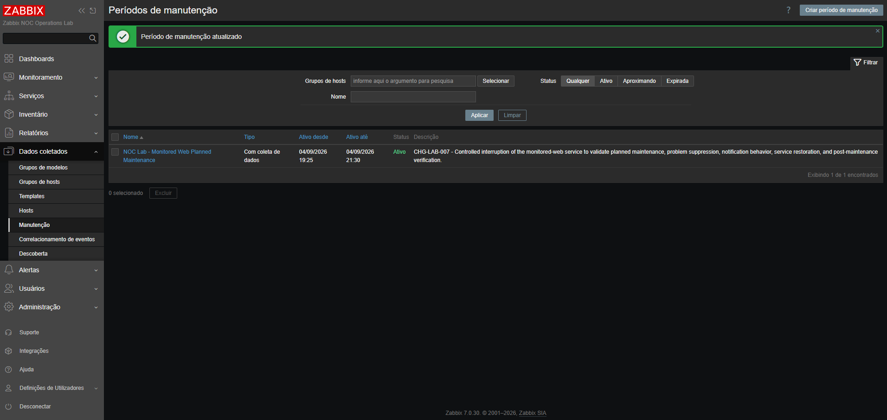
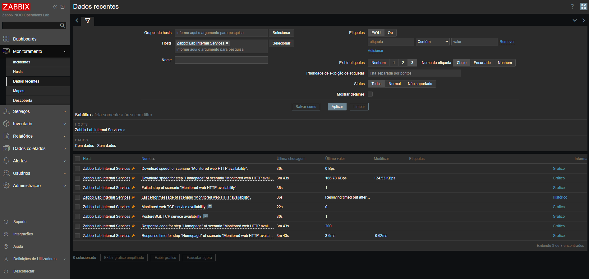
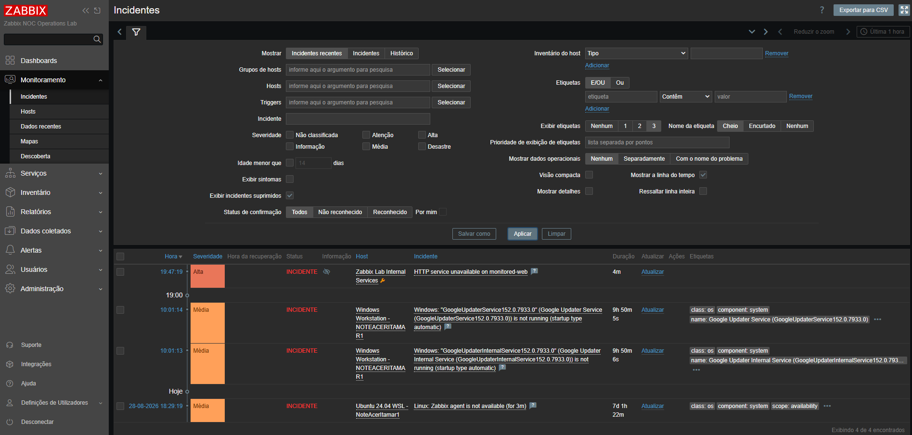
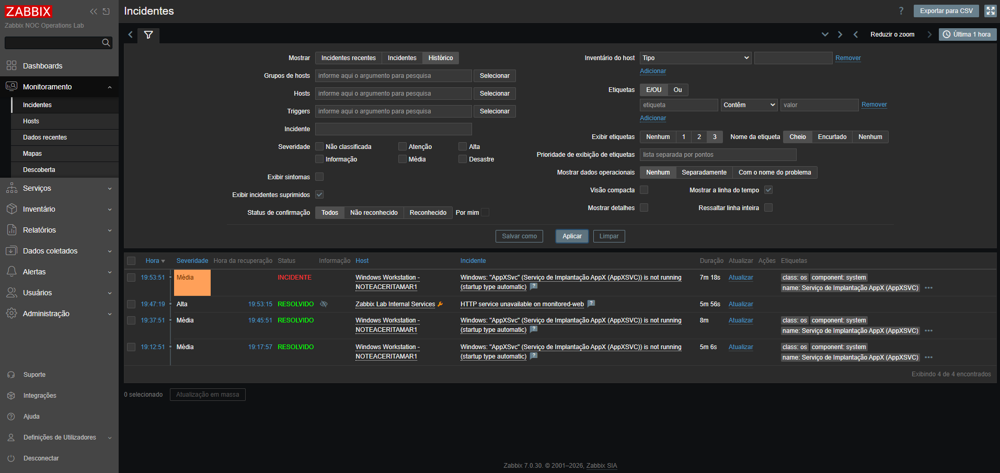
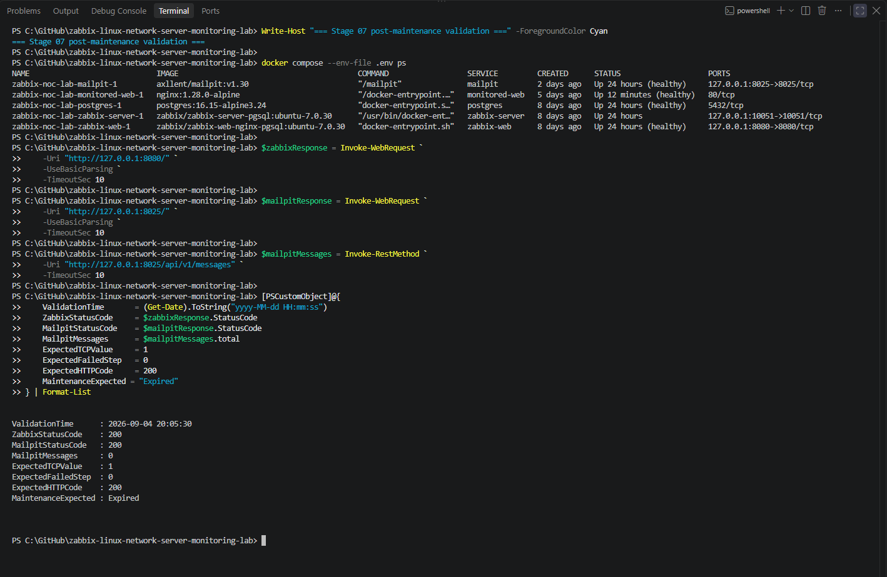

# Planned Maintenance Record — CHG-LAB-007

[Back to Stage 07](README.md)

## Change Summary

| Field | Value |
|---|---|
| Change ID | `CHG-LAB-007` |
| Change type | Planned maintenance |
| Environment | Zabbix NOC Operations Lab |
| Service | `monitored-web` |
| Zabbix host | `Zabbix Lab Internal Services` |
| Maintenance name | `NOC Lab - Monitored Web Planned Maintenance` |
| Maintenance mode | With data collection |
| Execution date | September 4, 2026 |
| Planned start | 19:25 |
| Controlled interruption | 19:46 |
| Service restoration | 19:52 |
| Maintenance closure | 20:04 |
| Final validation | 20:05 |
| Final status | Successfully completed |

## Objective

The purpose of this planned maintenance was to validate the operational behavior of Zabbix when a monitored HTTP service is intentionally interrupted during an approved maintenance window.

The activity was designed to confirm that:

- monitoring data continued to be collected;
- the HTTP service failure was detected;
- a problem event was generated;
- the problem was identified as suppressed;
- notification operations were paused for the suppressed incident;
- no unintended message was delivered to Mailpit;
- the service could be restored normally;
- the problem event recovered after restoration;
- the maintenance period could be formally closed;
- the platform returned to its normal operational state.

## Scope

### In scope

- the `monitored-web` Docker service;
- the `Zabbix Lab Internal Services` host;
- the dedicated TCP availability item;
- the monitored HTTP web scenario;
- the dedicated HTTP availability trigger;
- the Zabbix maintenance configuration;
- the Mailpit notification mailbox;
- post-maintenance platform validation.

### Out of scope

- PostgreSQL interruption;
- Zabbix Server interruption;
- Zabbix frontend interruption;
- Mailpit interruption;
- Linux or Windows monitored-host changes;
- external SMTP delivery;
- production infrastructure.

## Risk Assessment

| Risk | Expected impact | Mitigation |
|---|---|---|
| HTTP monitoring becomes unavailable | Limited to the laboratory `monitored-web` service | Only the target container was stopped |
| Unintended alert notification | A maintenance-related message could reach Mailpit | Suppressed-incident operations were paused in the trigger action |
| Monitoring data loss | Maintenance behavior could not be validated | Maintenance was configured with data collection |
| Failed service restoration | HTTP availability could remain unavailable | Container health and Zabbix item values were verified after startup |
| Maintenance left active | Later incidents could remain suppressed | The maintenance end time was updated and its `Expired` status was confirmed |

## Preconditions

Before the controlled interruption, the following conditions were confirmed:

- all five Docker Compose services were running;
- PostgreSQL was healthy;
- Zabbix Server was running;
- Zabbix Web was healthy;
- `monitored-web` was healthy;
- Mailpit was healthy;
- the Zabbix frontend returned HTTP status `200`;
- the Mailpit frontend returned HTTP status `200`;
- the monitored-web TCP availability value was `1`;
- the HTTP web scenario returned status code `200`;
- no HTTP availability incident was active;
- the Mailpit mailbox contained zero messages.

## Maintenance Configuration

The following maintenance period was created in Zabbix:

| Setting | Value |
|---|---|
| Name | `NOC Lab - Monitored Web Planned Maintenance` |
| Maintenance type | With data collection |
| Host | `Zabbix Lab Internal Services` |
| Schedule type | One time only |
| Initial active period | September 4, 2026, from 19:25 to 21:30 |
| Test period | September 4, 2026, starting at 19:29 for one hour |
| Description | `CHG-LAB-007 - Controlled interruption of the monitored-web service to validate planned maintenance, problem suppression, notification behavior, service restoration, and post-maintenance verification.` |

## Notification-Suppression Control

The trigger action used by the laboratory was reviewed before the interruption:

`NOC Lab - Mailpit problem notifications`

The following action option was enabled:

`Pause operations for suppressed incidents`

This configuration allowed Zabbix to create and retain the problem event while preventing the associated notification operation during the approved maintenance window.

## Execution Timeline

| Time | Activity | Result |
|:---:|---|---|
| 19:25 | Maintenance window became active | Host entered planned maintenance |
| 19:46:05 | Controlled test started | Mailpit contained zero messages |
| 19:46 | `monitored-web` was stopped | Target container entered the stopped state |
| 19:47:19 | HTTP availability problem was generated | Incident created with High severity |
| 19:49:08 | Suppression validation was completed | Mailpit still contained zero messages |
| 19:52:36 | Service restoration started | `monitored-web` was started |
| 19:53:15 | HTTP problem recovered | Incident changed to `RESOLVED` |
| 19:58:58 | Recovery validation was completed | Service healthy and Mailpit still empty |
| 20:04 | Maintenance period ended | Maintenance status changed to `Expired` |
| 20:05:30 | Final platform validation was completed | Platform returned to normal state |

## Controlled Service Interruption

Only the monitored HTTP service was stopped with the command `docker compose --env-file .env stop monitored-web`.

The interruption produced the expected monitoring conditions:

| Monitoring signal | Expected value | Observed value | Result |
|---|:---:|:---:|:---:|
| Monitored-web TCP availability | `0` | `0` | Passed |
| HTTP scenario failed step | `1` | `1` | Passed |
| PostgreSQL TCP availability | `1` | `1` | Passed |
| Problem severity | High | High | Passed |
| Problem suppression | Enabled | Confirmed | Passed |
| New Mailpit messages | `0` | `0` | Passed |

Monitoring data continued to be collected during the maintenance period, as required by the selected maintenance type.

## Suppressed Problem Validation

Zabbix generated the following problem:

`HTTP service unavailable on monitored-web`

The event was created at `19:47:19` with High severity.

The incident view confirmed:

- the problem event existed;
- the event belonged to `Zabbix Lab Internal Services`;
- the host was under maintenance;
- the incident was marked as suppressed;
- the problem remained operationally visible when suppressed incidents were displayed.

## Notification Validation

Mailpit was queried before and after the controlled interruption.

| Measurement | Value |
|---|:---:|
| Messages before interruption | `0` |
| Messages after trigger activation | `0` |
| New messages during maintenance | `0` |
| Expected new messages | `0` |

No unintended problem notification was delivered.

This confirmed that the trigger action respected the configuration to pause operations for suppressed incidents.

## Service Restoration

The monitored HTTP service was restored with the command `docker compose --env-file .env start monitored-web`.

After restoration:

- the container returned to the `healthy` state;
- monitored-web TCP availability returned to `1`;
- the HTTP scenario failed-step value returned to `0`;
- the HTTP response code returned to `200`;
- PostgreSQL TCP availability remained `1`;
- the HTTP availability problem recovered;
- Mailpit still contained zero messages.

The problem recovered at `19:53:15`, producing a total incident duration of `5m 56s`.

## Maintenance Closure

After service recovery and health validation, the maintenance period was formally closed by changing its active-until value to `20:04`.

The maintenance list subsequently displayed the status `Expired`.

This confirmed that the host was no longer under maintenance and that future incidents would not inherit the completed maintenance context.

## Post-Maintenance Validation

The final platform validation confirmed:

| Validation | Expected | Observed | Result |
|---|:---:|:---:|:---:|
| PostgreSQL container | Healthy | Healthy | Passed |
| Zabbix Server container | Running | Running | Passed |
| Zabbix Web container | Healthy | Healthy | Passed |
| Monitored-web container | Healthy | Healthy | Passed |
| Mailpit container | Healthy | Healthy | Passed |
| Zabbix frontend | HTTP `200` | HTTP `200` | Passed |
| Mailpit frontend | HTTP `200` | HTTP `200` | Passed |
| Monitored-web TCP availability | `1` | `1` | Passed |
| HTTP scenario failed step | `0` | `0` | Passed |
| HTTP response code | `200` | `200` | Passed |
| Mailpit messages | `0` | `0` | Passed |
| Maintenance state | Expired | Expired | Passed |

The maintenance indicator was no longer displayed for `Zabbix Lab Internal Services`, confirming that the host had returned to its normal monitoring state.

## Outcome

The planned maintenance was completed successfully.

The test demonstrated that Zabbix:

- continued collecting monitoring data during maintenance;
- detected the intentional HTTP service interruption;
- generated the expected problem event;
- associated the event with the active maintenance period;
- marked the problem as suppressed;
- prevented unintended notification delivery;
- detected service recovery;
- retained the complete incident lifecycle;
- removed the maintenance state after closure;
- returned the monitored service to normal operation.

No rollback was required, no unrelated laboratory service was interrupted, and no notification was delivered to Mailpit during the activity.

## Final Status

**CHG-LAB-007 — COMPLETED SUCCESSFULLY**
