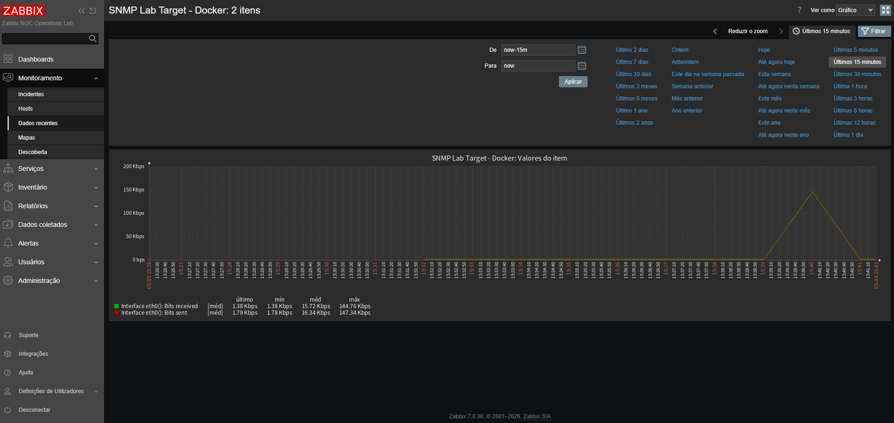
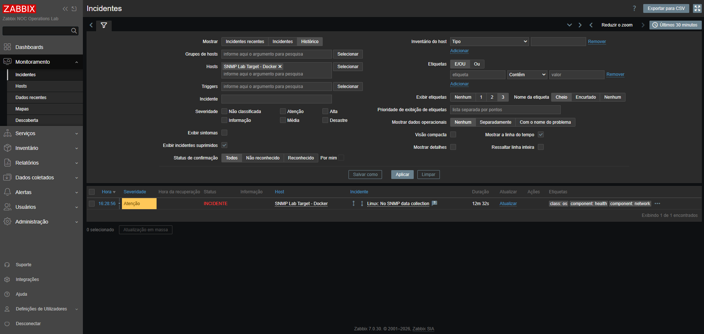
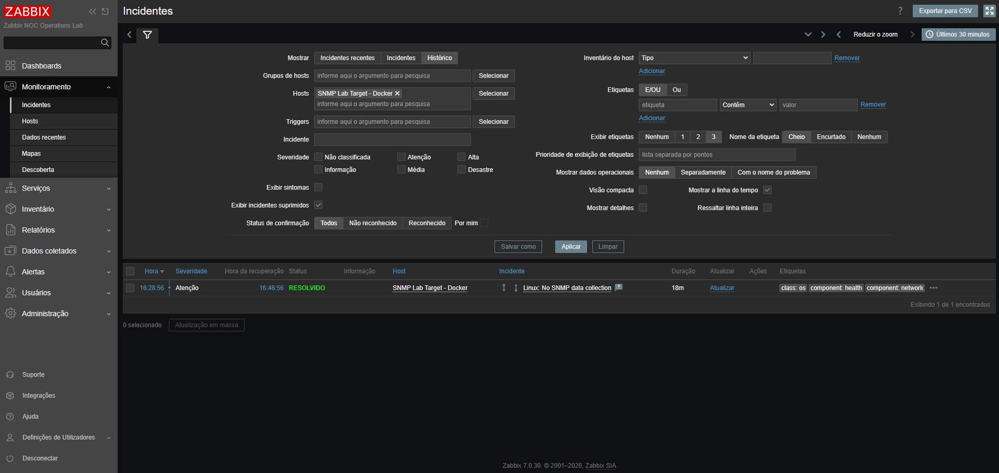

# Stage 08 - SNMP Network Monitoring and Grafana Decision

[Back to the main README](../../README.md)

## Objective

This stage introduces SNMP-based infrastructure monitoring through a controlled Docker target integrated with Zabbix.

The implementation prioritizes a complete native Zabbix workflow: target deployment, secure community handling, direct polling, host registration, interface discovery, traffic collection, problem detection, recovery, and troubleshooting.

Grafana was retained as an optional decision gate rather than a mandatory dependency. The stage was completed with native Zabbix monitoring because the required operational results were achieved without adding another visualization platform.

## Final Status

**Completed**

The final implementation includes:

- a dedicated Alpine Linux SNMP target;
- Net-SNMP agent and command-line tools;
- environment-based SNMP configuration;
- a private SNMPv2c community stored outside version control;
- Docker Compose integration;
- a loopback-only published UDP endpoint;
- container health validation;
- direct SNMP polling;
- Zabbix host registration through an SNMP interface;
- a secret Zabbix host macro for the community;
- the official `Linux by SNMP` template;
- system and network-interface discovery;
- inbound and outbound traffic collection;
- native Zabbix graphs;
- controlled authentication failure;
- automatic problem detection and recovery;
- community rotation after accidental exposure during local testing;
- selected technical evidence.

## Implemented Architecture

| Component | Responsibility |
|:---:|---|
| Controlled SNMP target | Exposes deterministic Linux system and interface data through UDP `161` |
| Zabbix Server | Polls SNMP OIDs, discovers interfaces, stores values, and evaluates triggers |
| Zabbix Web | Configures the SNMP host and provides items, incidents, and native graphs |
| PostgreSQL | Stores Zabbix configuration, history, trends, and events |
| Docker monitoring network | Provides internal name resolution and isolated service communication |
| NOC operator | Validates collection, performs controlled fault injection, and confirms recovery |

## SNMP Target

The controlled target is implemented as the Docker Compose service:

`snmp-target`

The dedicated image is based on:

`alpine:3.22`

The image installs:

- `gettext-envsubst`;
- `net-snmp`;
- `net-snmp-tools`.

The container starts the Net-SNMP daemon and exposes UDP port `161`.

The endpoint published to the Windows workstation is restricted to:

`127.0.0.1:161/udp`

Zabbix Server does not depend on the published workstation endpoint. It reaches the target directly through the internal Docker monitoring network at:

`snmp-target:161`

The container health check performs an authenticated SNMP query against its own assigned container address.

## Environment Configuration

The tracked `.env.example` file documents the required SNMP variables:

- `SNMP_AGENT_PORT`;
- `SNMP_COMMUNITY`;
- `SNMP_ALLOWED_NETWORK`;
- `SNMP_SYSTEM_NAME`;
- `SNMP_SYSTEM_LOCATION`;
- `SNMP_SYSTEM_CONTACT`.

The operational community is generated locally and stored only in the ignored `.env` file.

The `.env` file is excluded by `.gitignore` and must never be committed, included in published evidence, or copied into documentation.

## Protocol Selection

The controlled target uses SNMPv2c.

| Setting | Implemented value |
|:---:|:---:|
| Protocol | SNMP |
| Version | SNMPv2c |
| Transport | UDP |
| Agent port | `161` |
| Access mode | Read only |
| Community storage | Ignored local `.env` and secret Zabbix host macro |
| Workstation exposure | `127.0.0.1:161/udp` |
| Zabbix destination | `snmp-target:161` |
| Monitoring source | Zabbix Server container |

SNMPv2c is appropriate for this isolated laboratory because it allows direct examination of OIDs, polling behavior, connectivity, and authentication failures.

SNMPv3 remains the recommended production option when authentication, integrity protection, and encryption are required.

## Security Controls

The implementation applies the following controls:

- the target is restricted to the controlled laboratory;
- SNMP access is read only;
- the real community is not embedded in tracked files;
- the Zabbix community macro uses secret text;
- UDP port `161` is bound only to loopback on the workstation;
- Zabbix accesses the target through the internal Docker network;
- no production network device is queried;
- no router, switch, access point, or ISP-managed device is modified;
- published evidence is reviewed for secret exposure;
- an exposed laboratory community was rotated immediately;
- the target and Zabbix macro were synchronized after rotation.

## Line-Ending Incident

The first SNMP container startup failed with exit code `127`.

Inspection of the entrypoint shebang returned:

`23 21 2f 62 69 6e 2f 73 68 0d 0a`

The final `0d 0a` sequence demonstrated that the script had Windows CRLF line endings. Inside the Linux container, the carriage-return character became part of the interpreter path and prevented execution.

The correction included:

- normalizing the entrypoint and SNMP template during the image build;
- preserving executable permissions;
- rebuilding the image without cache;
- confirming a Linux LF shebang;
- adding repository line-ending rules through `.gitattributes`.

After correction, the shebang ended with:

`23 21 2f 62 69 6e 2f 73 68 0a`

The recreated SNMP container became healthy and remained stable.

## Direct SNMP Validation

Direct SNMPv2c queries succeeded against the controlled target before Zabbix registration.

| Signal | Validated result |
|---|---|
| System name | `zabbix-lab-snmp-target` |
| System location | `Docker-based NOC Operations Lab` |
| System contact | `NOC Lab Administrator` |
| System description | Net-SNMP running on Linux |
| System object identifier | Net-SNMP enterprise OID |
| System uptime | Returned successfully |
| Interface count | Returned successfully |

These results separated target-side SNMP validation from Zabbix-side configuration.

## Zabbix Host Configuration

The SNMP target was registered with the following final configuration:

| Field | Value |
|---|:---:|
| Host name | `zabbix-lab-snmp-target` |
| Visible name | `SNMP Lab Target - Docker` |
| Host group | `Network services` |
| Template | `Linux by SNMP` |
| Interface type | SNMP |
| Connection method | DNS |
| DNS name | `snmp-target` |
| Port | `161` |
| SNMP version | SNMPv2 |
| Community | `{$SNMP_COMMUNITY}` |
| Monitoring source | Zabbix Server |
| Status | Active |

The initial `Generic by SNMP` template validated basic connectivity and system OIDs. It was then replaced by `Linux by SNMP` to provide broader Linux monitoring, low-level discovery, interface metrics, triggers, and graphs.

The `{$SNMP_COMMUNITY}` macro contains the same private value stored in the local `.env` file. Its type is secret text, and its description does not contain the operational value.

## Monitoring Results

After template initialization and discovery, the host exposed:

| Zabbix resource | Observed count |
|---|:---:|
| Items | `53` |
| Triggers | `15` |
| Graphs | `8` |
| Discovery rules | `5` |

The collected data included:

- SNMP availability;
- system name, description, contact, location, and object identifier;
- system and network uptime;
- Linux operating-system information;
- interface discovery;
- interface type and operational status;
- received and transmitted traffic;
- inbound and outbound packet errors;
- inbound and outbound discarded packets.

The `eth0` interface was discovered automatically. Its received and transmitted traffic values changed between checks, demonstrating active time-series collection rather than static configuration alone.

The template also provided eight native Zabbix graphs for direct operational visualization without an additional dashboard dependency.

## Controlled Failure and Recovery

The controlled failure tested the SNMP authentication path without stopping PostgreSQL, Zabbix Server, Zabbix Web, Mailpit, the monitored HTTP service, or unrelated monitored hosts.

The test sequence was:

1. confirm normal SNMP availability;
2. preserve the operational community in the ignored `.env` file;
3. replace only the secret Zabbix host macro with an invalid laboratory value;
4. wait for consecutive failed SNMP checks;
5. observe the `Linux: No SNMP data collection` problem;
6. restore the correct community from `.env`;
7. confirm green SNMP availability;
8. confirm automatic event recovery.

| Signal | Normal state | Failure state | Recovery state |
|---|---|---|---|
| SNMP target container | Healthy | Healthy | Healthy |
| Zabbix SNMP authentication | Valid | Invalid | Valid |
| SNMP availability | Available | Unavailable | Available |
| Data collection | Current | Interrupted | Resumed |
| Problem event | Absent | `Linux: No SNMP data collection` | Resolved |

This method isolated the authentication dependency and demonstrated that a healthy target can still become unavailable to monitoring when credentials diverge.

## Notification Validation Decision

A dedicated action named `NOC Lab - SNMP problem notifications` was configured during troubleshooting. Two controlled incidents were generated, but the action did not produce entries in the Zabbix action log and Mailpit received no messages.

The action conditions were revised from an inherited trigger reference to a host and event-name combination. The second test still produced no delivery. The unvalidated action was therefore disabled instead of being presented as successful evidence.

SNMP email delivery was not retained as a Stage 08 acceptance requirement because the complete Zabbix-to-Mailpit problem and recovery workflow had already been validated and documented in Stage 06. Stage 08 remains focused on the new technical scope: SNMP polling, discovery, interface monitoring, authentication failure, and recovery.

This outcome is recorded transparently as deferred troubleshooting rather than a successful result.

## Community Exposure and Rotation

During local testing, the operational community was accidentally placed in a visible field and appeared in a non-published screenshot.

The corrective response included:

- preventing publication of the affected evidence;
- correcting the macro description;
- changing the macro type to secret text;
- generating a new private community;
- updating the ignored `.env` file;
- recreating only the `snmp-target` service;
- updating the secret Zabbix host macro;
- confirming restored SNMP availability;
- using only the rotated value for subsequent testing.

No operational community value is documented in this repository.

## Grafana Decision

Grafana integration was evaluated and intentionally deferred.

The decision was based on the following results:

- native Zabbix interface discovery succeeded;
- traffic metrics were collected successfully;
- native Zabbix graphs were available;
- controlled failure detection succeeded;
- automatic recovery succeeded;
- the repository already demonstrates the intended NOC workflow;
- adding Grafana would duplicate visualization work covered by separate observability projects.

Keeping Grafana optional preserves the scope of this repository as a Zabbix-centered NOC operations laboratory. A future stage may revisit Grafana if it introduces a distinct operational outcome rather than another view of the same data.

## Evidence

### Zabbix SNMP host availability

The host list shows the active target, internal `snmp-target:161` interface, assigned `Linux by SNMP` template, and green SNMP availability.

### SNMP data collection

The latest-data view demonstrates current SNMP values collected from the controlled target.

### Interface discovery and traffic collection

The latest-data view shows the discovered `eth0` interface, operational state, interface type, and received and transmitted traffic.

### SNMP problem detection

The incident view shows `Linux: No SNMP data collection` after the controlled community mismatch interrupted authenticated polling.

### SNMP recovery

The incident history shows automatic resolution after the correct secret community was restored.

## Acceptance Criteria

- [x] Create a reproducible controlled SNMP target.
- [x] Restrict the published UDP endpoint to loopback.
- [x] Preserve the private community outside tracked files.
- [x] Build and validate the dedicated SNMP image.
- [x] Correct Windows-to-Linux line-ending incompatibility.
- [x] Confirm healthy container status.
- [x] Perform direct SNMP polling.
- [x] Register the SNMP host in Zabbix.
- [x] Configure the internal DNS-based SNMP interface.
- [x] Store the community in a secret host macro.
- [x] Assign the `Linux by SNMP` template.
- [x] Confirm green SNMP availability.
- [x] Collect standard system information.
- [x] Validate network-interface discovery.
- [x] Validate inbound and outbound traffic collection.
- [x] Confirm native Zabbix graphs.
- [x] Simulate an isolated SNMP authentication failure.
- [x] Validate problem detection.
- [x] Restore the correct community securely.
- [x] Validate automatic collection recovery.
- [x] Validate the resolved event.
- [x] Rotate an exposed laboratory community.
- [x] Confirm the final healthy platform state.
- [x] Evaluate and defer optional Grafana integration.
- [x] Commit selected Stage 08 evidence.
- [x] Document the implementation and troubleshooting outcomes.

## Troubleshooting Lessons

The stage demonstrated the importance of validating each layer independently:

- Docker health does not prove Zabbix authentication;
- direct polling separates target behavior from Zabbix configuration;
- UDP services require protocol-aware connectivity checks;
- Docker service DNS should be used for container-to-container polling;
- secret values must never be placed in descriptions or screenshots;
- local configuration archives can contain ignored files even when Git does not;
- Windows CRLF line endings can invalidate Linux entrypoints;
- template selection determines available items, discovery rules, triggers, and graphs;
- an inherited trigger reference may not behave as expected in an action condition;
- an empty action log indicates that no notification operation was executed;
- failed optional integration work must not be represented as validated evidence;
- recovery must be confirmed from both availability and event-history views.

## Skills Demonstrated

- SNMP fundamentals and SNMPv2c polling;
- OID interpretation and MIB awareness;
- Linux network-interface discovery;
- inbound and outbound traffic monitoring;
- UDP service validation;
- Docker image engineering;
- Docker Compose networking;
- container health-check design;
- Linux entrypoint troubleshooting;
- Windows and Linux line-ending interoperability;
- environment-based secret handling;
- secret rotation and configuration synchronization;
- Zabbix SNMP host and macro configuration;
- Zabbix template evaluation and replacement;
- low-level discovery;
- native graph provisioning;
- controlled fault injection;
- problem and recovery validation;
- notification-path troubleshooting;
- evidence review and security hygiene;
- transparent technical documentation.

## Final Result

Stage 08 is complete.

The laboratory now includes a reproducible SNMPv2c target, secure community handling, direct and Zabbix-based polling, Linux interface discovery, traffic collection, native visualization, controlled authentication failure, automatic recovery, and documented troubleshooting.

The final environment is healthy, the operational community has been rotated and restored securely, and the unvalidated Stage 08 notification action remains disabled.
