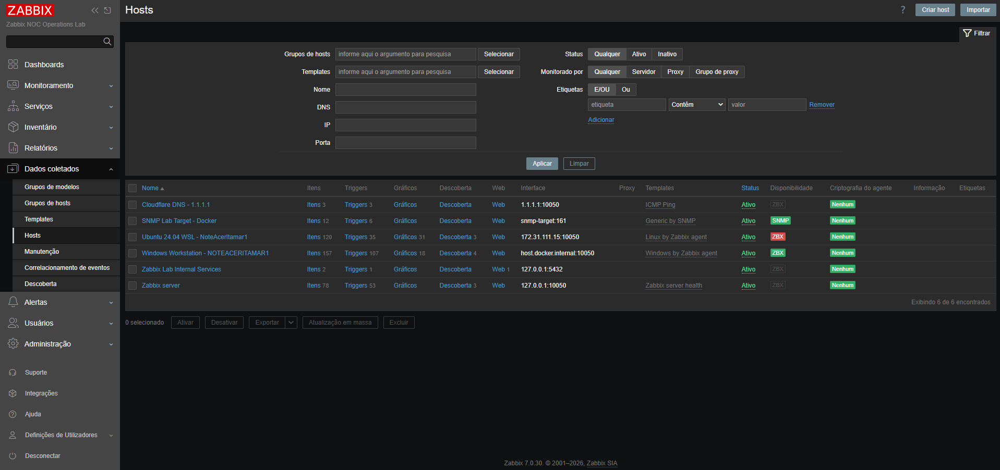
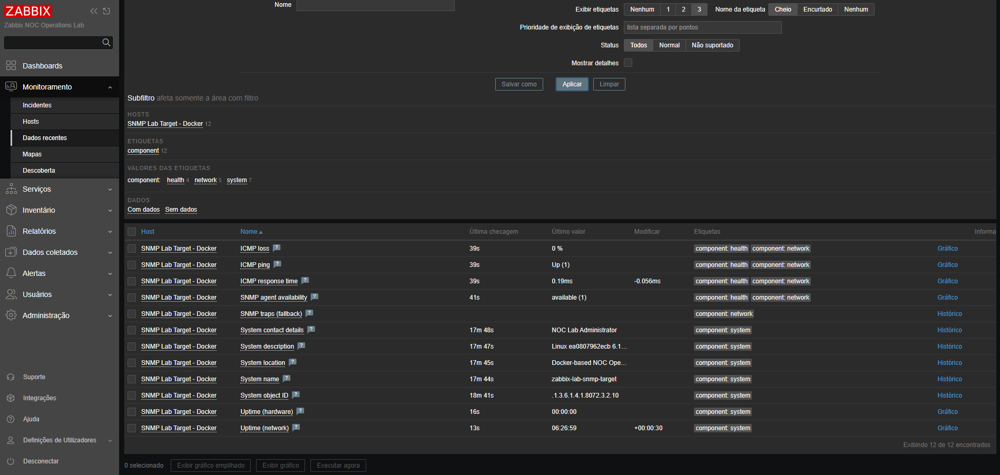

# Stage 08 - SNMP Network Monitoring and Optional Grafana Integration

[Back to the main README](../../README.md)

## Objective

This stage introduces SNMP-based monitoring through a controlled Docker target integrated with Zabbix.

The implementation prioritizes a complete native Zabbix workflow before any optional Grafana integration. SNMP connectivity, collection, visualization, failure detection, recovery, notifications, and troubleshooting must first be validated directly in Zabbix.

The stage covers:

- SNMP fundamentals used in network operations;
- deployment of a controlled SNMPv2c target;
- UDP port `161` connectivity;
- secure community configuration through a local environment variable;
- direct command-line polling;
- Zabbix host registration with an SNMP interface;
- standard system OIDs;
- interface discovery and monitoring;
- native Zabbix graphs;
- controlled SNMP failure simulation;
- problem detection and recovery;
- notification behavior;
- SNMP troubleshooting;
- selected technical evidence;
- optional Grafana integration.

## Current Status

**In progress**

The controlled SNMP target has been deployed successfully and integrated with Zabbix.

The implementation completed so far includes:

- a dedicated Alpine Linux SNMP target image;
- Net-SNMP agent and command-line tools;
- environment-based SNMP configuration;
- a private SNMPv2c community stored only in the ignored local `.env` file;
- Docker Compose integration;
- UDP port `161` published only on `127.0.0.1`;
- health-check validation;
- direct SNMP polling;
- Zabbix host registration;
- a secret host macro for the SNMP community;
- assignment of the `Generic by SNMP` template;
- successful Zabbix SNMP availability;
- collection of twelve monitoring items;
- collection of standard system information.

The next phase will validate interface monitoring, native graphs, controlled failure detection, notifications, and automatic recovery.

## Implemented Architecture

| Component | Responsibility |
|:---:|---|
| Controlled SNMP target | Exposes deterministic system and interface information through UDP `161` |
| Zabbix Server | Polls SNMP OIDs and processes monitoring values |
| Zabbix Web | Configures the SNMP host, template, items, triggers, and native graphs |
| PostgreSQL | Stores configuration, collected values, trends, and events |
| Mailpit | Captures notifications generated during controlled incidents |
| Grafana | May optionally visualize validated monitoring data after the native workflow is complete |
| NOC operator | Validates availability, interprets values, investigates failures, and confirms recovery |

## SNMP Target

The controlled target is implemented as a dedicated Docker Compose service named:

`snmp-target`

The image is based on:

`alpine:3.22`

The image installs:

- `gettext-envsubst`;
- `net-snmp`;
- `net-snmp-tools`.

The container runs the Net-SNMP daemon and exposes UDP port `161`.

The published host endpoint is restricted to:

`127.0.0.1:161/udp`

Zabbix Server does not use the published Windows endpoint. It reaches the target directly through the Docker monitoring network by using the internal service name:

`snmp-target:161`

## Environment Configuration

SNMP configuration is supplied through environment variables.

The tracked `.env.example` file documents the required variables:

- `SNMP_AGENT_PORT`;
- `SNMP_COMMUNITY`;
- `SNMP_ALLOWED_NETWORK`;
- `SNMP_SYSTEM_NAME`;
- `SNMP_SYSTEM_LOCATION`;
- `SNMP_SYSTEM_CONTACT`.

The operational community is generated locally and stored only in `.env`.

The `.env` file remains ignored by Git and was not committed.

## Protocol Selection

The implementation uses SNMPv2c.

| Setting | Implemented value |
|:---:|---|
| Protocol | SNMP |
| Version | SNMPv2c |
| Transport | UDP |
| Agent port | `161` |
| Access mode | Read only |
| Community storage | Ignored local environment file and secret Zabbix host macro |
| Host exposure | `127.0.0.1:161/udp` |
| Zabbix destination | `snmp-target:161` |
| Monitoring source | Zabbix Server container |

SNMPv2c is appropriate for this isolated laboratory because it allows direct examination of OIDs, polling behavior, connectivity, and failure conditions.

SNMPv3 remains the recommended option for production environments requiring authentication and encryption.

## Security Controls

The implementation follows these controls:

- the target is restricted to the controlled laboratory;
- SNMP access is read only;
- the real community value is not embedded in tracked files;
- the Zabbix community macro is stored as secret text;
- UDP port `161` is bound only to the local host;
- Zabbix accesses the target through the internal Docker network;
- no production network device is queried;
- no router, switch, access point, or ISP-managed device is modified;
- no personal credential is committed;
- published evidence does not expose the private community value.

## Line-Ending Incident

The first SNMP container startup failed with exit code `127`.

Inspection of the entrypoint shebang returned these bytes:

`23 21 2f 62 69 6e 2f 73 68 0d 0a`

The final `0d 0a` sequence demonstrated that the shell script had Windows CRLF line endings. Inside the Linux container, the carriage-return character became part of the interpreter path, preventing execution.

The correction included:

- normalizing the entrypoint and SNMP template during the image build;
- preserving executable permissions on the entrypoint;
- rebuilding the image without cache;
- validating that the shebang ended only with Linux LF;
- adding repository line-ending rules through `.gitattributes`.

After correction, the entrypoint shebang ended with:

`23 21 2f 62 69 6e 2f 73 68 0a`

The recreated SNMP container became healthy and remained stable.

## Direct SNMP Validation

Direct SNMPv2c queries succeeded against the controlled target.

Validated information included:

| Signal | Validated result |
|---|:---:|
| System name | `zabbix-lab-snmp-target` |
| System location | `Docker-based NOC Operations Lab` |
| System contact | `NOC Lab Administrator` |
| System description | Net-SNMP running on Linux |
| System object identifier | Net-SNMP enterprise OID |
| System uptime | Returned successfully |
| Interface count | Returned successfully |

These results confirmed that the agent was responding before registration in Zabbix.

## Zabbix Host Configuration

The SNMP target was registered with the following configuration:

| Field | Value |
|---|:---:|
| Host name | `zabbix-lab-snmp-target` |
| Visible name | `SNMP Lab Target - Docker` |
| Host group | `Network services` |
| Template | `Generic by SNMP` |
| Interface type | SNMP |
| Connection method | DNS |
| DNS name | `snmp-target` |
| Port | `161` |
| SNMP version | SNMPv2 |
| Community | `{$SNMP_COMMUNITY}` |
| Monitoring source | Zabbix Server |
| Status | Active |

The `{$SNMP_COMMUNITY}` host macro contains the same private community stored in the local `.env` file.

Its value is configured as secret text and is not visible in the committed evidence.

## Collected Monitoring Data

Zabbix currently reports the SNMP interface as available and collects twelve items from the assigned template.

Observed values include:

- ICMP packet loss;
- ICMP availability;
- ICMP response time;
- SNMP agent availability;
- SNMP trap fallback;
- system contact;
- system description;
- system location;
- system name;
- system object identifier;
- hardware uptime;
- network uptime.

The collected system identity matches the values returned during direct command-line polling.

## Evidence

### Zabbix SNMP host availability

The host list shows the active target, the internal `snmp-target:161` interface, the assigned `Generic by SNMP` template, and green SNMP availability.

### SNMP data collection

The latest-data view shows twelve monitored items, successful SNMP agent availability, and the expected system identity values.

## Remaining Workflow

The remaining implementation will follow this sequence:

1. validate interface discovery;
2. identify the monitored interface and traffic items;
3. validate received and transmitted traffic values;
4. validate native Zabbix graphs;
5. define a controlled SNMP availability trigger;
6. record the normal polling and trigger timing;
7. interrupt only the SNMP target;
8. validate loss of SNMP availability;
9. validate the Zabbix problem event;
10. validate problem notification delivery in Mailpit;
11. restore the SNMP target;
12. confirm automatic collection recovery;
13. validate the resolved event;
14. validate recovery notification delivery;
15. confirm the final platform state;
16. evaluate whether optional Grafana integration adds portfolio value;
17. complete the Stage 08 documentation;
18. update the main repository README.

## Controlled Failure Plan

The failure test will interrupt only the SNMP target.

PostgreSQL, Zabbix Server, Zabbix Web, Mailpit, the monitored HTTP service, Windows Agent 2, Linux Agent 2, and unrelated monitored hosts must remain available.

| Signal | Normal state | Failure state | Recovery state |
|---|:---:|:---:|:---:|
| SNMP target container | Healthy | Stopped or unavailable | Healthy |
| SNMP polling | Successful | Unavailable | Successful |
| SNMP availability | Available | Unavailable | Available |
| SNMP problem event | Absent | Present | Resolved |
| Notification lifecycle | No new message | Problem message | Recovery message |

The final trigger behavior will be defined after the polling interval and availability characteristics have been observed.

## Grafana Decision Gate

Grafana integration remains optional.

It will be considered only if:

- the SNMP target remains stable;
- direct polling succeeds consistently;
- Zabbix receives current values;
- interface discovery succeeds;
- native Zabbix graphs are available;
- controlled failure detection succeeds;
- target recovery succeeds;
- the incident lifecycle is preserved;
- the integration adds portfolio value without unnecessarily duplicating another repository.

If these criteria are not met, the stage will be completed with native Zabbix SNMP monitoring only.

## Acceptance Criteria

### Completed

- [x] Create a reproducible controlled SNMP target.
- [x] Restrict the published UDP endpoint to the local host.
- [x] Preserve the private community outside tracked files.
- [x] Validate Docker Compose configuration.
- [x] Build the dedicated SNMP image.
- [x] Validate required SNMP binaries.
- [x] Correct Windows-to-Linux line-ending incompatibility.
- [x] Start the SNMP target successfully.
- [x] Confirm healthy container status.
- [x] Perform direct SNMP polling.
- [x] Register the SNMP host in Zabbix.
- [x] Configure the internal DNS-based SNMP interface.
- [x] Store the community in a secret host macro.
- [x] Assign the `Generic by SNMP` template.
- [x] Confirm green SNMP availability.
- [x] Collect standard system information.
- [x] Commit selected availability and collection evidence.

### Pending

- [ ] Validate network-interface discovery.
- [ ] Validate inbound and outbound traffic collection.
- [ ] Validate native Zabbix graphs.
- [ ] Configure the controlled SNMP availability trigger.
- [ ] Simulate an isolated SNMP failure.
- [ ] Validate problem detection.
- [ ] Validate problem notification delivery.
- [ ] Restore the SNMP target.
- [ ] Validate automatic collection recovery.
- [ ] Validate the resolved event.
- [ ] Validate recovery notification delivery.
- [ ] Confirm the final platform state.
- [ ] Decide whether Grafana integration adds value.
- [ ] Complete the final Stage 08 documentation.
- [ ] Update the main repository README.

## Troubleshooting Focus

The remaining implementation may require troubleshooting involving:

- UDP connectivity;
- Docker network attachment;
- incorrect community values;
- incorrect SNMP version;
- invalid or unsupported OIDs;
- missing MIB definitions;
- numeric versus textual OIDs;
- SNMP timeout behavior;
- unsupported Zabbix items;
- interface-index changes;
- trigger timing;
- problem and recovery notification execution;
- Grafana connectivity if the optional integration is implemented.

## Skills Demonstrated

The implementation currently demonstrates:

- SNMP fundamentals;
- SNMPv2c polling;
- OID interpretation;
- MIB awareness;
- UDP connectivity validation;
- Docker image engineering;
- Docker network communication;
- Linux entrypoint troubleshooting;
- Windows and Linux line-ending interoperability;
- environment-based secret handling;
- Zabbix SNMP host configuration;
- secret host macros;
- SNMP item collection;
- operational evidence selection;
- technical documentation.

Additional interface-monitoring, visualization, fault-injection, incident, and recovery skills will be added during the remaining work.
